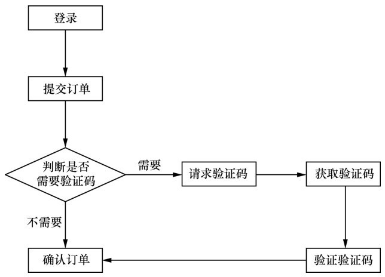

## 8. 外卖的自动化测试项目
#### 8.4.1 测试需求分析
外卖平台其实不仅仅是用户订个外卖这一个简单的系统，其中涉及订餐餐厅的管理、餐厅管理者的订单处理、用户的外卖配送物流等多个其他系统，而每个系统又有相互的数据关联，并非想象中那么简单，所以对于接口自动化测试的系统和用例选择就非常重要了，并不是每个系统或者功能都适合做接口自动化的，这里就先挑选一个最主要的订外卖系统作为实例。

### 相信订过外卖的人应该都知道订外卖的步骤。
* 1.登录外卖平台。【需要用指定的测试账号和密码登录，一般是不会出错的。即避免验证码的干扰】
* 2.选择餐厅的范围（手机端可以通过定位直接获取周边的餐厅，计算机端则需要手动输入某一个点并根据这个点寻找一定范围内的餐厅）。【这一步其实可以跳过，因为自动化要保证运行的正确性，需要指定餐厅订餐】
* 3.选择餐厅进入。【带上餐厅ID】
* 4.选择菜品达到起送金额并确认提交。【也需要指定菜品，不然达不到起送费是没法订餐成功的。只要在提交订单的时候带上菜品的ID 和数量保证达到起送费就行了】
* 5.选择送餐时间、送餐地址、货到付款/在线支付。【对于支付方式只能选择餐到付款，因为在线支付涉及其他支付公司的回调以及安全考虑，比较难实现。】
* 6.提交外卖订单。
## 8.4.2 测试流程设计
分析完测试场景，接着就要把测试流程梳理清楚，就像产品设计的流程图一样。
### 测试流程设计如图所示

## 8.4.3 测试环境准备
自动化测试需要一个干净的测试环境，不然很难重复运行起来。自动化测试要做到绝对智能也是不可能的，尤其运行过程中会遇到脏数据或者异常就会中断。
## 8.4.4 测试代码编写
根据之前的流程设计，首先要把每一步操作分别放到一个函数完成，然后将函数之间的数据进行关联，最后通过特定的结构组合起来，这样即完成了一个完整的自动化测试脚本
### 几点注意事项如下。
* 1 函数的定义没有先后顺序，只有执行有先后顺序。
* 2 断言即判断实际结果是否和预期结果一致，如果不一致，则中断整个程序的执行，因为后面的程序都没有执行的必要了，而且会打印出不一致的地方，以便可以快速定位到哪一步执行结果出错，方便查询问题。
* 3 函数之间参数传递，需要将函数执行结果赋值给某一个参数，并在另外的函数之中定义形式参数，并最终将实际参数赋值到函数内的参数之中。