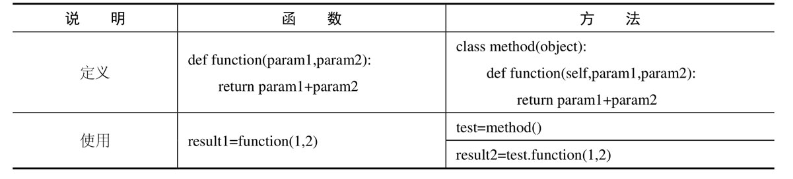

# practice_2020

## basic_Python
### 1.基础
在Unix下 `contral+D`  exit the interprete，在window OS 下使用 `contral+z` 
or 使用 `quit()` 退出编辑器。

在python交互模式下只适合临时调试，不能保存代码，不适合在此模式下写代码。要选择一个可以适用的编辑器：比如VSCode、Pycharm等。    
pytho是动态语言：这意味着变量并没有固定的类型。实际上，Python 中的变量和其他 语言有很大的不同，特别是静态类型语言。变量并不是计算机内存中被写入的某个值，它们 只是指向内存的 ‘标签’ 或 ‘名称’ 。

### 2.Number,string and operator
```python
print('1024 * 768 =', 1024 * 768) 
#结果：1024 * 768 = 786432
print(17/3) #5.666666666666667
print(17 // 3) #5
print(17 % 3) #2
```
/：除法运算符，// ：除法运算取整数，%：除法运算符取余数
含有浮点数多运算会自动把全部数据转换为浮点数

```python
print('I\'m \"ok\"!') #I'm "ok"!
```
如果字符串内部既包含'又包含"怎么办？可以用转义字符\来标识.字符串内部有很多换行，用\n(换行)写在一行里不好阅读，为了简化，Python允许用'''...'''的格式表示多行内容。\t：制表符.但有时为了代码风格好看会在triple引号中加入\来阻止因为敲来换行符而对于实际代码产生但换行                     
```python
print('%2d-%02d' % (3,1)) # 3-01
print('%.2f' % 3.1415926) #3.14
print('growth rate: %d %%' % 7) # growth rate: 7 %
```
## Python 命名规则
* 1，模块或包全部使用小写字母的命名方式，并且以_分隔单词。
* 2，类或异常使用首字母大写的命名方式
* 3，全局或类常量全部使用大写字母的命名方式，并且以_分隔单词。
* 4，其余变量（包括方法名、函数名和普通变量名）则全部使用小写字母命名的方式。
* 5，以上内容如果是Python内部的，则使用双下画线开头命名。

变量在程序中就是用一个变量名表示了，变量名必须是大小写英文、数字和_的组合，且不能用数字开头.                                                                  python是动态语言：即变量本身类型不固定当语言。
python中通常用大写的变量表示常量。

格式化：字符串中的有些字段是根据变量变化的，所以需要一种简便的格式化字符串的方式
在Python中，采用的格式化方式和C语言是一致的，用%实现。
%%：表示一个%    
%d：整数                                                                %f:浮点数  
%x：16进制整数

```python
print(3*'un' +'ium') 
#：unununium 字符串通过+拼接，通过*重复
print('py' 'thon') #python
#相邻但两个字符串会自动链接,但这种方法只适合链接字符串，变量或表达式并不适合。想要连接只能使用 +
```
### 字符串
字符串分隔与取索引:**索引越界会报错，切片中索引越界会自动处理**     
Python 中的字符串不能被修改，它们是 immutable 的。因此，向字符串的某个索引位置赋值会产生一个错误。如果想要改变可以新建通过+拼接
 ```python
word='python'
print(word[0]) #:p 角标从0开始
print(word[1:3])
#:yt 开始总是被包括在结果中，而结束不被包括。这使得 s[:i] + s[i:] 总是等于 s
print(word[:3])
#:pyt 省略开始索引时默认为0，省略结束索引时默认为到字符串的结束
print(word[4:]) 
#:on 默认到字符串长度结束，长度比实际多1，所以最后一个有包括
print(word[:2] +word[2:] ) #:python
print(word[-1]) #:n 从后向前
print(word[-4:]) #:thon 角标从0开始
print(word[-4:-2]) 
#:th  [a, b) print(word[:-2]) #:pyth  [a, b)
print(word[:-3] +word[-3:] ) #python
 ```

## 3.内置数据类型
有序的集合：即有下标   
Python内置数据类型：  
* List[]：是一种有序的集合，可以随时添加、删除、修改和查看其中的元素、支持索引和切片。    
list中元素类型可以不同，元素页可以是另外一个list，但通常数据类型是相同的。    
可以通过built-in function len()函数可以获得list元素的个数  
使用索引访问list中每个元素的位置：list[len(classmates) - 1]=list[-1]  
[负数的最后一位的整数会比正向取值多1，即为len()]   
list中追加元素到末尾：classmates.append('Adam')  
list中把元素插入到指定的位置：classmates.insert(1, 'Jack')  
list中删除list列表中末尾的元素：classmates.pop()  
list中删除list列表中指定位置：i的元素：classmates.pop(i)  
list中指定的某个元素替换成为别的元素，lists are a mutable type ,可以直接赋值给对应的索引位置：classmates[1] = 'Sarah'    
只写[:]就可以原样复制一个list：  
L[::5]  (以5为步调切片list/tuple/string)  
[0, 5, 10, 15, 20, 25, 30, 35, 40, 45, 50, 55, 60, 65, 70, 75, 80, 85, 90, 95]
 
* 另一种有序列表叫元组：tuple()，但tuple一旦初始化就不能修改【是说指向对象变化】
因为tuple不可变，所以代码更安全。元组本身虽然不支持修改但元组中但元素是可以修改但，比如元组中但一个数据是列表，则可以修改这个列表但数据。

tuple的陷阱：当你定义一个tuple时，在定义的时候，tuple的元素就必须被确定下来
只有1个元素的tuple定义时必须加一个逗号,来消除数学公式中的小括号
"""。

```python
列表和元组可以相互转变：
tuple(list)
list(tuple)
```
### 字典 ：{}  
* 1，以键值对形式存储数据,字典数据随时灵活可变，支持增加、删除、修改、查找等操作。但字典但key必须是不可变的，即固定的数据，比如可以使用字符串，但不可以使用列表。
* 2，涉及字典操作时，其key必须存在，如果key不存在，则会抛出‘keyError’
* 3，不允许同一个键出现两次。如果同一个键被赋值两次，则前一个值会被覆盖。字典是无序的。
* 4,字典的操作


# 4.重要基础
## 4.1.0 print 函数介绍
### 条件语句：IF and input() functoin
```python
age = int(input('Input you age: '))
if age >= 18:
    print('Adult')
elif age >= 6:
    print('teenager')
else:
    print('kid')

```
注意:input()返回的是字符串，必须通过int()将字符串转换为整数，才能用于数值比较:

## 4.1.1 for 循环和 range()
```python
sum = 0
for x in [1, 2, 3, 4, 5, 6, 7, 8, 9, 10]:
    sum = sum + x
print(sum)  #55

print(list(range(5)))  #[0, 1, 2, 3, 4]
```
Python的循环有两种，一种是for...in循环，依次把list或tuple中的每个元素迭代出来.  
range()函数，可以生成一个整数序列，再通过list()函数可以转换为list。比如range(5)生成的序列是从0开始小于5的整数：
## 4.1.2 break and cotinue
```python
# break语法
n = 1
while n <= 100:
    if n > 10: # 当n = 11时，条件满足，执行break语句
        break # break语句会结束当前循环
    print(n)
    n = n + 1
print('END')
# continue语法
n = 0
while n < 10:
    n = n + 1
    if n % 2 == 0: # 如果n是偶数，执行continue语句
        continue # continue语句会直接继续下一轮循环，后续的print()语句不会执行
    print(n)
```

break语句可以在循环过程中直接退出循环，而continue语句可以提前结束本轮循环，并直接开始下一轮循环。这两个语句通常都必须配合if语句使用。

要特别注意，不要滥用break和continue语句。break和continue会造成代码执行逻辑分叉过多，容易出错。大多数循环并不需要用到break和continue语句，上面的两个例子，都可以通过改写循环条件或者修改循环逻辑，去掉break和continue语句。

有些时候，如果代码写得有问题，会让程序陷入“死循环”，也就是永远循环下去。这时可以用Ctrl+C退出程序，或者强制结束Python进程。
## 4.1.3 dict和set

```python
d = {
    'Michael': 95,
    'Bob': 75,
    'Tracy': 85
}
print('d[\'Michael\'] =', d['Michael'])
print('d[\'Bob\'] =', d['Bob'])
print('d[\'Tracy\'] =', d['Tracy'])
print('d.get(\'Thomas\', -1) =', d.get('Thomas', -1)) 
# 通过dict提供的get()方法，如果key不存在，可以返回None，或者自己指定的value
# 要删除一个key，用pop(key)方法，对应的value也会从dict中删除： 
s1 = set([1, 1, 2, 2, 3, 3])
print(s1)
s2 = set([2, 3, 4])
print(s1 & s2)
print(s1 | s2)
# s.remove/sort/add()
```
和list比较，dict有以下几个特点：

查找和插入的速度极快，不会随着key的增加而变慢；需要占用大量的内存，内存浪费多。而list相反：查找和插入的时间随着元素的增加而增加；占用空间小，浪费内存很少。所以，dict是用空间来换取时间的一种方法。

dict可以用在需要高速查找的很多地方，在Python代码中几乎无处不在，正确使用dict非常要，需要牢记的第一条就是dict的key必须是不可变对象。和list比较，dict有以下几个特点：
查找和插入的速度极快，不会随着key的增加而变慢；需要占用大量的内存，内存浪费多。而list相反：

查找和插入的时间随着元素的增加而增加；占用空间小，浪费内存很少。所以，dict是用空间来换取时间的一种方法。

dict可以用在需要高速查找的很多地方，在Python代码中几乎无处不在，正确使用dict非常重要，需要牢记的第一条就是dict的key必须是不可变对象。

### 函数和方法的区别

# 5 Function（函数）
### 5.1 调用函数
Python内置了很多有用的函数，我们可以直接调用。要调用一个函数，需要知道函数的名称和参数，比如求绝对值的函数abs，只有一个参数。可以直接从Python的官方网站查看文档：

http://docs.python.org/3/library/functions.html#abs

也可以在交互式命令行通过help(abs)查看abs函数的帮助信息。
例如：数据类型转换也是 python 内置函数的调用。

### 5.2 定义函数
在Python中，定义一个函数要使用def语句，依次写出函数名、括号、括号中的参数和冒号:，然后，在缩进块中编写函数体，函数的返回值用return语句返回。

### 5.3 函数参数

### 5.3.1 必选参数&默认参数

为什么要设计str、None这样的不变对象呢？因为不变对象一旦创建，对象内部的数据就不能修改，这样就减少了由于修改数据导致的错误。此外，由于对象不变，多任务环境下同时读取对象不需要加锁，同时读一点问题都没有。我们在编写程序时，如果可以设计一个不变对象，那就尽量设计成不变对象。


### 5.3.2 可变参数：
```python
def calc(*numbers):
    sum = 0
    for n in numbers:
        sum = sum + n * n
    return sum
```
允许你传入0个或任意个参数，这些可变参数在函数调用时自动组装为一个tuple。
### 5.3.3 关键字参数：
```python
def person(name, age, **kw):
    print('name:', name, 'age:', age, 'other:', kw)
print(person('Adam', 45, gender='M', job='Engineer'))
```
允许你传入0个或任意个含参数名的参数，这些关键字参数在函数内部自动组装为一个dict。请看示例：
### 5.3.4 命名关键字参数
如果要限制关键字参数的名字，就可以用命名关键字参数，例如，只接收city和job作为关键字参数。这种方式定义的函数如下：
```python

def person(name, age, *, city, job):
    print(name, age, city, job)
```
和关键字参数**kw不同，命名关键字参数需要一个特殊分隔符*，*后面的参数被视为命名关键字参数。

调用方式如下：

```python

person('Jack', 24, city='Beijing', job='Engineer')
Jack 24 Beijing Engineer
```
如果函数定义中已经有了一个可变参数，后面跟着的命名关键字参数就不再需要一个特殊分隔符*了：
```python
def person(name, age, *args, city, job):
    print(name, age, args, city, job)
```
### 5.3.5 参数组合
在Python中定义函数，可以用必选参数、默认参数、可变参数、关键字参数和命名关键字参数，这5种参数都可以组合使用。但是请注意，参数定义的顺序必须是：必选参数、默认参数、可变参数、命名关键字参数和关键字参数
## 小结
Python的函数具有非常灵活的参数形态，既可以实现简单的调用，又可以传入非常复杂的参数。

默认参数一定要用不可变对象，如果是可变对象，程序运行时会有逻辑错误！

要注意定义可变参数和关键字参数的语法：

*args是可变参数，args接收的是一个tuple；

**kw是关键字参数，kw接收的是一个dict。

以及调用函数时如何传入可变参数和关键字参数的语法：

可变参数既可以直接传入：func(1, 2, 3)，又可以先组装list或tuple，再通过*args传入：func(*(1, 2, 3))；

关键字参数既可以直接传入：func(a=1, b=2)，又可以先组装dict，再通过**kw传入：func(**{'a': 1, 'b': 2})。

使用*args和**kw是Python的习惯写法，当然也可以用其他参数名，但最好使用习惯用法。

命名的关键字参数是为了限制调用者可以传入的参数名，同时可以提供默认值。

定义命名的关键字参数在没有可变参数的情况下不要忘了写分隔符*，否则定义的将是位置参数。
# 高级
### 迭代：Iteration
如果给定一个list或tuple，我们可以通过for循环来遍历这个list或tuple，这种遍历我们称为迭代（Iteration），在Python中，迭代是通过for ... in来完成的。  
当我们使用for循环时，只要作用于一个可迭代对象，for循环就可以正常运行，而我们不太关心该对象究竟是list还是其他数据类型。  
那么，如何判断一个对象是可迭代对象呢？方法是通过collections模块的Iterable类型判断：

```python 
from collections import Iterable
isinstance('abc', Iterable) # str是否可迭代
True
isinstance([1,2,3], Iterable) # list是否可迭代
True
isinstance(123, Iterable) # 整数是否可迭代
False
```
最后一个小问题，如果要对list实现类似Java那样的下标循环怎么办？Python内置的enumerate函数可以把一个list变成索引-元素对，这样就可以在for循环中同时迭代索引和元素本身：

```python
 for i, value in enumerate(['A', 'B', 'C']):
...     print(i, value)
...
0 A
1 B
2 C
```
### 列表生成器： List Comprehensions
写列表生成式时，把要生成的元素x * x（或调用python的内置函数）放到前面，后面跟for循环，就可以把list创建出来，十分有用，多写几次，很快就可以熟悉这种语法。for循环后面还可以加上if判断

### 生成器：generator 
在Python中，这种一边循环一边计算的机制     
凡是可作用于for循环的对象都是Iterable类型；  
凡是可作用于next()函数的对象都是Iterator类型，它们表示一个惰性计算的序列；  
集合数据类型如list、dict、str等是Iterable但不是Iterator，不过可以通过iter()函数获得一个Iterator对象。  
Python的for循环本质上就是通过不断调用next()函数实现的，例如：
# 函数式编程
### 高阶函数：Higher-order function
```python
def add(x, y, f):
    return f(x) + f(y)
print(add(-5, 6, abs))
```

函数本身也可以赋值给变量，即：变量可以指向函数。
把函数作为参数传入，这样的函数称为高阶函数，函数式编程就是指这种高度抽象的编程范式。

### map()和reduce()函数
### filter()
filter()的作用是从一个序列中筛出符合条件的元素。由于filter()使用了惰性计算，所以只有在取filter()结果的时候，才会真正筛选并每次返回下一个筛出的元素。

### 匿名函数：lambda
```python
# def is_odd(n):
#     return n % 2 == 1

# L = list(filter(is_odd, range(1, 20)))
# print(L)
# 使用匿名函数
L = list(filter(lambda x: x % 2 ==1, range(1, 20)))
print(L)

```
关键字lambda表示匿名函数，冒号前面的x表示函数参数。  
匿名函数有个限制，就是只能有一个表达式，不用写return，返回值就是该表达式的结果。  
用匿名函数有个好处，因为函数没有名字，不必担心函数名冲突。此外，匿名函数也是一个函数对象，也可以把匿名函数赋值给一个变量，再利用变量来调用该函数：
# 面向对象
面向对象最重要的概念就是类（Class）和实例（Instance），必须牢记类是抽象的模板，比如Student类，而实例是根据类创建出来的一个个具体的“对象”，每个对象都拥有相同的方法，但各自的数据可能不同。  
```python
class Student(object):

    def __init__(self, name, score):
        self.name = name
        self.score = score

    def print_score(self):
        print('%s: %s' % (self.name, self.score))

    def get_grade(self):
        if self.score >= 90:
            return 'A'
        elif self.score >= 60:
            return 'B'
        else:
            return 'C'

bart = Student('Bart Simpson', 59)
lisa = Student('Lisa Simpson', 87)

print('bart.name =', bart.name)
print('bart.score =', bart.score)
bart.print_score()

print('grade of Bart:', bart.get_grade())
print('grade of Lisa:', lisa.get_grade())
```
类是创建实例的模板，而实例则是一个一个具体的对象，各个实例拥有的数据都互相独立，互不影响；  

【对象是python最基本的单位，所有的事物都可以称为对象。“类”就是有特定属性（静态、动态）的一个基本组合】

方法就是与实例绑定的函数，和普通函数不同，方法可以直接访问实例的数据；    
通过在实例上调用方法，我们就直接操作了对象内部的数据，但无需知道方法内部的实现细节。   
和静态语言不同，Python允许对实例变量绑定任何数据，也就是说，对于两个实例变量，虽然它们都是同一个类的不同实例，但拥有的变量名称都可能不同：

```python
class Student(object): #通过class关键字来定义类，class后面紧跟的是类名【通常类名首字母需要大写】
    #‘object’表示该类是从那个类继承来的，如果没有合适的继承类就使用‘obgect’类，这是所有的类都会继承的类。
    def __init__(self,name,score): #属性：静态数据
        self.__name = name
        self.score = score
    def print_score(self): #方法：动态的处理函数
        print('%s:%s'%(self.__name,self.score))

pupil=Student(name='lili',score=99) #实例化类是在类名后面加（），类不可以被直接使用，只能先将其实例化，然后用实例代表类进而调用类中的方法处理数据
pupil.print_score()
# 类的访问权限：在类的外部不可以直接调用类中的数据。
# 在python中，在变量前面加`__`可以将变量置为私有变量。使其只能在类中使用，不能被类之外的其它函数（方法）调用。

# 继承
class Parent(object):
    def print_self(self):
        return "我是父类"
# 子类继承父类[方法直接在类名称的括号中加上父类的名称]：继承
class Student(Parent):
    def __init__(self,name,score):
        self.__name = name
        self.score = score
    def print_score(self):
        print('%s: %s' %(self.__name, self.__score))
MaiMai = Student('hello',99)
print(MaiMai.score)
# 直接在子类中使用父类的方法
print(MaiMai.print_self())


# 类的多态：即如果子类继承了父类，又想改变父类的方法，则无需修改父类，只需要在子类中添加相同的方法名，就可以起到覆盖的作用。
class Parent(object):
    def print_self(self):
        return "我是父类"
# 子类继承父类
class Student(Parent):
    def __init__(self,name,score):
        self.__name = name
        self.score = score
    def print_score(self):
        print('%s: %s' %(self.__name, self.__score))
    def print_self(self):
        return "我是子类"
MaiMai = Student('hello',99)
print(MaiMai.score)
# 直接在子类中使用父类的方法
print(MaiMai.print_self())
```