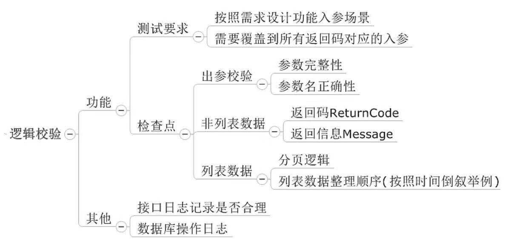
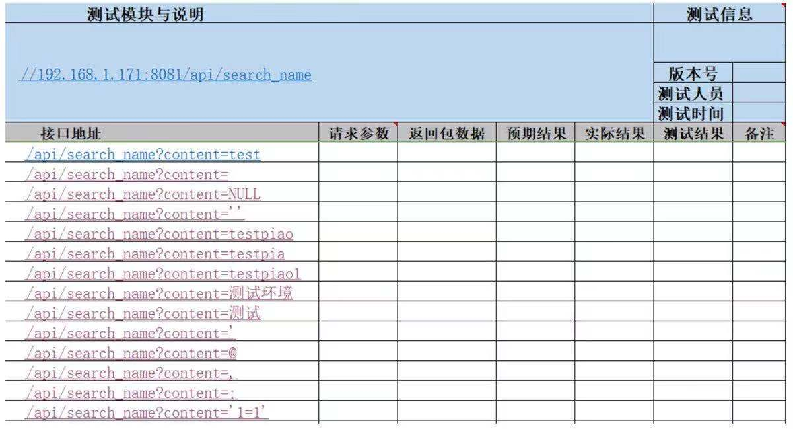

# thought
自动化=业务逻辑的抽象   
所以自动化不能提高测试的覆盖率，只是业务逻辑的一种体现，提高了一些效率而已。   
好处：无差异的执行   
效率高：项目比较稳定时执行的效率比手工高  
抛弃UI做接口是因为：接口是连接业务和数据的纽带，是业务逻辑的集中体现。实际中接口多以增量模式为主（保次原有逻辑不变，依据业务需要新增接口或抛弃原来接口），即稳定性比较高。   
务实做法：以提高效率来驱动自动化项目的开展和落实比追求华而不实的框架更加接地气。   
在自动化测试的过程中最害怕的就是变化，如何控制失败、降低维护成本，对自动化测试的成败至观重要。反过来说，一份永远运行成功的自动化测试脚本是没有价值的。   
接口测试：是用工具和代码来模拟请求和结果校验，以解放人力和保证持续、稳定地测试。  
单元测试：尽可能覆盖代码逻辑地每一条逻辑。   
JSON(JavaScript Object Notation)是一种轻量级的数据交换格式，它基于JavaScript的一个子集，易于人的编写和阅读，也易于机器解析    
## Get/Post方式的区别：  
*1.直观区别：对请求参数的处理方式不同。   
get：数据会附在URL之后，以“？”分隔URL和传输数据，如果有多个则使用“&”连接。（URL是ASCII编码格式而不是Unicode编码格式）  
post：放在HTTP请求包的Body数据中。（json格式）     
*2.传输数据的大小不同  
HTTP没有对于传输数据的大小及URL的长度进行限制。  
get：特定服务器、浏览器、以及操作系统的支持会对于URL的长度有一定的限制。  
post：理论上提交的数据大小不受限制。但实际web服务器（Apache、IIS6都有各自的配置）会对采用post方式提交的数据进行大小的限制。  
*3.安全性不同  
get：在地址栏可以看到请求数据。容易受到“Cross-site request forgery”：跨站请求伪造的攻击。   
post：需要抓包才可以获取数据，相对来说安全一点。  
## 接口测试的好处
1，传统测试成本增加，接口容易实现自动化可以减少人力及时间成本缩短测试周期支持后端版本的快速迭代。   
2，发现很多页面发现不了的bug。【绕过前端限制，看后端是否有限制】   
3，检查系统的异常处理能力【传入比较长的参数接口是否传传数据库有关的日志消息】   
4，检查系统的安全性、稳定性【SQL语句的前后端验证】       
前后端分离，只要双方均按照接口协议来，后端完成接口测试便可以保证业务逻辑的准确性。所以一般后端先上，前端再上线。  
## 答疑 
前端做了“非必填”校验了，为什么接口还要校验，这样是不是多此一举？   
答：双层保证。
前端：给用户友好的提示、最直接的系统保护，减少了对于后端的请求。【数据显示和交互】   
后端：如果前端没有做保护，后端不至于出错、另一方面如果客户绕过前端直接调用接口则不至于出错。【网站后台的逻辑设计、实现，以及用户及网站的数据保存和读取】
# fiddler
是一个中转站，也是代理服务器。所以它才能获取请求和响应数据。    
1，发送Http请求：composer中填写对应的方法及URL、参数->execute。查看返回数据在“inspector“中。    
2，获取PC端网络的数据包：
打开fiddler工具（使左下角的“Capturing”处于开启状态）->访问网站首页“登录账号”确定->在fiddler中找到“host”标题下对应的域名值->双击该条数据包->右侧展示具体的请求数据和返回数据。    
注意：  
capturing
All process 、WebBrowser、 Non_Browser   
3，获取手机端的网络数据包   
Fiddler可以获取APP数据请求的原因是：Fiddler是代理服务器。
配置代理的方法：
*1，手机连接的Wi-Fi和电脑在同一个网段。  
*2，fiddler设置为支持移动端连接：connections中勾选允许远程、监听端口：8888.单击“确定”按钮，重新启动fiddler。  
*3，cmd->"netstat-anop tcp"查看fiddler工具进程是否可以正常监听8888端口。   
   ipconfig->IPv4查看本机IP。   
*4，设置手机网络代理：IP及端口一致。   
*5，验证访问。  
注意：  
@1，测试完成关闭手机代理  
@2，在手机端抓包分析时可以让“Capturing”不显示。这样Fiddler就只显示主动发起的请求，而不会截取手机端所有的请求包。  
4，截包：截断请求数据包使其发送不到服务器、截断返回数据包不返回到前端。  
来模拟“等待服务器返回数据包”和“服务器端返回数据包超时”情况以测试前端页面如何处理。  
改包：修改请求数据包，再提交到服务器端，检查服务器端的处理情况。修改返回数据包，再提交给请求方检查请求方的处理情况。
5，Fiddler工具的其他功能
@1，辅助录制接口请求
@2，模拟低速网络环境：“Rules”-"Performance"-"Simulate" Modem Speeds

## 接口测试用例
接口 测试的设计包含两个维度：参数校验、逻辑校验
### 参数校验
梳理逻辑：接口完整的请求地址、参数要求、对于业务逻辑的分析得出查询的语句。
分解接口要点：参数本身（参数是否必填以及存在与否）、参数类型、参数长度、参数值SQL注入。
设计测试用例框架：使用Xmind梳理【要尽可能详细】
生成具体测试用例：一个参数时，多个参数（应保持一个参数在变化、其他参数不变化）   
@@SQL注入@@：   
指在不安全的控件内输入一些SQL语句或其它数据库的语句，从而欺骗服务器执行，进行影响数据库中的数据。即在提交请求时将请求数据替换成特殊的SQL语句，则服务端在没有对数据做处理的情况下直接处理来请求数据（主要在后台执行了SQL语句），从而得到非正常的返回结果。  
SQL注入防护
1，永远不要信任用户的输入，要对于用户的输入进行校验，可以通过正则表达式、限制长度、对单引号和双引号等进行转换。  
2，永远不要使用动态拼接sql，可以使用参数化的sql或者直接使用存储过程进行数据的存储与读取。  
3，管理员可以操作数据库做很多事情，而一些应用程序只需要查询权限，故不需要管理员权限。  
4，不要直接存放机密消息，应加密或使用hash算法对码和敏感的消息进行加密。  
5，对应用程序应给出尽可能少的提示消息。最好使用自定义的错误消息对原始错误消息进行包装。
6，检测sql注入一般采用软件或网站平台：软件一般采用SQL注入检测工具Jsky；网站平台一般采用亿思网站安全平台检测工具、MDCSOFT SCAN等。

逻辑校验：即本项目的业务逻辑

接口测试用例模版  
  
![接口用例模版2](../images/request-case2.jpeg

## Python
- 解释器  
在python执行的过程中，解释器起着“翻译”的作用，它把python 代码编译成能被机器识别的内容。最常用的是“CPython”  
**下载安装好python就获得了CPython，在命令行运行Python，就启动了CPython解释器**
- Python 的函数  
用于接收函数并返回执行后的结果。接口是必须要有的、否则返回的结果是None
## 使用python操作MySQL
见.rp文件中的流程图
## python 异常处理机制
主要依靠内置异常处理和logging日志