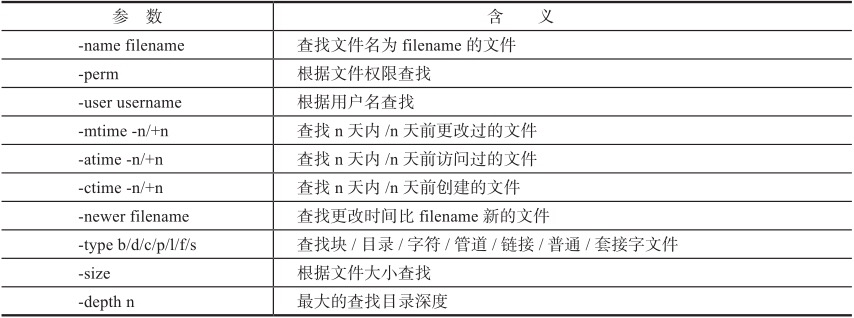

## 1.2 Linux的特点
从1991年问世到今天，Linux在服务器、桌面、行业定制等各级领域都获得了长足的发展，尤其在服务器领域获得了令人瞩目的成就，被业界认为是未来最有前途的操作系统之一。在嵌入式领域，由于Linux具有良好的移植性、丰富的代码资源等优点，也受到了越来越多的关注。
#### 下面我们就来看看这个操作系统有哪些主要特点。
* 1，免费开源
* 2，模块化程度高
* 3，广泛的硬件支持
* 4，安全稳定
* 5，多用户，多任务
* 6，良好的可移植性


## 1.3 系统安装
### Linux 系统安装前需要知道的概念
### 什么是交换分区？
* 交换分区是一个特殊的分区，它的作用相当于Windows下的虚拟内存，这个分区的大小一般设置为物理内存的两倍，但是不管物理内存有多大，交换分区建议不要超过8GB，因为大于8GB的交换分区其实并没有多大实际意义。
### 什么是Grub？(Grand Unified Bootloader)
* Grub是一个系统引导工具，通过它可以加载内核，从而引导系统启动。
### 什么是/boot分区？
/boot分区用于放置Linux启动所用到的文件，如kernel和initrd文件。
### 什么是DHCP？
DHCP是Dynamic Host Configuration Protocol的简写，中文称为动态主机配置协议。在TCP/IP网络中，每台主机都需要有IP地址才能与其他主机通信，在一个大规模的网络中，如果由管理员手动地对每一台主机进行IP地址配置是不现实的。由此也就产生了DHCP协议，可用它来对网络节点上的主机进行IP地址配置。


## 1.3 使用终端模式登录

如果现在在字符登录界面，默认屏幕上会显示如下内容：
* CentOS release 5.5 (Final)【发行版的名称（CentOS）和版本号（5.5）】
* Kernel 2.6.18-194.el5 on an i686【内核版本以及当前运行的硬件平台（i686）】
* Localhost login:root  【主机名（localhost），login后面等待用户输入，这里输入“root”】
* Password:【等待输入root用户的密码】
* Last login: Tue Oct  9 22:07:00 2012【当成功登录时，系统会显示出该用户上次成功登录的时间】
* “~”是用户home目录（又叫“用户家目录”）的简写。最后的 “#”是一个提示符，出现“#”说明目前的用户是有超级权限的root用户，而一般用户的提示符是“$”。现在已经登录到字符界面中了

## 1.4.4 开始学习使用Linux的命令
#### Linux下的命令是严格区分大小写的
* 1.显示日期：date  
 date命令后也可以加上一些“参数”来调整命令显示内容:date +%Y%m%d[命令和参数之间使用一个或者多个空格隔开。]
* 2.列出目录内容：ls    
详细显示当前目录下的所有文件:ls -l  
如果只是想详细显示其中一个文件，那么该怎么做呢？只要加上需要显示的文件就可以了:ls -l 1.txt
* 3.显示文件内容：cat
## 1.5 系统启动流程
#### 电脑在启动的过程一般都是按照由下向上的顺序进行启动，BIOS（Basic Input / Output System基本输入输出系统）就是直接与硬件打交道的底层代码，它为操作系统提供了控制硬件设备的基本功能。[这种通电后开始的自检过程被称为“加电自检”，英文中称为Power On Self Test，简称POST]
* 机器自检通过后，下面就要引导系统了。这个动作是BIOS设定的，BIOS默认会从硬盘上的第0柱面、第0磁道、第一个扇区中读取被称为MBR的东西，即主引导记录。
* Fdisk:DOS外部命令,给硬盘分区或查询硬盘分区状况
* 第三步就是顺理成章地运行Grub了。Grub最重要的功能就是根据其配置文件加载kernel镜像，并运行内核加载后的第一个程序/sbin/init，这个程序会根据/etc/inittab来进行初始化的工作。其实这里最重要的就是根据文件中设定的值来确定系统将会运行的runlevel
* 第四步，Linux将根据/etc/inittab中定义的系统初始化配置si::sysinit:/etc/rc.d/rc.sysinit执行/etc/rc.sysinit脚本，该脚本将会设置系统变量、网络配置，并启动swap、设定/proc、加载用户自定义模块、加载内核设置等。
* 第五步是根据第三步读到的runlevel值来启动对应的服务，如果值为3，就会运行/etc/rc3.d/下的所有脚本，如果值为5，就会运行/etc/rc5.d/下的所有脚本。
* 第六步将运行/etc/rc.local，第七步会生成终端或X Window来等待用户登录。
## 1.5.2 系统运行级别
* 何时候Linux只能在一种runlevel下运行。那么不同的runlevel之间到底有什么区别呢？上一节中提到，系统在启动的过程中会根据/etc/inittab中的设定读取runlevel的数值X，并相应地读取和运行/etc/rcX.d（X代表0～6）下所有的脚本
## 1.6 获得帮助
### 1.6.1 使用man page
#### 输入 `man ls`，就会有一大堆说明告诉你怎么使用了。
* 在查看man文件的时候，可以使用上下方向键阅读文件内容，也可以按空格键翻页，还可以使用关键字来搜索。
* 比如说在man ls的页面上，输入“/time”，按回车键，就可以看到关键字被标记了。
* 可以按小写字母n向下查找，也可以按大写的N向上查找，按小写字母q可以结束查看man文件。

### 在Linux下其中规定了以下9个man文件的种类：
常见命令的说明
可调用的系统函数库
设备文件
文件格式
游戏说明
杂项
系统管理员可用的命令
与内核相关的说明
有些命令会在好几个种类中存在，可以使用`man-f`来查询要找的命令存在于哪些man文件中.
### 1.6.2 使用info page
* info工具是一个基于菜单的超文本系统，包括少许关于Linux Shell、工具、命令的说明文档。比如可以在命令行中输入info ls来显示ls命令的说明文档：
* 可以按空格键向下翻页，按PageUp、PageDown键上下翻页，按q键退出info查询。
##  第2章 Linux用户管理
### 2.1 Linux用户和用户组
* Linux系统采用一个32位的整数记录和区分不同的用户，这意味着系统可以记录多达40亿个不同的用户。这个用来区分不同用户的数字被称为User ID，简称UID。系统会自动记录“用户名”和UID的对应关系。
#### Linux系统中的用户分为3类，即:
* 普通用户:普通用户即真实用户只能在其家目录、系统临时目录或其他经过授权的目录中操作，以及操作属于该用户的文件。通常普通用户的UID大于500
* 根用户：根用户也就是root用户，它的ID是0，也被称为超级用户，root账户拥有对系统的完全控制权：可以修改、删除任何文件，运行任何命令。所以root用户也是系统里面最具危险性的用户，root用户甚至可以在系统正常运行时删除所有文件系统，造成无法挽回的灾难
* 系统用户：系统用户是指系统运行时必须有的用户，但并不是指真实的使用者。比如在RedHat或CentOS下运行网站服务时，需要使用系统用户apache来运行httpd进程，而运行MySQL数据库服务时，需要使用系统用户mysql来运行mysqld进程。在RedHat或CentOS下，系统用户的ID范围是1~499
### 用户组
* 在Linux系统中除了有用户之外，还有“用户组”的概念，不同的用户组同样也是用数字来区分的，这种用于区分不同用户组的ID被称为Group ID，也就是GID。
### 如何查看自己的UID和GID呢
* 要确认自己的UID：id
* 要确认自己所属的用户组：groups
* 如果要查询当前在线用户，可在用户登录以后，使用命令：who

## 2.2 Linux账号管理
* 1.新增用户：useradd + 用户名
* 2.修改密码：passwd + 用户名
* 3.修改用户：usermod alice
* 4.删除用户：userdel alice
* 1.增加用户组：groupadd alice
* 2.删除用户组：groupdel Alice
* 1.查看用户：users、who、w
* 2.调查用户：finger
## 第3章 Linux文件管理
### 3.1 文件和目录管理
在Linux系统中也沿用了这种文件结构，所有目录和文件都在“根目录”下，目录名为“/”。FHS（文件系统层次标准）定义了在根目录下的主要目录以及每个目录应该存放什么文件。
### 3.1.1 绝对路径和相对路径
#### 绝对路径
* 1.比如：/usr/local/src目录。这种从根目录开始的全路径被称为“绝对路径”，绝对路径一定是以“/”开头的。
* 2.当前目录：pwd
* 3.特殊目录：（.）【代表的是当前目录】和（..）【当前目录的上层目录】
* 4.在Linux下，所有以点开始的文件都是“隐藏文件”，对于这类文件，只使用命令ls-l[显示文件权限]是看不到的，必须要使用ls-la【显示隐藏文件】才可以看到
### 相对路径
* 顾名思义，“相对路径”的关键在于当前在什么路径下
### 3.1.2 文件的相关操作
#### 1.创建文件：touch
* 如果在使用touch命令创建文件的时候，当前目录中已经存在了这个文件，那么这个命令不会对当前的同名文件造成影响，因为它并不会修改文件的内容，虽然实际上touch确实对该文件做了“修改”—它会更新文件的创建时间属性。
#### 2.删除文件：rm + 文件名【remove】
#### 3.移动或重命名文件：mv  【move】
* 后面需要跟两个参数，第一个参数是要被移动的文件，第二个参数是移动到的目录：mv test.txt /mnt/
* 该命令还能重命名文件：mv test.txt test.doc
* mv还可以在移动文件的同时重命名文件：mv test.doc /tmp/test1.doc
#### 4.查看文件：cat 【concatenate/ [kən'kætɪneɪt]：v. 连接，连结，使连锁】
* cat -n + 文件名：可以显示每行的行号。
#### 5.查看文件头：head
* 默认情况下，head将显示该文件前10行的内容
* 也可以使用-n参数（后面加数字）指定显示的行数
#### 6.查看文件尾：tail
* 默认情况下tail也是只显示文件的最后10行内容，同样可以使用-n参数指定显示的行数。
* 但是tail还有个更实用的功能，就是可以动态地查看文件尾。通过加`-f`参数来实现：tail-f /var/log/messages
#### 7.文件格式转换：dos2unix
* 因为Linux和Windows系统是可以通过文件共享的方式共享文件的，当把Windows下的文本文件移动到Linux下时，会由于系统之间文本文件的换行符不同而造成文件在Linux下的读写操作有问题。
* 该命令的使用方式非常简单直接，后面跟上需要转换的文件名即可。
### 3.1.3 目录的相关操作
* 目录的作用在于存放其他的目录和文件
#### 1.进入目录：cd【该命令是change directory的简写，方便用户切换到不同的目录.】
* cd 后面没有目录参数则默认进入到root的家目录
#### 2.创建目录：mkdir【make directory】
* 其用途是创建目录，使用方法是在后面跟上目录的名称
* 可以使用-p参数一次性创建所有目录：mkdir-p /root/dir1/dir2/dir3/dir4。这样就不需要进入制定目录创建之后再次重复了。
#### 3.删除目录：rmdir和rm
* rmdir：remove directory的简写，用来删除目录。但是需要注意的是，它只能删除空目录，如果目录不为空（存在文件或者子目录），那么该命令将拒绝删除指定的目录。
* 在使用rm删除目录时，最常用的组合参数是-rf，这样就不会有任何提醒了，可直接将目录删除干净。但是使用这个命令要极其小心，因为一旦删除了几乎是不可能恢复的了。
* 另外，由于root用户在Linux系统中的权限非常高，甚至可以用rm-rf /命令来删除全部的系统文件（这样做的后果是灾难性的），所以使用-rf参数删除目录一定要慎之又慎！
#### 4.文件和目录复制：cp
* 该命令是copy的简写，用于复制文件和目录。如果是复制文件，其后接两个参数，第一个参数是要复制的源文件，第二个参数是要复制到的目录或复制后的文件名
#####  复制文件的简单操作
* cp anaconda-ks.cfg /tmp/anaconda-ks-copy.cfg:复制到其它目录重命名
* cp anaconda-ks.cfg /tmp/ ：复制到其它目录不重命名
#####  复制目录的操作
* 复制目录同样也是使用cp命令。相对于复制文件，复制目录只需要使用-r参数即可
* cp -r a b:通过目录a，复制目录b
### 3.1.4 文件时间戳
* 之前在介绍touch命令的时候，已经知道通过touch可以创建新文件。如果文件已经存在，那么touch命令仅仅会更新文件的创建时间而不会修改文件内容
* 所以可以利用时间戳来进行差异化备份
## 3.2 文件和目录的权限
### 3.2.1 查看文件或目录的权限：ls-al
* ls-al格式化地输出了文件的详细信息，每个文件都有7列输出，
* 第一列是文件类别和权限，这列由10个字符组成，第一个字符表明该文件的类型。表3-2列出了第一个字符可能的值和所代表的含义。接下来的属性中，每3个字符为一组，第2~4个字符代表该文件所有者（user）的权限，第5~7个字符代表给文件所有组（group）的权限，第8~10个字符代表其他用户（others）拥有的权限。每组都是rwx的组合，如果拥有读权限，则该组的第一个字符显示r，否则显示一个小横线；如果拥有写权限，则该组的第二个字符显示w，否则显示一个小横线；如果拥有执行权限，则第三个字符显示x，否则显示一个小横线。
* 第二列代表“连接数”，除了目录文件之外，其他所有文件的连接数都是1，目录文件的连接数是该目录中包含其他目录的总个数+2，也就是说，如果目录A中包含目录B和C，则目录A的连接数为4。
* 第三列代表该文件的所有人，第四列代表该文件的所有组，第五列是该文件的大小，第六列是该文件的创建时间或最近的修改时间，第七列是文件名。
#### 文件类型示意图

### 3.2.2 文件隐藏属性
* 一些隐藏属性，必须使用lsattr来显示
* 要设置文件的隐藏属性，需要使用chattr命令
### 3.2.3 改变文件权限：chmod
* Linux下的每个文件都定义了文件拥有者（user）、拥有组（group）、其他人（others）的权限，我们使用字母u、g、o来分别代表拥有者、拥有组、其他人，
* 而对应的具体权限则使用rwx的组合来定义，增加权限使用+号，删除权限使用-号，详细权限使用=号
#### chmod用例

* 如果要给用户组或其他人添加或删除相关权限，只需要将上面的u相应地更换成g或o即可
* 如果要想同时设置所有人的权限就需要使用数字表示法了，我们定义r=4，w=2，x=1
* 假设想设置一个文件的权限是：拥有者的权限是读、写、执行（rwx），拥有组的权限是读、执行（r-x），其他人的权限是只读（r--），那么可以使用命令chmod 754 somefile来设置。
#### 如果需要修改的不是一个文件而是一个目录，以及该目录下所有的文件、子目录、子目录下所有的文件和目录（即递归设置该目录下所有的文件和目录的权限），则需要使用-R参数，也就是chmod-R 754 somedir。
### 3.2.4 改变文件的拥有者：chown
* 默认情况下，使用什么用户登录系统，那么该用户新创建的文件和目录的拥有者就是这个用户，比如使用root账户登录后，创建了一个文件a.txt，那么该文件的拥有者是root用户
* 要是想改变该文件的拥有者该怎么办呢？：chown john a.txt
* 该命令还可以同时更改文件的用户组。继续将该文件改为john用户组，使用方式如下：chown :john a.txt
* 如果需要修改的不是一个文件而是一个目录，以及该目录下所有的文件、子目录、子目录下所有的文件和目录（即递归设置该目录下所有的文件和目录的拥有者是john），则需要使用-R参数，也就是chown-R john somedir；如果要同时修改用户组为john，则使用chown-R john:john somedir。
### 3.2.5 改变文件的拥有组：chgrp
 * chgrp john b.txt：该命令用来更改文件的拥有组
 * 果需要修改的不是一个文件而是一个目录，以及该目录下所有的文件、子目录、子目录下所有的文件和目录（即递归设置该目录下所有的文件和目录的拥有组是john），则需要使用-R参数，也就是chgrp-R john somedir。
### 3.2.6 文件特殊属性：SUID/SGID/Sticky
### 3.2.7 默认权限和umask
* 就需要引入umask概念，中文翻译为：遮罩。在Linux下，定义目录创建的默认权限的值是“umask遮罩777后的权限”，定义文件创建的默认权限是“umask遮罩666后的权限”。系统在/etc/profile文件中，通过第51行至55行的一段代码设置了不同用户的遮罩值。
### 3.2.8 查看文件类型：file  + 文件/目录/文本
## 3.3 查找文件
#### 3.3.1 一般查找：find   find  PATH-name  FILENAME
* find /-name *.conf：以使用星号通配符来模糊匹配要查找的文件名
##### find常见参数示意图

### 3.3.2 数据库查找：locate
* 在运行locate命令的时候可直接到数据库中查找记录并打印到屏幕上，所以使用locate命令要比find命令反馈更为迅速。
* 在执行这个命令之前一般需要执行updatedb命令（这不是必须的，因为系统每天会自动检索并更新数据库信息，但是有时候会因为文件发生了变化而系统还没有再次更新而无法找到实际上确实存在的文件。所以有时需要主动运行该命令，以创建最新的文件列表数据库）
* find / -name *.txt
* find / -name test.txt
* updatedb            
locate test.txt
### 3.3.3 查找执行文件：which/whereis
* which用于从系统的PATH变量所定义的目录中查找可执行文件的绝对路径。比如说想查找passwd这个命令在系统中的绝对路径，
* 使用whereis也能查到其路径，但是和which不同的是，它不但能找出其二进制文件，还能找出相关的man文件：
## 3.4 文件压缩和打包
### 3.4.1 gzip/gunzip
### 3.4.2 tar
* tar不但可以打包文件，还可以将整个目录中的全部文件整合成一个包，整合包的同时还能使用gzip的功能进行压缩，比如说把整个/boot目录整合并压缩成一个文件。
* 下面的命令将/boot目录整合压缩成了boot.tgz文件:tar-zcvf boot.tgz /boot,这里-z的含义是使用gzip压缩，-c是创建压缩文件（create），-v是显示当前被压缩的文件，-f是指使用文件名，也就是这里的boot.tgz文件
解压命令如下: tar-zxvf boot.tgz,上面的命令会直接将boot.tgz在当前目录中解压成boot目录.
* 如需要指定压缩后的目录存放的位置，需要再使用-C参数。比如说将boot目录解压到/tmp目录中：tar-zxvf boot.tgz-C /tmp
### 3.4.3 bzip2
* 使用bzip2压缩文件时，默认会产生以.bz2扩展名结尾的文件，这里使用-z参数进行压缩，使用-d参数进行解压缩。
### 3.4.4 cpio
* 该命令一般是不单独使用的，需要和find命令一同使用。当由find按照条件找出需要备份的文件列表后，可通过管道的方式传递给cpio进行备份，生成/tmp/conf.cpio文件，然后再将生成的/tmp/conf.cpio文件中包含的文件列表完全还原回去。
## 第4章 Linux文件系统
### 4.1 文件系统
* 在Linux中采用的是文件系统+虚拟文件系统（Virtual File System，VFS）的解决方案。
### 4.1.1 什么是文件系统
* 文件系统是操作系统用于明确磁盘或分区上相关文件的方法和数据结构，通俗的说法就是在磁盘上组织文件的方法。在使用前，都需要针对磁盘做初始化操作，并将记录的数据结构写到磁盘上，这种操作就是建立文件系统，在有些操作系统中称之为格式化。
* 虽然文件系统多种多样，但是大部分Linux系统都具有类似的通用结构，包括超级块（superblock）、i节点（inode）、数据块（data block）、目录块（directoryblock）等
### 4.1.3 ext3文件系统简介
* ext2（The SecondExtended File System）文件系统.
* 果遇到问题需要检查文件系统或对ext3文件系统进行修复时，只需要检查日志即可，而ext2修复文件系统时，则需要遍历整个文件系统来检查文件的一致性信息，因此ext3节省了大量修复文件系统所需要的时间。不过，由于增加了日志功能，在存取数据时ext3文件系统要比ext2所做的写入操作多，但是ext3对写操作做了优化，使其性能不会比ext2低
### 4.2 磁盘分区、创建文件系统、挂载
* 磁盘使用前需要对其进行分割，这种动作被形象地称为分区。磁盘的分区分为两类，即主分区和扩展分区。受限制于磁盘的分区表大小（MBR大小为512字节，其中分区表占64字节），由于每个分区信息使用16字节，所以一块磁盘最多只能创建4个主分区，为了能支持更多分区，可以使用扩展分区（扩展分区中可以划分更多逻辑分区），但是即便这样，分区还是要受主分区+扩展分区最多不能超过4个的限制。在完成磁盘分区后，需要进行创建文件系统的操作，最后将该分区挂载到系统中的某个挂载点才可以使用。
#### 4.2.1 创建文件系统：fdisk
### 4.2.2 磁盘挂载：mount
### 4.2.3 设置启动自动挂载：/etc/fstab
##### 因为挂载只是暂时的—之前使用mount命令挂载的设备在你重启计算机之后就会消失，所以必须通过配置/etc/fstab使得系统在重启后能自动挂载。这里只需要如下一条命令即可：
 echo "/dev/sdb1 /root/newDisk ext3 defaults 0 0" >>/etd/fstab
### 4.2.4 磁盘检验：fsck、badblocks
## 4.3 Linux逻辑卷
* 计划赶不上变化，也许预估使用的比较多的分区后来实际使用得很少，而预估用得比较少的分区却又需要大量的空间。为了更好地使用磁盘空间，提高系统空间的可扩展性，此时就需要使用逻辑卷。
### 4.3.1 什么是逻辑卷？
* 逻辑卷就是使用逻辑卷组管理（Logic Volume Manager）创建出来的设备，也是Linux操作系统可以认识的设备
### 4.3.2 如何制作逻辑卷？
* 1.创建物理卷：pvcreate、pvdisplay
* 2.创建并查询卷组：vgcreate、vgdisplay
* 3.扩容卷组：vgextend
* 4.创建逻辑卷：lvcreate、lvdisplay
* 5.创建文件系统并挂载
## 4.4 硬链接和软链接
### 4.4.1 什么是硬链接
* 硬链接（hard link）又称实际链接，是指通过索引节点来进行链接。在Linux文件系统中，所有的文件都会有一个编号，称为inode，多个文件名指向同一索引节点是被允许的，这种链接就是硬链接
* touch hard01
* ls -li
* ln hard01 hard01_hlink
* 不允许给目录创建硬链接；只有在同一文件系统中的文件之间才能创建链接，即不同分区上的两个文件之间不能够建立硬链接
### 4.4.2 什么是软链接
* 软链接（soft link）又称符号链接（symboliclink），是一个包含了另一个文件路径名的文件，可以指向任意文件或目录，也可以跨不同的文件系统。软链接和Windows下的“快捷方式”十分类似，删除软链接并不会删除其所指向的源文件，如果删除了源文件则软链接会出现“断链”。
* ln -s file01 file01_slink
* ls -li
## 第5章 字符处理
### 5.1 管道
* 在Linux中也存在着管道，它是一个固定大小的缓冲区，该缓冲区的大小为1页，即4K字节。管道是一种使用非常频繁的通信机制，我们可以用管道符“|”来连接进程，由管道连接起来的进程可以自动运行，如同有一个数据流一样，所以管道表现为输入输出重定向的一种方法，它可以把一个命令的输出内容当作下一个命令的输入内容，两个命令之间只需要使用管道符连接即可。
* 如果想要看一下/etc/init.d目录下文件的详细信息，可以使用ls-l/etc/init.d命令，不过这可能会出现因输出内容过多而造成翻屏的情况，这样一来，先输出的内容在屏幕上就看不到了。其实这里就可以利用管道功能，将命令的输出使用more程序一页一页地显示出来。
* ls-l /etc/init.d | more
### 5.2 使用grep搜索文本
```python
[root@localhost ~]# grep [-ivnc] '需要匹配的字符' 文件名
#-i不区分大小写
#-c统计包含匹配的行数
#-n输出行号
#-v反向匹配
```
* grep -n 'name' teA.txt :不区分大小写,打印包含'name'
* grep -i 'name' teA.txt :区分大小写，打印包含'name'
* grep -ci 'name' teA.txt：区分大小写，统计3
* grep -c 'name' teA.txt：不区分大小写，统计2
* grep -v 'name' teA.txt：反选
* 以上命令都可以使用cat命令+管道符改写。比如上一个命令可以这样改写： cat toA.txt | grep-vi 'name'
### 5.3 使用sort排序
```python
[root@localhost ~]# sort [-ntkr] 文件名
#-n采取数字排序
#-t指定分隔符
#-k指定第几列
#-r反向排序
```
* cat sort.txt  | sort -r
* cat sort.txt  | sort -t ':' -k 2 -n
### 5.4 使用uniq删除重复内容
```python
[root@localhost ~]# uniq [-ic]
#-i忽略大小写
#-c计算重复行数
```
* 如果文件（或标准输出）中有多行完全相同的内容，我们很自然希望能删除重复的行
* cat uniq.txt | sort | uniq-c:uniq一般都需要和sort命令一起使用，也就是先将文件使用sort进行排序（这样重复的内容就能显示在连续的几行中），然后再使用uniq删除掉重复的内容（uniq的作用就在于删除连续的完全一致的行）
### 5.5 使用cut截取文本
* 顾名思义，cut就是截取的意思，它能处理的对象是“一行”文本，可从中选取出用户所需要的部分。在有特定的分隔符时，可以指定分隔符，然后打印出以分隔符隔开的具体某一列或某几列，
* 这里cut的用法如下： cut-f指定的列-d'分隔符'
* cat /etc/passwd | cut-c1-5,7-10
### 5.6 使用tr做文本转换
* tr命令比较简单，其主要作用在于文本转换或删除。这里假设要把文件/etc/passwd中的小写字母转换为大写字母，然后再尝试删除文本中的冒号，如:
* cat /etc/passwd | tr '[a-z]' '[A-Z]'
* cat /etc/passwd | tr ':' 
### 5.7 使用paste做文本合并
* paste的作用在于将文件按照行进行合并，中间使用tab隔开。假设有两个文件分别为a.txt、b.txt，下面使用paste命令来合并文件.
* paste -d: 1.txt a.txt
### 5.8 使用split分割大文件
## 第6章 网络管理
### 6.1.1 使用ifconfig检查和配置网卡
### 6.1.2 将IP配置信息写入配置文件
*  yum install net-tools
* ipconfif
### 6.2 路由和网关设置
* route del/add default gw 192.168.159.2:添加删除网关（路由）
* route -n：查看系统当前的路由表。
* 同样的，如果只使用route命令添加网关，一旦系统重启，配置信息就不存在了，必须将这种配置信息写到相关的配置文件中才能永久保存。可以在网卡配置文件中使用GATEWAY变量来定义网关，只需要添加如下部分到ifcfg-eth0中即可，当然别忘了重启网络服务使配置生效。
* 另外，在配置文件/etc/sysconfig/network中添加这段配置也能达到同样的效果。
### 6.4 网络测试工具
#### 6.4.1 ping(检查网卡硬件)
* ping程序的目的在于测试另一台主机是否可达，一般来说，如果ping不到某台主机，就说明对方主机已经出现了问题，但是不排除由于链路中防火墙的因素、ping包被丢弃等原因而造成ping不通的情况
对端主机在接收到这个包后会回应一个ICMP的reply回应包。在Linux下ping命令并不会主动停止，需要使用Ctrl+C组合键来停止，
### 6.4.2 host
* host命令是用来查询DNS记录的，如果使用域名作为host的参数，命令返回该域名的IP

## 第7章 进程管理