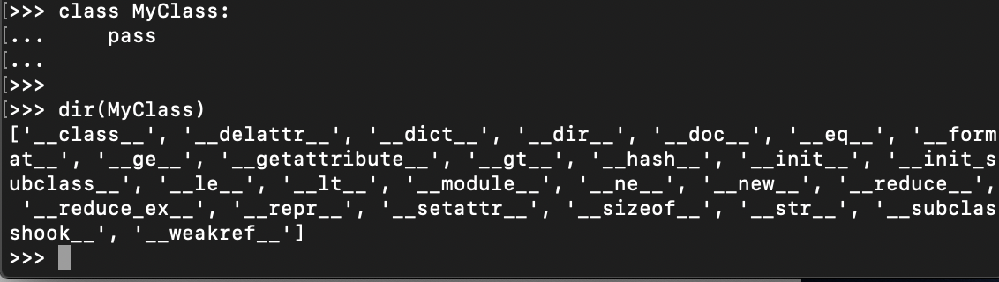

## 1，python 自定义函数
###  1.1.1声明/定义函数
```python
def hello():   #没有参数时，包含参数的圆括号也必须带上
    print('你好，python！')
    # return('返回值')
hello()  # 你好，python！  调用参数，无参数时圆括号也应该加上
print( hello() )  #你好，python！   None    
```
* 完整的函数是由 `函数名`,`参数`, `函数体`（在函数声明中，使用缩进表示语句属于函数体组成 。）
* 定义函数时，参数列表和返回值不是必须的，`return` 后也可以不跟返回值，甚至连`return`也没有。对于`return`后没有返回值的和没有`return`语句的函数都会返回`None`。
* python中声明一个函数不需要声明函数的返回值类型，也不需要声明参数的类型。
### 1.1.2调用函数
* 调用自定义函数和内建函数的方法是一样的。  
即：函数名之后使用圆括号将调用参数括起来，而多个参数之间则用逗号隔开。如调用的函数没有参数也必须在函数名后面加圆括号。

## 2，函数参数
### 2.1 默认值参数
```python
def hello(name='python'):
    print('你好，%s!' % name)
print('无参数调用时的输出')
hello()  #你好，python!
print('有参数（“Json”）调用时的输出')
hello('Json')  #你好，Json!
```
* 若无参数调用，则参数会自动赋值函数定义的参数。若调用加连参数，则`name` 会被赋值所给的参数。

```python
def test(e = 3,a):
    pass
# def test(e = 3,a):
            ^
# SyntaxError: non-default argument follows default argument
```
* 若声明一个函数即包含有默认值的参数，又包含没有默认值的参数，那么`声明函数参数时，必须先声明无默认值的参数`
## 2.2 可变数量参数传递
```python
def change_para_num(*tpl):
    print(type(tpl))
    print(tpl) 

change_para_num(1)   #<class 'tuple'>     (1,)
change_para_num(1,2,3)   #<class 'tuple'>    (1, 2, 3)
```
* 【可变参数】定义函数时，如果参数前面加一个 `*` 则表示该参数是一个可变长参数。
在调用该函数时：`如果依次将所有的其它变量都赋值之后，剩余的参数将会收集在一个元组中，元组的名称就是前面带星号的参数`
```python
def change_para_dict(a, b = 0, **adct):
    print('adct:', adct)
    print('a:', a)
    print('b:', b)
change_para_dict(1, k = 3, b = 2, c = 3)
""" 
adct: {'k': 3, 'c': 3}
a: 1
b: 2
"""
```
* 【关键字参数】使用元组收集参数的参数时，调用时提供的参数不能为关键字参数。  
如果要收集不定数量的关键字参数可以在自定义函数时的参数前加 `**valuename`,这样多余的关键字参数就可以字典的方式收集到变量valuename之中。
* 函数在调用的时候，提供的非关键字参数必须在关键字参数之前。
```python
def cube(name, **nature):
    all_nature={'x':1,
        'y':1,
        'z':1,
        'color':'white',
        'weight':1}
    all_nature.update(nature)
    print(name,'立方体的属性：')
    print('体积：',all_nature['x']*all_nature['y']*all_nature['z'])
    print('颜色：',all_nature['color'])
    print('重量：',all_nature['weight'])

cube('first')
cube('scond',y = 2,color = 'red')
cube('scond',z = 2,weight = 10)
""" 
first 立方体的属性：
体积： 1
颜色： white
重量： 1

scond 立方体的属性：
体积： 2
颜色： red
重量： 1

scond 立方体的属性：
体积： 2
颜色： white
重量： 10
"""
```
* 这种收集字典的方式为函数中大量使用默认值的方式提供了方便，不用把大量的默认值放在函数声明的参数中，而是放在程序中。

* `nature` :关键字参数,  `all_nature` :函数体中的默认参数字典。
* 使用字典的`update()` 函数将调用时提供的关键字参数更新至默认参数字典中，使用时直接从字典中获取。
### [这些参数在书写时要遵循一定的顺序即：*位置参数、默认参数、变长参数、关键字参数、命名关键字参数*]
## 2.3 拆解序列的函数调用
```python
def mysum(a, b):
    return a+b

print('拆解元组调用')
print(mysum(*(3,4)))
print('拆解字典调用')
print(mysum(**{'a':3,'b':4}))

""" 
拆解元组调用
7
拆解字典调用
7
"""
```
*使用函数调用时提供的参数都是位置参数和关键字参数，实际上调用函数时还可以把元组和字典进行拆解调用
## ****2.4函数调用时参数的传递方法****
* python中的元素有可变化和不可变化之分。
* 不可变化的：整数、浮点数、字符串、元组等
#### 为什么不可变化？
原因：`=`  的作用是将对象的引用与内存中某个对象进行绑定。
* 可变的：列表、字典【原因：可以增减修改元素的值】
* 在函数调用时，若提供的是不可变参数，那么在函数内部进行修改时，在函数外部的值是不变的；若提供的参数是可变参数，则在函数内部修改时，函数外部也会改变。
## 2.4 变量的作用域
在python中变量的作用域可以分为：
* 内置作用域：Python预先定义的
* 全局作用域：所编写的整个程序
* 局部作用域：某个函数内部范围【每次执行函数时创建一个新命名空间】


* 小结：

1）参数的传递是通过自动将对象赋值给本地变量名来实现的
函数参数在实际中只是Python赋值的另一个实例而已，因为引用可以是以指针的形式来实现的，所有的参数实际上都是通过指针进行传递的，作为参数被传递的对象从来不自动拷贝

2）在函数内部的参数名的赋值不会影响调用者
在函数运行时，在函数头部的参数名时一个新的、本地的变量名，这个变量名是在函数的本地作用域内的，函数参数名和调用者作用域中的变量是没有区别的

3）改变函数的可变对象参数的值也许会对调用者有影响
换句话说，因为参数是简单地赋值给传入的对象，函数就能够就地改变传入的可变对象，因此其结果会影响调用者；可变参数对函数来说可以做输入和输出的

Python的通过赋值进行传递的机制与C++的引用参数选项不完全相同，但是实际中，它与C语言的参数传递模型相当类似：

1）不可变参数“通过值”进行传递
像整数和字符串这样的对象是不可变对象，它们通过对象引用而不是拷贝进行传递的，但是因为无论如何都不可能在原处改变不可变对象，实际的效果就很像创建了一份拷贝

2）可变对象是通过“指针”进行传递的
列表和字典这样的对象也是通过对象引用进行传递的，这一点与C语言使用指针传递数组很相似，可变对象能够在函数内部进行原处的改变，这一点和C数组很像

## 3，面向对象编程
* 使用函数来解决相关问题的程序叫面向过程编程。
* （Obgect Oriented Programming）：oop面向对象程序设计。对于现实中的事物进行抽象模拟出来的模型我们称之为 `对象（实际事物）` 或 `类（程序中的方式）`
###  3.1   对象（类）的优越性
 * 封装：(将对象的属性和能力包装在一起，需要对外展示的，其它对象才能得到或使用它，而不需要对外展示细节，则隐藏在对象的内部。同时，对象也使同一事物的属性与方法聚合在一起，而不能随便在别的什么地方定义)
 * 继承：(指通过获取父对象的属性及能力，再加上自定义的属性和能力而成为一个对象的子对象或一个类的子类。通过继承可以快速地对对象建模，进而可以节省大量的时间去写已经存在的代码，还可以又不失灵活的去修改父对象的某些属性和能力)
 * 包含：(指在对象建模的时候，还可以对对象模型进行细分，即将一个对象划分为几部分，分别进行建模，最后将他们组装在一起成为一个完整的对象)

### 3.2类和对象
* 具有相同属性和能力的模型在面向对象编程中以 `类` 进行定义和表示，由类可以（`实例化`）出同类的各个实例。
* ** `类`实例化之后成为 `对象`**
### 3.3定义类和使用类
在python中没有继承其它类的类，会自动继承系统中内建的类 `object`

## 3.3.1 定义类
```python
class<类名><父类名>:  
    pass
# class：定义类的关键字
# 类名：符合标志规范的名称
# 父类名：该类继承的父类名称【此名称可选，如果该类不继承其它类可以连同括号都不写】
# pass：空语句【预留位置】
```
* 用一个单位缩进表示它属于这个`类`定义的一部分。
### 3.3.2 使用类
* 类定义之后必须先实例化才能使用，类的实例化跟函数调用类似，只要使用类名加圆括号就可以实例化一个类。
* 类实例化之后会生成该类的一个实例，一个类可以实例化成多个实例，实例与实例之间并不会相互影响，类实例化之后就可以直接使用了。
```python
class MyClass:
    "MyClass help."
myclass = MyClass()
print('输出类说明：')
print(myclass.__doc__)
print('显示类帮助信息：')
help(myclass)

```
* 没有继承的父类名称时实例化也需要加圆括号。
### 3.4.1 类的属性和方法--类的方法
* 类的方法实际上是为类的能力建模的，那么定义类的方法让类具有一定的能动性。
* 类的方法定义和调用与函数定义和调用的方式基本相同，其区别有：
 * 1，方法的第一个参数必须是 `self`，而且不能省略；
 * 2，方法的调用需要实例化，并以 `实例名字.方法名（参数列表）形式调用`；
 * 3，整体进行一个单位的缩进，表示其属于实体中的内容。 
 ```python
 class SmplClass:

    def info(self):
        print('我定义的类')

    def mycalc(self, x, y):
        return x + y

sc = SmplClass()
print('调用 info 方法的结果：')
sc.info()
print('调用 mycalc 方法的结果：')
print(sc.mycalc(3, 4))
""" 
调用 info 方法的结果：
我定义的类
调用 mycalc 方法的结果：
7
"""
 ```
 * 定义方法时也可以像定义函数一样声明各种形式的参数，方法调用时不用提供 `self`参数。
 ## 3.4.2构造方法：即 `__init__()` 方法
 ```python
 class DemoInit:

    def __init__(self, x, y = 0):
        self.x = x
        self.y = y

    def mycalc(self):
        return self.x + self.y

dia = DemoInit(3)
print('调用mycacl方法结果1: ')
print(dia.mycalc())

dia = DemoInit(3, 7)
print('调用mycacl方法结果2: ')
print(dia.mycalc())
""" 
调用mycacl方法结果1: 
3
调用mycacl方法结果2: 
10
"""
 ```
 * 构造方法中有参数，实例化时也必须提供参数。
 * 类方法中的 `self`可以继承构造函数传给类参数的属性。

 ```python
 def coord_chng(x,y): # 定义全局函数，模拟坐标变换值，求绝对值
    return (abs(x), abs(y))

class Ant: #定义一个类

    def __init__(self, x1 = 0, y1 = 0):  # 定义一个构造方法
        self.x = x1
        self.y = y1
        self.disp_point() #构造函数中调用类中的方法

    def move (self, x, y ):
        x, y = coord_chng(x, y)
        self.edit_point(x, y)
        self.disp_point()

    def edit_point(self, x2, y2):
        self.x += x2
        self.y += y2
    
    def disp_point(self):
        print("当前位置：（%d,%d)" %(self.x, self.y))
   
ant_a = Ant()
ant_a.move(2,4)
ant_a.move(-9,6)
 ```
 * 类的方法中即可以调用本类中的方法，也可以调用全局函数，形式：`self.方法名(参数列表)`
## 3.4.3 类的属性
```python
class Demo_property:
    class_name = "Demo_property" #类属性

    def __init__(self, x1 = 0):
        self.x = x1 #实例属性
    def class_info(self):
        print('类变量值： ',Demo_property.class_name)
        print('实类变量值： ',self.x)
    def chng(self,x2):  #修改实例属性的方法
        self.x = x2  # 【注意实例属性的引用方法】
    def chng_cn(self,name):   #修改类属性的方法
        Demo_property.class_name = name   #【注意类属性的引用方法】

dpa = Demo_property() #实例化dpa
dpb = Demo_property()  #实例化dpb，两个对象dpa、dpb
print("初始化两个实例")
dpa.class_info()
dpb.class_info()
print("修改实例变量")
print("修改dpa实例变量")
dpa.chng(3)
dpa.class_info()
dpb.class_info()
print("修改dpb实例变量")
dpb.chng(10)
dpa.class_info()
dpb.class_info()
print("修改类变量")
print("修改dpa类变量")
dpa.chng_cn('dpa')
dpa.class_info()
dpb.class_info()
print("修改dpb实例变量")
dpb.chng_cn('dpb')
dpa.class_info()
dpb.class_info()

""" 
初始化两个实例
类变量值：  Demo_property
实类变量值：  0
类变量值：  Demo_property
实类变量值：  0
修改实例变量
修改dpa实例变量
类变量值：  Demo_property
实类变量值：  3
类变量值：  Demo_property
实类变量值：  0
修改dpb实例变量
类变量值：  Demo_property
实类变量值：  3
类变量值：  Demo_property
实类变量值：  10
修改类变量
修改dpa类变量
类变量值：  dpa
实类变量值：  3
类变量值：  dpa
实类变量值：  10
修改dpb实例变量
类变量值：  dpb
实类变量值：  3
类变量值：  dpb
实类变量值：  10
"""
```
python 语言中类的属性有两类：
* 实例属性:同一个类的不同实例，其值不相互影响也不相互关联.定义时使用 `self.属性名`调用时也使用它。
* 类属性:是同一个类的所有实例共有的，直接在类体中独立定义，引用时要用  `类名.类变量名` 的形式引用，只要某个实例对其进行修改，就会影响其它的所有这个类的实例。

## 3.4.4 类成员方法与静态方法
类的属性有`类属性`和`实例属性`。类的方法也有不同的种类，主要有：
* 实例方法：其隐含调用参数是类的实例
* 类方法：类方法隐含调用参数则是类,使用`@classmethod`进行修饰，必须有默认参数`cls`.
* 静态方法：没有隐含调用参数。使用`@staticmethod`进行修饰，`没有默认参数`.
类方法和静态方法的调用方式可以直接由类名进行调用，调用前也可以不实例化类，当然也可以用该类的任一个实例来进行调用。  
** 在静态方法和类方法中不能使用实例属性，但实例可以使用他们 **
```python
class DemoMthd:
    @staticmethod
    def static_mthd():
        print("调用了静态方法")
    @classmethod
    def class_mthd(cls):
        print("调用了类方法")
DemoMthd.static_mthd()
DemoMthd.class_mthd()
dm = DemoMthd()
dm.static_mthd()
dm.class_mthd()
""" 
调用了静态方法
调用了类方法
调用了静态方法
调用了类方法
"""
```
## 4.1 类的继承
类是可以继承的，子类继承父类，就具有了父类的属性和方法，但`不可以继承父类但私有属性和私有方法（属性名和方法名前面加两个下划线的）`。
* 子类还可以重载来修改父类的方法，以实现与父类不同的行为表现或能力。
```python
class Ant:  # 定义类

    def __init__(self, x1 = 0, y1 = 0, color1 = 'black'): #定义构造方法
        self.x = x1
        self.y = y1
        self.color = color1
    
    def crawl(self, x2 ,y2):
        self.x = x2
        self.y = y2
        print('爬行')
        self.info()
    
    def info(self):
        print('当前位置:(%d,%d)' %(self.x, self.y))
    
    def attack(self):
        print("用嘴咬")
class FlyAnt(Ant):

    def attack(self):  #方法重新载，即子类实例化时调用attack方法时，就会直接调子类中的方法，不会调用父类中同名的方法。
        print("用尾针")
    
    def fly(self, x3, y3):
        print('飞行。。。。')
        self.x = x3
        self.y = y3
        self.info()
flyant = FlyAnt(color1='red')
flyant.crawl(3, 5)
flyant.fly(10, 14)
flyant.attack()
""" 
爬行
当前位置:(3,5)
飞行。。。。
当前位置:(10,14)
用尾针
"""
```
## 4.2 多重继承
在类定义继承父类的括号中，`以“，”分隔要多重继承的父类即可`
* 在多重继承时，继承顺序也是一个很重要的要素，即如果继承的父类中有相同的方法名，但在类中使用时为指定父类名，则Python解释器将从左到右搜索，即调用先继承的类中的同名方法。
## 5，集合
###  5.1 split 函数
```python
str = "hello boy<[www.baidu.com]>byebye"

# str = str.split('[') # [ 'hello boy<', 'www.baidu.com]>byebyye' ]
# str = str[1] # 'www.baidu.com]>byebye'
# str = str.split(']') # [ 'www.baidu.com', '>byebye' ]
# str = str[0]

# print('str:', str)

str = str.split('[')[1].split(']')[0]
print('str:', str)
```
1、split()函数
语法：str.split(str="",num=string.count(str))[n]

参数说明：
str:表示为分隔符，默认为空格，但是不能为空('')。若字符串中没有分隔符，则把整个字符串作为列表的一个元素
num:表示分割次数。如果存在参数num，则仅分隔成 num+1 个子字符串，并且每一个子字符串可以赋给新的变量
[n]:表示选取第n个分片

注意：当使用空格作为分隔符时，对于中间为空的项会自动忽略

 

2、os.path.split()函数
语法：os.path.split('PATH')

参数说明：

1.PATH指一个文件的全路径作为参数：

2.如果给出的是一个目录和文件名，则输出路径和文件名

3.如果给出的是一个目录名，则输出路径和为空文件名

* split()的时候，多个空格当成一个空格；split(' ')的时候，多个空格都要分割，每个空格分割出来空。

## 6， 网络编程
* 计算机网络：是一些相互连接的自主计算机或设备的集合，它是计算机技术和通信技术相结合的产物。
* 互联网（Internet）：网络（局域网、城域网、广域网）大多相互连接在一起，就形成了互联网
* 网络传输协议：网络进行数据交换与传输所需要的规则、标准或约定。主要有语法（数据与信息的结构）、语义和同步（数据的实现顺序）三个要素组成。

### 地址与接口
* 目前广泛使用的地址是IPv4版本的地址，使用32位二进制代码表示网络地址。为了方便使用把32位分为4个8位的二进制代码，并把其转换位十进制，中间使用`.`来分隔，称位点分十进制表示法。
* 端口：在同一个计算机中可以同时运行多个网络程序，协议如何区分不同的网络程序传输的数据呢？，这就是端口的使用。
* TCP/IP协议规定端口的取值范围为 `0～65535`,总共`65536`个。

范围|作用
----|------
0～1023 | 周知端口，一般都有固定的协议使用
 1024～49151 | 注册端口，程序员可以自由注册使用
 49152～65535 | 动态端口，由操作系统动态分配

 ## 套接字的使用
 TCP/IP协议中TCP、UDP协议都通过一种名为套接字（socket）来实现网络功能。套接字是一种类文件对象，它使程序能接收客户端的连接或建立对客户端的连接，用以发送和接收数据，不论是客户端还是服务器端程序，为了进行网络通信都需要创建套接字对象。 
 ## 用 socketserver 模块建立服务器
 python 标准库中提供了一个创建网络服务器的框架--socketserver
 ## urllib 与 HTTP 包使用
 * python标准库的 socket 模块主要应用与底层网络协议。urllib 与 HTTP主要是针对应用层的协议。

# 使用 smtplib 库发送邮件

# 数据库编程
* 数据库：是指以一定的方式存储在一起、能为多个用户共享、具有尽可能小的冗余度、与应用程序彼此独立的数据集合。
* 数据库管理想系统（DBMS）：是为管理数据库设计的软件系统，它一般具有查询、存储、截取、安全保障和备份等功能。
