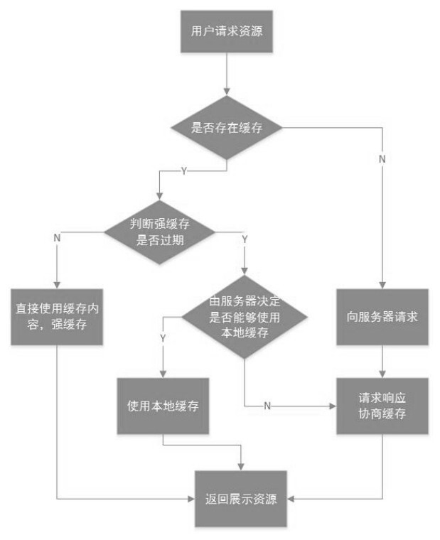
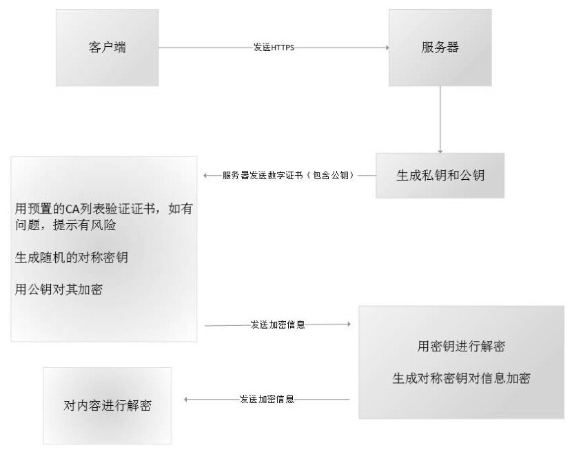
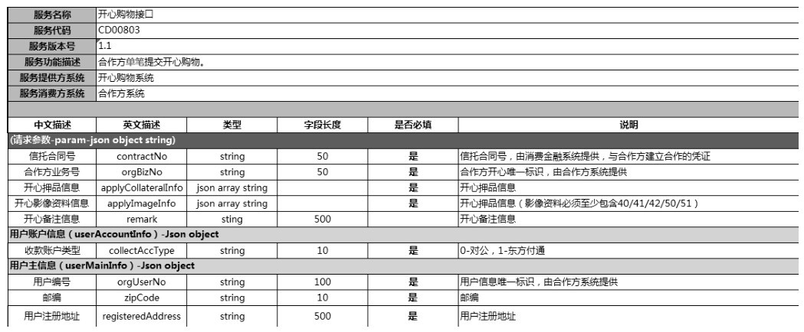
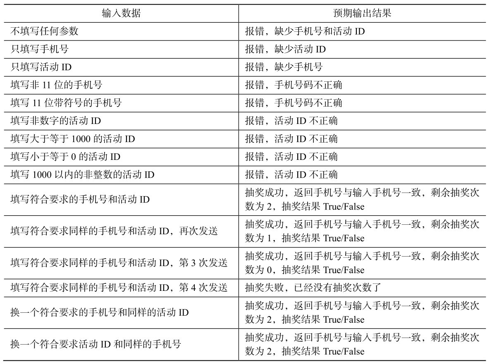
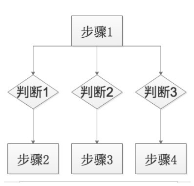
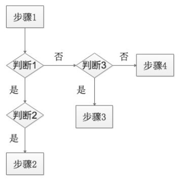
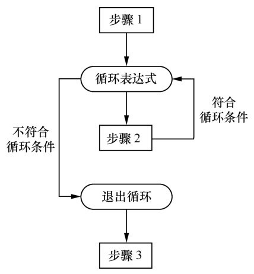

## 1 软件测试基础
* 功能测试只关注外部结构，不考虑内部逻辑，主要针对软件界面和软件功能进行的测试
#### 1.1 工程师阶
### 按项目开发阶段来划分：
* 单元测试：对于软件中的基本组成单元进行测试。方法包括控制流测试、数据流测试、排错测试、分域测试。【在这之前开发单元测试自测也很重要，可以有效减少项目成本代价】
* 集成测试：开发做的，即接口联调【主要有自顶向下和自低向上两种】。测试人员做的即接口测试。【分为系统层面：模块与模块，系统与系统之间的接口传输是否正常。代码层面：类与方法的调用】
* 系统测试：测试接触最多的测试，对集成好的软件进行测试，以验证软件系统功能的正确性和性能等是否能满足其规格需求说明书所指定的要求。
* 验收测试:Alpha（灰度测试）测试与Beta（真实使用，业务运维人员）测试
### 按测试执行类型：
* 功能测试：主要高级测试也用例，测试员执行
* 自动化测试：适合以及稳定成熟的项目
* 性能测试：负载压力测试，即用户体验
* 安全测试：静态的代码安全测试、动态的渗透测试和程序数据扫描（工具：RSAS、AWVS、APPscan、jsky、burpsuite）
### 按测试技术的不同分为：
* 黑盒测试：功能测试，方法：等价类划分、边界值分析、因果图分析、错误推测法等
* 白盒测试：即单元测试
* 灰盒测试：接口测试
#### 功能测试用例架构=测试用例整体需求+测试用例层级关系
## 1.2专家阶【需要储备的技术】
* js/css前端技术：例如前端数据正确性的校验
* 网络架构：C/S（Client/Server）、B/S（Browser/Server）
* 网络协议
* DNS解析：（Domain Name Service ）就是把域名解析成IP的过程。DNS劫持原理：简单来说就是计算机中病毒，病毒修改来计算机的DNS设置。高级的做法是入侵正常的DNS服务器，改掉域名和IP的正确对应关系。
* 负载均衡策略：CDN（Content Delivery Network）通过在网络各处放置节点服务器所构成的在现有的互联网基础之上的一层智能虚拟网络。分配原则：就近分配、负载均衡分配、手动分配
* Linux 系统基本操作
* 数据库知识：让测试结果不受前端影响，专家级的测试可以通过修改构架数据库创建测试环境。
## 1.3总监级
* 年度总结及计划
## 1.4 并发测试
* 点层面并发
* 线层面的并发
## 1.5 自动化测试
* 手工测试的目的在于通过破坏发现系统有bug，自动化测试的目的在于‘验证’系统没有bug。所以自动化测试只能选一些稳定重要的功能来做，而更多的一些测试需要手工来测。
##  2 Python的环境准备
##  3 Python的基础
* 换行表示一条语句。缩进表示层级关系。
* python和 其它语法的不同：赋值不需要声明变量，而且变量可以存储任何值（变量的第一个字母必须是字母或者下划线，但不能是数字）
* 变量不仅可以赋值各种类型，而且还可以随意改变类型
* 全局变量就是对于整个文件产生作用，也就是说该变量直到程序结束才会被回收（使用时需要加global（变量名））。局部变量只能对于某一部分代码产生作用，一旦这部分代码结束，这个变量就会被回收。
#### python的逻辑运算
```python
a = 3
b = 4
print(a and b)
print(a or b)
print(not a)
""" 
4
3
False
"""
```
* 逻辑与运算：只有为True时，才会去计算y的值。
* 逻辑或运算：只有当x为Flase时，才会去计算y的值

```python
a = 0
b = 4
print(a>b and a==b)
print(a<b or a==b)
print(not a!=b) 
"""
False
True
False 
"""
```
* 关系运算的优先级大于逻辑运算
#### python 的数据结构
列表可以通过 `+`进行合并，字典也可以通过 `update` 进行合并，不同的是列表可以合并重复的数据但不会被替代，但字典中如果有重复的 `键`是可以被替代的，那么就会被新的键的值替换掉。
#### 函数
* 一段代码的集合，可以被重复调用，也可以理解为处理事物的方法。
* 定义函数时创建的参数是：形式参数。形式参数也可以有默认值，当调用的时候函数不加实际参数，就以定义函数时参数的值作为实际参数；当调用函数加上实际参数，则实际参数的值替代原来的参数。
### 函数的返回值
```python
def add(a = 1,b = 2):
    c = a + b
    return a, b, c
print(add())
x, y, z  = add()
print(x, y, z )
""" 
(1, 2, 3)
1 2 3
 """
```
* python中没有返回值时，不会报错只会返回 `None`,实际我们需要保存结果，需要 `return`结果。
### 函数的嵌套
即在函数中相互嵌套调用，嵌套有多种形式
### 字符串处理
`s = str(任意数据类型) `
*字符串的拼接是通过 `+`来完成的，前提条件`+`连接左右的均应该为字符串，否则会`TypeError`
### 字符串截取
* 即可以使用切片（字符串比较长的时候不可取）、也可以使用 `split()`（一般有一定的规则）函数。又或者使用 `正则表达式`（需要一定的编码基础和强大的分析能力）。
### 字符串的替换
* 需要使用 `replace()`函数，语法结构：`replace(‘原字符串’，‘替换字符串’，替换次数)`
* 注意：`replace()`只是替换了其副本、并不会改变原来的字符串。
##  4，接口测试的基础
#### 4.1.1网络传输基础
* 超文本传输协议（HTTP）：是一种分布式、合作式超媒体信息系统。它是一种通用的、无状态（stateless）的协议，除了应用于超文本传输外，它也可以应用于诸如名称服务器和分布对象管理系统之类的系统，这可以通过扩展它的请求方法、错误代码和报头来实现。HTTP 的一个特点是数据表现形式是可输入的和可协商性的，这就允许系统能被建立而独立于数据传输。
#### 协议类型
* 每个协议可能需要获取不同的信息，即格式及传输的数据内容不同。所以协议可以分为很多种类，网络传输协议可以分为HTTP协议、HTTPS协议以及WebSocket协议等。
#### 4.1.2 Cache
##### 一个优秀的缓存策略可以为网络传输带来以下两方面的好处：
* 1. 减少延迟：因为发出的网页请求是指向更近客户端的缓存而不在是服务器。
* 2. 降低网络负荷：因为缓存文件可以重复使用，节省了不少的带宽，降低了网络负荷。站在用户的角度也节省了不少流量。
* 缓存概念：使用缓存Cache的站点会监听客户端向服务器发出的请求，并根据相应的缓存设置保存服务器端反馈的数据，比如KHTML页面、图片等文件。如果用户再次使用相同URL发送请求，请求不会直接发向服务器，而是通过缓存策略先判断是否能够使用之前已经保存下来的反馈文件，从而降低服务器的负载及提高数据的响应时间。
#### 根据缓存类型可以分为以下几种：
* 浏览器缓存：各个浏览器都有缓存设置项，它可以将你浏览过的网页全部保存到你本地计算机的硬盘中。当你不希望使用浏览器缓存时，可以通过删除浏览历史记录的操作对其进行删除。
* 代理缓存： 浏览器缓存由于客户端内存的限制不能存放过多的数据，否则会降低本机性能。在实际使用中开发者需要存储大规模的数据及面向更广泛的用户群，可以使用代理缓存，它使用相同的原理，但可以以相同的方法为几百甚至几千的使用者服务。代理缓存不属于客户端也不属于服务器，而是利用网络路由请求信息。代理缓存是共享缓存的一种。它有以下两种最常用的场景：  
1，用户手动设置浏览器代理           
2，使用网页代理，网页代理将你的URL请求通过它潜在的网络定向到代理。
* 网关缓存：网关可以为通信线路上的服务器提供不同的协议服务。网关缓存也是中间人，但不是由系统网络管理员出于节省带宽而部署，它们通常是网站站长自己部署的，这样可以让自己的网站更加具有可拓展性，可靠性和性能更好。可以通过很多方法将请求路由到网关高速缓存，它就类似于负载均衡器。
#### 根据缓存策略可以分为以下几种：
* 强缓存：直接从本地缓存中取资源，不会和服务器通信
* 协商缓存：需要和服务器协商。
* 协商缓存也强缓存图

* 使用什么去判断使用何种缓存策略，这就是网络协议定义的报文规范所建立的标准。
#### 4.1.3 Cookie【保存在客户端浏览器中】
* cookie的内容是保存已小段文本信息，这些文本信息组成一份通行证，它是客户端对于**无状态协议的一种解决方案**。
* 有了cookie这样的技术实现，服务器在接收到来自客户端的请求之后，就能够通过分析cookie的内容得到客户端特有的信息，从而动态生成与该客户端对应的内容。（例如‘保存用户名使用的就是这一机制’。例如要模拟有状态的请求行为，就可以通过直接向服务器提交已保存Cookie信息以便绕过身份认证，优化测试步骤。）
##### 获取Cookie的途径
* 1，使用浏览器的开发者工具或专业抓包工具获取
* 2，本地文件中获取（cookie是被浏览器保存到本地，那么就可以在本地文件中找到）
* 3，通过前端技术获取:在浏览器的地址栏输入：`Javascrip:alert(document.cookie)[弹框显示]`Javascripy脚本就会弹出一个对话框，显示本网站颁发的所有Cookie的内容。因为弹框显示的不便，可以在浏览器的开发者工具下的 `console` 输入：`console.log(document.cookie);`获取可复制文本。
#### 因为cookie可以通过各种方法获取，所以cookie中存在的信息很容易被窃取，假如cookie中所传输的内容比较重要，那么就要求使用加密的数据传输。但加密只是传输信息的加密，对于本地信息除了用户自己加密是不会自行加密的，所以一般敏感的信息是不会存放在cookie中的，如密码等信息。
### cookie的生命周期
* 测试可以通过对浏览器的设置修改Cookie的生命周期
* 开发也可以在服务器端的代码层面对Cookie的生命周期进行修改。下面是cookie的常用属性：
* 1，name：cookie名称，一旦创建不可修改
* 2，Value：cookie的值。如果值为 `Unicode `（保存中文，在内存中占用4个字符）字符，需要为字符编码。如果值为二进制数据，则需要使用 `Base64`（二进制数据）编码。
* 3，MaxAge：该cookie的失效时间。如果为正数，则cookie在MaxAge秒之后失效。  如果为负，则该 cookie 为临时 cookie，关闭浏览器即失效，浏览器也不会以任何形式保存该cookie。   如果为0，表示删除该cookie。 默认为-1.
* 4，Secure：该cookie是否仅被使用安全协议传输。安全协议有HTTPS、SSL等。在网络上传输数据之前先将数据加密。默认为Flase。
* 5，Path：该cookie的使用路径，注意⚠️：最后一个字符必须为:‘/’      
* 6，Domain： 可以访问该cookie的域名。注意⚠️：第一个字符必须为：‘.’ 
#### cookie 不可以跨域名以及跨浏览器使用【隐私安全机制】
### 4.1.4 Session【保存在服务器上】
Session 是另外一种记录用户状态的机制，不同的是Cookie保存在客户端浏览器中，而Session保存在服务器上。它是服务器端对于无状态协议的一种解决方案。客户端访问服务器时，服务器把客户端信息以某种形式记录在服务器上，这就是Session。
####  Session的传输媒介：
* 1， 通过cookie传输：虽然Session保存在服务器端，对于客户端是透明的，但它的正常运转仍然需要客户端浏览器的支持，因为Session需要使用Cookie作为识别标志。因此服务器向客户端浏览器发送一个名为JSESSIONID的 cookie，他的值为Session的ID。测试人员获取 JSESSIONID 的值即可。
* Session的有效期与会话有关。存储JSESSIONID的Cookie是服务器自动生成的它的MaxAge属性一般为 -1.表示当前浏览器有效，并且各个浏览器窗口之间不共享，关闭浏览器就会失效（但子窗口会共享父窗口的Cookie，因此会共享一个Session）
* 2，URL地址重写：是对客户端不支持Cookie的解决方案。它的原理是将该用户Session的ID信息重新写到URL地址中。服务器能够解析重写后的URL，获取Session的ID。
* Session 的生命周期：关闭浏览器不会导致Session 被删除，迫使服务器为Session设置一个失效时间，当距离客户端上一次使用Session的时间超过这个失效时间，服务器就可以认为客户端已经停止了活动，才会把Session删除，以节省存储空间。例如Tomcat中Session的默认超时时间为20分钟，可以通过`setMaxInactiveInterval(int seconds)` 方法修改Session的默认超时时间。
## Cookie 和 Session 的区别
* 1.存储位置不同：   
通常情况，Cookie的数据信息存放在客户端浏览器上。Session的数据信息存放在服务器上。
* 2.存储容量不同：   
通常情况，单个Cookie保存的数据≤4KB，一个站点最多保存20个Cookie。对于Session并没有上限，但出于对服务器端的性能考虑，Session内不要存放过多的东西，并且设置Session删除机制。
* 3.存取方式的不同：  
Cookie中只能保管ASCII字符串，需要通过编码的方式存取Unicode字符或者二进制数据。运用Cookie难以实现存储略微复杂的信息。
Session中能够存取任何类型的数据，包括且不限于String、Integer、List、Map等。
* 4.隐私策略的不同：  
Cookie 对客户端是可见的，别有用心的人可以分析存放在本地的 Cookie 并进行 Cookie欺骗，所以它是不安全的。Session存储在服务器上，对客户端是透明的，不存在敏感信息泄露的风险。   
假如选用Cookie，比较好的方法是：敏感的信息，如账号密码等，尽量不要写到Cookie中。可以将Cookie信息加密，提交到服务器后再进行解密。存储在本地的Cookie 就需要自行加密了。
* 5.有效期上的不同：  
在介绍Cookie的章节中提到，开发可以通过设置Cookie的属性，达到使Cookie长期有效的效果。  
由于Session依赖于名为JSESSIONID的Cookie，而Cookie JSESSIONID的过期时间默认为−1，只需关闭窗口该Session就会失效，  
因而Session不能达到长期有效的效果。就算不依赖于Cookie，运用URL地址重写也不能完成，因为假如设置Session的超时时间过长，服务器累计的Session就会越多，越容易导致内存溢出。
* 6.服务器压力的不同：  
Session是保管在服务器端的，每个用户都会产生一个Session。假如并发访问的用户十分多，会产生十分多的Session，耗费大量的内存。
Cookie保管在客户端，不占用服务器资源。对于并发用户十分多的网站，Cookie是很好的选择。
* 7.浏览器支持的不同：   
假如客户端浏览器不支持Cookie。   
Cookie是需要客户端浏览器支持的。假如客户端禁用了Cookie，或者不支持Cookie，则会话跟踪会失效。关于WAP上的应用，常规的Cookie就派不上用场了。
运用Session需要使用URL地址重写的方式。一切用到Session程序的URL都要进行URL地址重写，否则Session会话跟踪还会失效。关于WAP应用来说，Session+URL地址重写或许是它唯一的选择。   
假如客户端支持Cookie。  
Cookie 既能够设为本浏览器窗口以及子窗口内有效（把过期时间设为−1），也能够设为一切窗口内有效（把过期时间设为某个大于0的整数）。
Session 只能在本窗口以及其子窗口内有效。假如两个浏览器窗口互不相干，它们将运用两个不同的Session。（IE8下不同窗口Session相干。）
* 8.跨域支持上的不同：  
**Cookie 支持跨域名访问**，例如，将 domain 属性设置为“.biaodianfu.com”，则以“.biaodianfu.com”为后缀的一切域名均能够访问该Cookie。跨域名Cookie如今被普遍用在网络中，例如，Google、Baidu、Sina等。   
**Session则不会支持跨域名访问**。Session仅在它所在的域名内有效。
关于Cache、Cookie与Session的知识是许多测试人员所忽视的内容，但这些运行机制往往就是请求能够被正确传输的最核心的内容，除了测试人员在执行测试任务时会运用到，其更是如何和开发人员有效沟通的技术基础。不要认为这些是开发基础就忽视它，必须做到知其然，并知其所以然。在掌握以上基础知识后，测试人员还需要了解由它们引出的Token和JWT。

概念：
* 分布式缓存(Memcached/Redis)：主要使用场景就是将频繁访问的数据保存在内存中避免磁盘加载。
* CDN的全称是Content Delivery Network，即内容分发网络。CDN是构建在现有网络基础之上的智能虚拟网络，依靠部署在各地的边缘服务器，通过中心平台的负载均衡、内容分发、调度等功能模块，使用户就近获取所需内容，降低网络拥塞，提高用户访问响应速度和命中率。CDN的关键技术主要有内容存储和分发技术


### 4.1.5 Token
Token的原理
* （1）当客户端第一次请求时，发送用户信息至服务器。服务器对用户信息使用HS256算法及密钥进行签名，再将这个签名和数据一起作为Token，返回给客户端。
* （2）服务器端不保存Token，客户端保存Token。
* （3）当客户端再次发送请求时，在请求信息中将Token一起发给服务器。
* （4）服务器用同样的HSA256 算法和同样的密钥，对数据再计算一次签名，和Token中的签名做比较。  
如果相同，服务器就知道客户端已经登录过了，并且可以直接取到客户端的user ID。     
如果不相同，数据部分肯定被人篡改过，服务器就返回客户端：认证不通过。  
### 好处
运用Token服务器就不再需要保存Session ID，只负责生成Token，然后验证Token。这就是服务器用CPU计算时间换取Session存储空间的方式。Token的传递通常被放在Cookie中，如果客户端不支持Cookie，Token也可以放置在请求头中。和Cookie一样，为了数据安全性Token中不应该放如密码等敏感信息。可以通过抓包工具获取 Token 值。Token通常被用于一种轻巧的规范下，这种规范就叫作JSON Web Token（JWT）。

### 4.1.6 JSON Web Token
* JWT 的原理是，服务器认证以后，生成一个 JSON 对象，发回给用户，就像下面这样。
* JWT(Json Web Token)是实现token技术的一种解决方案,JWT由三部分组成: header(头)、payload(载体)、signature(签名)
* 客户端收到服务器返回的 JWT，可以储存在 Cookie 里面，也可以储存在 localStorage。
* 此后，客户端每次与服务器通信，都要带上这个 JWT。你可以把它放在 Cookie 里面自动发送，但是这样不能跨域，所以更好的做法是放在 HTTP 请求的头信息Authorization字段里面。
Authorization: Bearer <token>
* 另一种做法是，跨域的时候，JWT 就放在 POST 请求的数据体里面。
## **安全测试**
安全性测试工程师就可以运用`XSS Attacks`、`Replay Attacks`以及`MITM Attacks`跨站脚本攻击等手段获取Token模拟正常请求发送场景，服务器是不会发现这是假请求的。
## 5，网络协议
* 服务器收到请求时，会在响应中回送该资源的Last-Modified和ETag头，客户端将该资源保存在Cache中，并记录这两个属性。当客户端需要发送相同的请求时，会在请求中携带If-Modified-Since和If-None-Match两个头。两个头的值分别是响应中Last-Modified和ETag头的值。服务器通过这两个头判断本地资源未发生变化，客户端不需要重新下载，返回304响应。
### 5.1 HTTP协议中的cookie
* 服务器在响应消息中用Set-Cookie头将Cookie的内容回送给客户端，客户端在新的请求中将相同的内容携带在Cookie头中发送给服务器，从而实现会话的保持。
### 5.2 HTTP协议中的session
* 当程序需要为某个客户端的请求创建一个 Session 的时候，服务器首先检查这个客户端的请求里是否已包含了一个Session标识，称为Session ID。如果已包含一个Session ID，则说明以前已经为此客户端创建过Session，服务器就按照Session ID把这个Session检索出来使用（如果检索不到，可能会新建一个），如果客户端请求不包含Session ID，则为此客户端创建一个Session，并且生成一个与此Session相关联的Session ID。Session ID的值应该是一个既不会重复，又不容易被找到规律以仿造的字符串，这个Session ID将被在本次响应中返回给客户端保存。
#### session的两种实现方式
* 使用Cookie来实现
* URL回写来实现（开发对于页面中的链接会使用response.encodeURl()来实现）
### 5.3 HTTP协议中的token
Token的值一般会放在Cookie中进行传输，如图4.33所示。
运用 Token，服务器就不用再保存 Session ID，只负责生成 Token，然后验证 Token。Token的传递通常被放在Cookie中，如果客户端不支持Cookie，Token也可以放置在请求头中。和Cookie一样，为了数据安全性，Token中不应该放如密码等敏感信息。
## 5.4 HTTPS协议详解
HTTP协议通常承载于TCP协议之上，有时也承载于TLS或SSL协议层之上，这个时候，其就成了我们常说的HTTPS。HTTPS（Hypertext Transfer Protocol over Secure Socket Layer），是以安全为目标的HTTP通道，简单讲是HTTP的安全版。
### 5.4.1 加密算法
#### 1），对称加密
* 采用单钥密码系统的加密方法，同一个密钥可以同时用作信息的加密和解密，这种加密方法就称为对称加密，也称为单密钥加密。对称加密的密钥只有一个，加密解密为同一个密码，且加解密速度快，典型的对称加密算法有DES、AES等。
#### 2），非对称加密
* 密钥成对出现（根据公钥无法推知私钥，根据私钥也无法推知公钥），加密解密使用不同密钥（公钥加密需要私钥解密，私钥加密需要公钥解密），相对对称加密速度较慢，典型的非对称加密算法有RSA、DSA等。
### 5.4.2 数字签名
* 小王把他的公钥和个人信息用一个Hash算法生成一个消息摘要，这个Hash算法有个极好的特性，只要输入数据有一点点变化，那生成的消息摘要就会有巨变，这样就可以防止别人修改原始内容。随后让有公信力的认证中心（简称 CA）用它的私钥对消息摘要加密，形成签名：把原始信息和数据签名合并，形成一个全新的东西，叫作“数字证书”。当小徐把他的证书发给小王的时候，小王就用同样的Hash 算法，再次生成消息摘要，然后用 CA的公钥对数字签名解密，得到CA创建的消息摘要，两者进行对比就知道有没有被篡改了。
### 5.4.3 传输过程
* https传输过程图


## 5.5.1 WebSocket 协议详解
### websocket 产生是因为HTTP存在以下三个关键缺点
* （1）HTTP协议是符合请求响应模型基本特征的。即它的生命周期是一个request一个response。在HTTP1.0中，当有了一个request和一个response后这次HTTP请求就结束了。如再请求就需要再建立连接。这个问题在HTTP1.1中进行了改进，连接定义为keep-alive在一个HTTP连接中，可以发送多个request，接收多个response。但一个request也只能有一个response，不存在一个request对应多个response的情况，反之亦然。  
* （2）HTTP协议的服务器端不能主动给客户端发送请求，一次连接的建立只能由客户端发起。所以HTTP协议对于服务器端来说是被动发起请求的。
* （3）HTTP 协议的无状态性，请求与请求间是没有关联的。通俗地说，服务器是个健忘鬼，你一挂电话，它就把你的东西全忘光了，把你的东西全丢掉了。你第二次还得将之前的信息再告诉服务器一遍，它才能识别你的身份。
#### 随着推送通知等功能对请求传输需求的日益更新，HTTP 因为这些缺点已经无法满足开发需求。或许你会说，可以用HTTP long poll或者Ajax轮询实现实时信息传递。但这又会产生另外两个问题，要说明这些我们必须先掌握HTTP long poll及Ajax轮询的原理是什么。
#### HTTP long poll的实现原理如下：
* long poll是指客户端发起连接后，如果没消息，就一直不返回response给客户端。直到有消息才返回，返回之后，客户端再次建立连接，周而复始。
可以看出long poll其实是很消耗服务器资源的，需要长时间的响应和处理并发的能力。
#### ajax轮询的实现原理如下：
* ajax轮询就是让浏览器隔个几秒就发送一次请求，询问服务器是否有新信息。
### WebSocket的产生
* ajax轮询需要服务器有很快的处理速度和资源。而long poll需要有很高的并发，也就是说同时接待客户的能力。那么问题来了，怎么解决这种过度消耗资源的问题呢？人类的智慧是伟大的，随着HTML5的推出一种崭新的协议出现在世人面前。它就是WebSocket协议。  
在HTML5规范中，定义了WebSocket API。WebSocket API是下一代客户端-服务器的异步通信方法。该通信取代了单个的TCP套接字，使用ws或wss协议，可用于任意的客户端和服务器程序。这个新的 API 提供了一个方法，从客户端使用简单的语法有效地推动消息到服务器。       
WebSocket API最伟大之处在于服务器和客户端可以在给定的时间范围内的任意时刻，相互推送信息。WebSocket并不限于以Ajax（或XHR）方式通信，因为Ajax技术需要客户端发起请求，而WebSocket服务器和客户端可以彼此相互推送信息；XHR受到域的限制，而WebSocket允许跨域通信。
## 5.5.2 WebSocket 的属性
* WebSocket是基于HTTP协议的，它借用HTTP的协议来完成一部分握手工作。
* 只是多来两个字段：   
Upgrade: websocket      
Connection: Upgrade   
这个就是WebSocket的核心，它告诉Apache、Nginx等服务器：注意啦，我发起的是WebSocket协议，快点帮我找到对应的助理处理
## 5.5.3 WebSocket 的原理
* WebSocket解决了HTTP的缺点。当服务器完成协议升级（HTTP->websocket），服务器端就可以主动推送信息给客户端啦
* 只需要经过一次HTTP请求，就可以做到源源不断的信息传送。
* 这样的协议也同时解决了langloop以及Ajax轮询的同步有延迟非常消耗资源的问题。我们所用的程序是要经过两层代理的，即HTTP协议在Nginx等服务器的解析下，然后再传送给相应的Handler来处理。简单地说，我们有一个非常快速的接线员（Nginx），它负责把问题转交给相应的客服（Handler）。
* 同时，在传统的方式上，要不断地建立、关闭HTTP协议。由于HTTP是无状态性的，每次都要重新传输identity info告诉服务器端你是谁。但是WebSocket只需要一次HTTP握手，所以说整个通信过程是建立在一次连接/状态中，也就避免了HTTP的无状态性。服务端会一直知道你的信息，直到你关闭请求，这样就解决了接线员要反复解析HTTP协议，还要查看identity info的信息的问题。
* 同时由客户主动询问，转换为服务器（推送）有信息的时候就发送（当然客户端还是主动发送信息过来的），没有信息的时候就交给接线员（Nginx），不需要占用本身速度就慢的客服（Handler）。
## 6 模拟网络请求
### 6.1 发送HTTP请求
#### 6.1.1 requests模块
* Python有很多模块都可以发送HTTP请求，包括原生的模块http.client，urllib2等，第三方模块requests等，都封装了发送HTTP请求的方法。由于原生的模块过于复杂，不推荐使用，之后所有的请求都是基于第三方模块 requests 进行的，该模块的好处在于简单，把请求的框架都搭建好了，只需要填入相应的参数数据，就能发送网络请求了。
* requests模块非原生模块，所以使用之前需要先进行安装
```python 
pip install requests
import requests
```
### 6.1.2 请求与响应
* HTTP 就是发送请求和获取响应的一个过程，而 requests 模块只需要一步就能完成这样的一个过程，并且requests支持所有的HTTP请求的方法和响应数据，
* 语法介绍。
```python
⚠️注意：参数都建议赋值给一个变量
r = requests.方法（url，headers，data，…）

1,url:
URL是唯一的必填参数，既然是网络请求，必须要有URL地址才能发送[最好赋值给一个变量，这样方便代码的维护]

2,head：
如果是pc端的请求，会返回pc端的页面，如果是手机端的请求，则返回手机端的页面，这时候就要用带上 headers 参数的请求，通过浏览器的抓包工具可以看到headers有个字段“User-Agent”，而服务器就是根据这个字段来判断访问的来源，如果需要模拟手机端请求，需要将“User-Agent”改为请求的手机型号。【确定请求的是客户端还是Pc端】

3,cookies参数：
cookies也是最常用的参数之一，因为只要涉及登录后数据获取，都需要用到选择application中的cookies，点击对应的测试的URL域名，再找到Session属性并且Domain是对应测试请求的域名，然后这条信息name和value对应的就是cookie了。
cookies参数以字典的形式发送，只需要对应地将name和value传入即可。

其实cookie也是可以通过headers参数传递的，只是不同之处在于cookie是以字典的形式发送的，而在headers之中cookie只是其中一个键，所以需要把cookie放到该键对应的值里面，而对应的值是以key=value的形式传入的。

推荐使用cookies参数。一方面把cookies单独分离出来，不用与其他headers的字段放在一起，让代码更清晰；另外一方面通过post请求返回的cookies是可以直接赋值到cookies参数之中的，不需要再做转换。

# cookie单独传送
import requests

c = {"JSESSIONID":"43359E88FC2BDA774141CE4E840731D7"}
# h = {"User-Agent":"Android/H60-L01/4.4.2/"}
h = {"User-Agent": "Mozilla/5.0 (Macintosh; Intel Mac OS X 10_15_0) AppleWebKit/537.36 (KHTML, like Gecko) Chrome/80.0.3987.106 Safari/537.36"}
test_url = "https://mail.163.com/js6/main.jsp?sid=XAtmXtQvMGinqkXRfXvvGARtYUvRofxo&df=mail163_mailmaster#module=welcome.WelcomeModule%7C%7B%7D"
response=requests.get(test_url, cookies = c, headers = h)
print (response.status_code)
print (response.headers)
print (response.text)

# cookie 放在headers中
import requests
c = "JSESSIONID=43359E88FC2BDA774141CE4E840731D7"
test_url = "https://mail.163.com/js6/main.jsp?sid=XAtmXtQvMGinqkXRfXvvGARtYUvRofxo&df=mail163_mailmaster#module=welcome.WelcomeModule%7C%7B%7D"
response = requests.get(test_url ,headers={"cookie":c})
print (response.status_code）
print (response.headers）
print (response.text)

4.params参数
对于params参数可以存放请求的表单，并会以key1=value1&key2=values的形式跟在URL之后发送，为了区分URL和参数，最好不要把表单放在URL之中，可以通过params参数进行发送，上面网易邮箱的URL也是带着参数的，直接放到URL之中，如果使用params参数就可以把后面的参数和URL分离。

import requests

h = {"User-Agent": "Mozilla/5.0 (Macintosh; Intel Mac OS X 10_15_0) AppleWebKit/537.36 (KHTML, like Gecko) Chrome/80.0.3987.106 Safari/537.36"}
c = {"JSESSIONID":"43359E88FC2BDA774141CE4E840731D7"}
test_url = "https://mail.163.com/js6/main.jsp"
p = {"sid": "XAtmXtQvMGinqkXRfXvvGARtYUvRofxo","df": "mail163_mailmaster#module=welcome.WelcomeModule%7C%7B%7D"}

response = requests.get(test_url ,headers = h, cookies = c, params = p)

print (response.status_code)
print (response.headers)
print (response.text)

5.data参数
data参数也是用于存放请求的表单，是request模块中最重要的参数之一。
在使用data之前，先来了解一下post提交数据类型，区别于params，后者只有一种类型，就是字符串，
而post可以提交4种类型的数据，至于需要提交什么类型取决于服务器接收的数据类型，post的数据类型需要和服务器接收的一致，不然服务器就无法正确识别post的数据，导致测试结果报错。就像协议一样，接收方约定接收哪种类型的表单，然后发送方按照接收方指定的协议发送表单，这样就完成了一个表单的提交。
如何识别服务器接收的数据类型呢？最简单的方式还是抓包

通过抓包可以看到，在 request headers 中有一个 `content-tpye` 的字段，这个字段表示了 post发送数据的类型，一般分为以下4种类型。
（1）Content-Type: application/json
实际上，现在越来越多的人把application/json作为请求头，用来告诉服务器端消息主体是序列化后的JSON字符串。由于JSON规范的流行，除了低版本IE之外的各大浏览器都原生支持JSON.stringify，服务端器语言也都有处理JSON的函数，并且JSON格式支持比键值对更加复杂的结构化数据。
（2）Content-Type: application/x-www-form-urlencoded
这是最常见的POST提交数据的方式，浏览器的原生form表单，如果不设置enctype属性，那么最终就会以 application/x-www-form-urlencoded 方式提交数据。提交的数据按照 key1=value1&key2=value2的方式进行编码，key和value都进行了URL转码，然后打包发送到服务器。
（3）Content-Type: multipart/form-data
Content-Type 为multipart/form-data方式，主要用于上传文件。需要注意的是同时form的enctype属性也要设置为multipart/form-data，才能正确提交并解析所传输的数据。
（4）Content-Type: text/xml
它是一种使用HTTP作为传输协议，XML作为编码方式的远程调用规范。考虑到XML结构还是过于臃肿，一般场景用JSON会更灵活方便，所以这种提交方式在我们的工作中实际使用的不多，仅了解一下就可以了。

import requests

test_url = "http://music.163.com/weapi/search/suggest/web?csrf_token="
form = {"params":"BDqibj+HQR5hWEEPGxP6oD2T6wbbVWqQSMxemz7MHmMF2472SBpOqK/rQlpPry w2o4IZVSrK96yAA480wMbx7vX1eHi+Z+6iKzzTdaNsR1r4N9PGhAzYCBnJLmSu73Ih","encSecKey":"b39b6bef59f01a4072ec0314b45f0f1bfd263949cd64a10f0e9f104856c102 127deb2df53d8abe83ff5a23588771db03b2fea96833b8ee6c079216cbbc238835ccafa1e9bea39b912 697ca0bb4cd9044843545cb37c46f004114437ca1ec6b5c6dce4ba236cfaca2ed290ef6ca0f5319cc7e 388cc8c49b77a8c4c753e4c1102"}

response = requests.post(test_url,data = form)
print (response.status_code)
print (response.headers)
print (response.text)

```


* 其中URL参数是必填的，毕竟HTTP请求就是对指定的URL进行发送，其他各种参数可根据实际请求的需要选择性使用。
* 发送请求后会获取响应结果，然后把结果赋值给变量，最后通过变量的属性值取出需要的结果，下面是常用返回结果。
```python
r.headers　获取返回的头信息
r.text　　 获取返回的主体
r.cookies　获取返回的cookie
r.status_code获取返回的状态码
```
### 5.1 发送HTTPS请求
* 随着对安全性的要求越来越高，HTTP渐渐被HTTPS所取代，而requests的库也在不断地完善，最新的requests模块中自带了一个certifi包，requests会试图使用它里边的证书。这样用户就可以在不修改代码的情况下更新它们的可信任证书。
* 不需要修改请求的代码，只需要将URL替换成HTTPS，就可以发送HTTPS的请求了。
* 当然也会遇到一些特有的证书不在certifi包中，这时候就需要先通过浏览器找到需要的证书名称，然后通过浏览器设置中的证书选项导出对应的证书和密钥，加上一个cert参数指定证书和密钥的路径就可以了。
```python
requests.post (url, cert=("/path/client.cert", "/path/client.key"))
```
## 6.3 发送WebSocket请求
### 6.3.1 WebSocket模块
之前介绍的requests模块是基于HTTP协议的，所以如果要发送WebSocket请求就需要安装第三方的WebSocket模块。通过pip安装就可以了。
```python
pip install websocket
pip install websocket-client
# 然后同理导入该模块就可以使用WebSocket模块的功能发送请求了。
import websocket

# websocket请求与响应
1 import websocket

2 url = "ws://www.xxxx.com/xxxx"
3 ws = websocket.create_connection(url) # 创建链接
4 ws.send("{"request":1111,"service":1001,"name":"xxxx"}") # 通过send()方法发送请求的内容，即登录所需要的信息。
5 new_msg = ws.recv() #登录成功与否的返回信息
6 print (new_msg)
7 ws.send("{"request":"1111,"service":1003,"name":"x","message":"1111111"}")
8 new_msg1= ws.recv()
9 print (new_msg1)
```
## 7接口测试
####  7.1接口定义
*接口测试是指对系统组件间接口进行的一种测试行为。接口测试主要用于检测外部系统与系统之间以及内部各个子系统之间，又或者是系统内的模块与模块间的接口是否正常工作。测试的重点是检查数据的交换、传递和控制管理过程以及系统间的相互逻辑依赖关系是否符合需求标准

####  7.2接口测试工具
Postman大部分web项目的开发人员和测试人员都会选择使用这个工具。图形化的界面，操作方便，执行结果易阅读，易调试。可以实现自动化批量运行。但免费版仅支持http和https协议，且无法读写数据库。
####  7.3接口文档、用例、代码
接口文档模版：可以去看YAPI

接口测试用例

### 代码编写
```python
1 import requests
2 phone = 13211111111
3 id = 1001
4 form = {"mobilePhone":phone,"activityGuid":id}
5 url = "http://www.xxx.com/management/winningrecord/newluckDraw"
6 response = requests.post(url,data = form)
7 print (response.text)
```
## 8 UnitTest测试框架
UnitTest是Python自带的测试框架，主要适用于单元测试，可以对多个测试用例进行管理和封装，并通过执行输出测试结果.
### 8.1 UnitTest模块
UnitTest模块是Python标准库中的模块，其模块提供了许多类和方法处理各种测试工作。先来了解几个概念。
* `测试用例—testcase` 
这是UnitTest中最重要的概念，测试就是由一个个测试用例组成的，而对于测试框架来说测试用例就是最底层的东西，就像盖一座房子一样，砖头就是最基础的东西，无论怎么设计和搭建，最终都是要靠一块块砖头堆砌而成。测试用例既可以是对同一个测试点的不同输入，也可以是对不同测试点的不同输入，也可以是对多个测试点的组合测试，就看如何设计组合测试用例，但一般适用于前两者。
* `测试固件—testfixture`   
测试固件从名字来说就是固定的测试代码，对于测试代码来说必然会有一些相同的部分，比如测试一个接口，那接口地址就是相同的部分，而这可以通过setup()进行初始化，然后各个测试用例直接调用初始化的接口地址就可以简化代码了。同样还可以通过teardown()来结束测试工作。测试固件就是整合了代码的公共部分。
* `测试套件—testsuite ` 
如果说测试用例是砖头的话，那测试套件就可以理解为一层楼的墙面。测试套件把多个测试用例集合到一起，而测试套件和测试用例一样，也可以有多个，并且可以组合在一起形成更多的测试用例集合。
* `测试运行器—testrunner`  
测试运行器是给测试用例提供运行环境的，通过它的run()方法来执行测试用例，并在执行完成后将测试结果输出。
#### 以上这些构筑了整个UnitTest的测试框架结构，接着就通过一个例子来介绍。
### 8.2 测试用例
在UnitTest模块中，需要通过继承TestCase类来构建单元测试用例，具体语法如下。
* 既可以一个测试用例生成一个类，也可以多个测试用例生成一个类，考虑到执行效率的问题，建议使用后者来构建测试用例。
```python
class 测试类名（unittest.TestCase）:
　　测试用例1
　　测试用例2
　　测试用例3
```
一个测试用例可以通过定义一个函数完成，将执行测试的代码封装到函数内，最后通过TaseCase类中的断言来判断测试是否通过，常用的断言方法有以下几种。
* assertEqual（预期值，实际值）当两者相等的时候测试通过。
* assertNotEqual（预期值，实际值）当两者不相等的时候测试通过。
* assertTrue（表达式）当表达式为真的时候测试通过。
* assertFalse（表达式）当表达式为假的时候测试通过。
举个简单测试登录接口的例子，通过不同的输入来获取结果，然后用断言判断预期结果和实际结果是否相等。
### 8.3 测试固件
```python
class LoginTest(unittest.TestCase):
    def setUp(self):
        self.url = "http://www.xxx.com/login.html"
    def test_login1(self):
        form = {"username":13111111111,"password":123456}
        r = requests.post(self.url,data = form)
        self.assertEqual(r.text,"登录成功")
    def test_login2(self):
        form = {"username":"","password":123456}
        r = requests.post(self.url,data = form)
        self.assertEqual(r.text,"用户名不能为空")
    def test_login3(self):
        form = {"username":13111111111,"password":""}
        r = requests.post(self.url,data = form)
        self.assertEqual(r.text,"密码不能为空")
    def test_login4(self):
        form = {"username":13111111111,"password":111111}
        r = requests.post(self.url,data = form)
        self.assertEqual(r.text,"账号或者密码错误")
```
* 之前介绍了测试固件就是将重复的代码放在一起，通过上一节的例子会发现，每个测试用例中的URL都是相同的，通过测试固件的setup()可以将URL初始化，然后可以给各个测试用例调用。这样可以减少重复的代码，而且对于以后修改代码也有好处，只需要修改初始化的URL，而不需要再对每一个测试用例中的URL进行修改。
* 在logintest类中定义setUp函数，这个函数就是放置测试用例的公共部分，类似一个全局变量，供其他函数调用。这里就是初始化一个接口的URL，让其他函数不需要再重复定义，直接通过变量self.url调用。
* 对于公共部分比较多的情况就会发现减少了很多冗余的代码，也易于后期的维护，因此能利用测试固件的时候尽量使用。


### 8.4 测试套件

完成了测试用例的准备部分，接着需要根据用例进行组合，这时候就用到测试套件了。测试套件有多种添加测试用例的方式.
```python
import unittest
import requests
class LoginTest(unittest.TestCase):
　　　　省略之前的代码
    def suite():
        loginTestCase = unittest.TestSuite()
        loginTestCase.addTest(LoginTest("test_login1"))
        loginTestCase.addTest(LoginTest("test_login2"))
        loginTestCase.addTest(LoginTest("test_login3"))
        loginTestCase.addTest(LoginTest("test_login4"))
        return loginTestCase
```
*  定义一个suite()函数，用来返回已经创建好的测试套件实例。调用TestSuite()函数生成一个测试套件实例。
```python
import unittest
import requests
class LoginTest(unittest.TestCase):
　　　　省略之前的代码
    def suite():
        loginTestCase = unittest.makeSuite(logintest,"test")
        return loginTestCase
```
* 这样在完成了将测试用例加入到测试套件之中的过程，但这样一个个添加测试用例的方式有点烦琐，一旦用例太多就会有太多冗余的代码，于是介绍另外一个添加测试用例的方法，通过makeSuite方法来创建测试用例类中所有测试用例的测试套件。
### 8.5 运行测试
7.5 运行测试
* UnitTest模块提供了TestRunner类，为测试的运行提供了环境，最常见的就是TextTestRunner类，整个类使用了文字化的运行方式来报告最后的测试结果，来看例子。
```python
1 import unittest
2 import requests
3 class LoginTest(unittest.TestCase):
　　　　省略测试用例的代码
4 class LoginoutTest(unittest.TestCase):
　　　　省略测试用例的代码
5 def suite():
　　　　省略测试套件的代码
6 if __name__ == "__main__":
7　　 runner = unittest.TextTestRunner()
8　　 runner.run(suite())
```
#### 代码说明：
7～8 使用TextTestRunner类构建一个运行器对象，此对象提供了run方法，它所接收的参数是之前生成的测试套件实例，这样测试框架就可以自动运行测试套件中的测试用例了。


* 其实还有一个更简单的运行方法，就是用UnitTest的main方法，这个方法是一个全局方法，即直接加载所有测试类中的测试用例，并全部执行，只需要一句代码就行。
```python
1 import unittest
2 import requests
3 class logintest(unittest.TestCase):
　　　　省略测试用例的代码
4 class loginouttest(unittest.TestCase):
　　　　省略测试用例的代码
5 def suite():
　　　　省略测试套件的代码
6 if __name__ == "__main__":
7　　　 unittest.main()
```
#### 代码说明：
* 用main方法完成所有测试用例的加载和运行，就是将所有的操作封装在main方法之中。
结果和之前是一样的，这个方法虽然方便，却少了一些灵活性，需要通过实际情况来选择使用
## 8.6 测试报告
* UnitTest测试框架作为Python内置的框架，也并非十分完善，虽然运行测试框架能看到结果，但没有测试报告的输出，不易于测试结果的保存。
* 那要如何获取测试报告呢？需要下载导入一个第三方模块HTMLTestRunner，这个类区别于之前的TextTestRunner类，是以HTML形式存放测试结果的，并会以报告的形式保存。
#### HTMLTestRunner
* HTMLTestRunner扩展模块无法通过pip安装，下载地址如下。
http://tungwaiyip.info/software/HTMLTestRunner.html
现在完成之后需要将这个py文件放到Python安装的目录lib文件夹下面.
```python
# 由于这个扩展模块是基于Python2开发的，那么对于Python3来说语法上会有不兼容，所以需要对这个文件进行修改后才能使用。

第94行，将import StringIO
修改成import io
第539行，将StringIO.StringIO()
修改成io.StringIO()
第631行，将print >> sys.stderr, “\nTime Elapsed: %s” %(self.stopTime-self.startTime)
修改成print(sys.stderr, “\nTimeElapsed: %s” % (self.stopTime-self.startTime))
第642行，将if not rmap.has_key(cls):
修改成if not cls in rmap:
第766行，将uo = o.decode(“latin-1”)
修改成uo = e
第775行，将ue = e.decode(“latin-1”)
修改成ue = e
第778行，将output = saxutils.escape(uo+ue),
修改成output = saxutils.escape(str(uo)+str(ue)),
修改完成之后就可以在Python3.6上使用这个扩展模块了。

实例代码：
1 import unittest
2 import requests
3 import HTMLTestRunner
4 class logintest(unittest.TestCase):
　　　　省略测试用例的代码
5 class loginouttest(unittest.TestCase):
　　　　省略测试用例的代码
6 def suite():
　　　　省略测试套件的代码
7 if __name__ =="__main__":
8　　　fr = open("res1.html","wb")
9　　　runner = HTMLTestRunner.HTMLTestRunner(stream=fr,title=“"测试报告"
　　　　,description="详情")
10　　 runner.run(suite())
```
#### 代码说明：
* 8 新建一个名为res1.html的HTML，并且设置权限是读写。
* 9～10使用HTMLTestRunner模块中的HTMLTestRunner方法，构建一个运行器对象，并通过参数将结果写入之前新建的res1.html文件之中，标题为测试报告，描述为详情，最后也是通过run方法完成测试用例的运行。运行之后会生成一个HTML的报告文件.

## 9,接口自动化测试
#### 9.1 项目的选择
并非所有的项目都适合做自动化测试，那么哪些项目适合做自动化测试呢。
* 稳定的项目系统
* 可预计结果的项目系统
* 逻辑判断简单的项目系统  
#### 即便符合了以上的一些要求，实际还有各种限制的自动化测试情况，从而也往往只有部分功能可以做自动化测试，因此自动化测试现阶段还主要用于*冒烟测试和简单的回归测试*，既能达到部分减少重复人工测试，也不会耗费大量的精力在自动化测试上，算是达到某种程度的平衡吧。

### 9.2 结构化设计
所谓的自动化测试就是把一个个测试点通过一定的方式组合起来，而组合的方式一般分为 3种，顺序结构，判断结构和循环结构。
### 9.2.1 顺序结构
顺序结构顾名思义就是按照顺序一步步执行，当其中某一步出错后可以继续执行下一步，

* 某一步无法执行或者执行错误，则继续进行下一个步骤，步骤之间只有先后关系，没有逻辑关系，当然数据之间可能存在相互依赖的关系，但最多一步执行错误，后面其他步骤也会跟着错误而已，步骤还是会执行的，
#### 下面举例就能更好理解了。
* 步骤1：登录某个网站，登录完成后将cookie取出来。
* 步骤2：将步骤1的cookie传递过来，并带着cookie发送请求去获取登录后的个人信息。
当步骤1登录失败时是取不到cookie的，所以步骤2获取不到步骤1的cookie，那自然也获取不到个人信息，所以从数据关系来说步骤2的操作依附于步骤1的操作结果，但从逻辑关系来说步骤2并不会因为步骤1的操作结果失败而不执行。这是顺序结构最大的局限性，所以用的相对比较少。
### 9.2.2 判断结构
判断结构就是根据表达式判断结果的不同，而去执行不同的代码，因此弥补了顺序结构在逻辑关系上的缺陷，让测试脚本更具有灵活性。
### 单个判断结构如图所示

* 这是最简单的判断流程，因此步骤2和步骤3是互斥的，两者只能执行一个，具体语法如下。
```python
if (判断表达式):
　　执行实体1
else:
　　执行实体2
```
还是以网易首页的请求作为例子，请求成功，则输出结果“请求成功”，请求失败，则输出结果“请求失败”。
```python
 -*- coding: utf8
1 import requests
2 test_url = "http://www.163.com"
3 response = requests.get(test_url)
4 if (response.status_code == 200):
5　　 print ("请求成功")
6 else:
7　　 print ("请求失败")
```
### 多个判断结构如图所示

```python
# 介绍下语法
if （判断表达式1）：
　　执行实体1
elif （判断表达式2）：
　　执行实体2
elif （判断表达式3）：
　　执行实体3
else：
　　执行实体4
其实对于返回的状态码来说不只是200，可能是404、500、502等，前面一个代码例子只能区分成功和不成功，并不能区分失败的原因，所以通过if和elif的方式对每种情况进行判断，并打印出每种返回结果的注解。来改一下代码。
实例代码：
# -*- coding: utf8
1 import requests
2 test_url = "http://www.163.com"
3 response = requests.get(test_url)
4 if (response.status_code == 200):
5　　 print ("请求成功")
6 elif (response.status_code == 404):
7　　 print ("请求页面不存在")
8 elif (response.status_code == 502):
9　　 print ("连接服务器失败")
10else:
11　　print ("其他未知错误")
```

以上是可以达到多种判断的目的，但代码逻辑不够清晰，不利于代码可读性，因为404和502都属于失败的结果，而200属于成功的结果，并没有通过代码区分开，所以代码可以继续优化，让其逻辑结构更清晰。这里要介绍判断结构的嵌套，通过多层的缩进来区分主次关系。
#### 嵌套判断结构所示。

```python
先介绍一下语法。
if （判断表达式1）:
　　if （判断表达式2）:
　　　　执行实体1
　　else:
　　　　执行实体2
else:
　　if （判断表达式4）:
　　　　执行实体3
　　elif （判断表达式5）:
　　　　执行实体4
　　else:
　　　　执行实体5
通过嵌套来对代码逻辑进行分层，这种虽然不适合新手，但对于已经熟练掌握判断结构的人来说，能写出更好的测试代码，把上面的例子改一下。
实例代码：
# -*- coding: utf8
1 import requests
2 test_url = "http://www.163.com"
3 response = requests.get(test_url)
4 if (response.status_code == 200):
5　　 print ("请求成功")
6 else:
7　　 if(response.status_code==404):
8　　　　　 print ("请求页面不存在")
9　　 elif (response.status_code==502):
10　　　　　print ("连接服务器失败")
11　　else：
12　　　　　print ("其他未知错误")
```

## 9.2.3 循环结构
循环结构就是重复执行某一段代码n次，即可以指定循环的次数，执行到指定次数后停止，也可以不指定循环的次数，通过判断直到满足某个条件后停止。
### 循环结构如图所示


* 最常用的循环可以用for循环来实现
```python
for 变量 in 集合：
　　执行实体
怎么来理解变量和集合的关系呢？就是每次循环从集合内取一个值赋值给变量，并且不会重复赋值，集合可以是元组、列表、字典等各种各样的数据结构，而循环次数就是集合中元素的个数。
```
* 那么如果要指定循环次数的话可以引入range()函数，该函数会产生一个正整数列表.
```python
range（起始值，结束值，递增值）
参数起始值和递增值可以不写，起始值默认是0，而递增值默认是1，仅当有需要的时候可以填写。
```
* 通过range()函数可以指定循环次数，其原理就是生成n个整数的列表，那就可以指定运行n次。
* 当然 for 其实也可以用于不固定的循环次数，只是必须满足不固定实际循环次数小于指定循环次数的条件，并且嵌套之前判断结构加上break跳出循环，来实现不固定次数的循环。
##### 举个例子，登录一个网站，一共执行10次登录，如果登录成功、退出循环，如果登录失败、再重试登录，直到完成10次登录后结束循环。先定义一个登录的login()函数，并return返回的状态码。
```python
实例代码：
# -*- coding: utf8
1 for i in range(10):
2　　 x = login()
3　　 if (x == 200):
4　　　　 print ("登录成功")
5　　　　 break
6　　 else:
7　　　　 print("登录失败")
```
代码说明：
* 1 循环10次下面的代码。
* 2 执行login()函数进行登录，返回状态码并赋值给变量x。
* 3 判断x是否等于200，如果是200，则执行第4行和第5行代码，如果不是200，则执行第7行代码。
* 4 打印“登录成功”。
* 5 跳出循环，不再执行循环内的代码。
* 7 打印“登录失败”，并重新进行下一次循环的代码执行。
### 如果想要看异常情况下的循环机制，可以先断一下网络，然后在中间执行过程中再连接网络。

#### 上面的例子其实也可以通过while循环来替代，因为while循环的语法是支持判断表达式的，所以上面的例子更适合用while循环，先介绍语法。
```python
while（判断表达式）：
执行实体
可以把if判断条件加到while的判断表达式中。
实例代码：
# -*- coding: utf8
1 x = 0
2 while(x!=200):
3　　x = login()
4 print ("登录成功")
```
代码说明：
* 1 自定义变量x并赋值为0。
* 2 判断x是否等于200，如果不等于200，则执行第三行代码。因为初始变量x是0，所以第一次必然会执行下面的代码。
* 3执行login()函数进行登录，返回状态码并赋值给变量x。
* 4 当程序跳出循环体后，即登录成功x=200，打印登录成功。
这相对于 for 循环其实是有差异的，由于没有固定的循环次数，也就是说直到登录成功才会退出循环，一旦一直无法登录成功，就会无限地死循环，除非手动终止程序。
* 这也是 while 循环相对for循环好用，但又不推荐的原因。当然while循环也是可以指定循环次数的，只是没有for循环那么灵活，那就修改一下代码，通过while循环实现10次循环。
```python
实例代码：
# -*- coding: utf8
1 i = 0
2 while(i!=10):
3　　 x = login()
4　　 if (x == 200):
5　　　　print ("登录成功")
6　　　　break
7　　 else:
8　　　　print("登录失败")
9　　 i = i+1
代码说明：
1 自定义变量i并赋值为0。
2 判断i是否等于10，如果不等于10，则执行下面行的代码。因为初始变量i是0，所以第一次必然会执行下面的代码。
9 每次执行完代码给i的值加1，直到循环到第11次，i等于10的时候退出循环。
从代码层面来说for和while能实现的功能还是类似的，主要还是需要根据测试场景的特性来选择适合的循环方式，以减少测试代码量。
```
## 9.3 内置功能应用
实自动化测试重点就在于其智能性，不需要人工介入完成测试工作，所以不仅逻辑的框架需要通过程序结构设计搭建好，还有很多细节上的困难需要处理，而Python有很多内置模块相当实用，合理利用好这些模块可以解决很多问题。
#### 9.3.1 随机产生数据
内置的 random 模块，是一个随机的模块，它能解决大部分测试数据重复的问题，可以说是自动化测试中需要导入的重要模块之一，先看一下random模块所提供的一些常用函数方法。

```python
random.random()  #0.5109691372511669 用于生成一个0到1的随机浮点数。
random.randint(a,b) #用于生成一个最小值是a，最大值是b区间的整数。
random.randrange(a,b,c)# 用于生成一个最小值是a，最大值是b区间，并且指定递增为c的整数，比如要取一个100内的双数，则可以写成random.randrange(0,100,2)，即在范围[2,4,6…100]的列表中随机产生一个整数。
random.choice（a）

# -*- coding: utf8
1 import random
2 e = ("小学","初中","高中","大学")
3 education = random.choice(e)
4 print (education)

从集合a中获取一个随机元素，a可以是字符串、元组、列表。
这些都是random模块中常用的函数，接着就是如何运用到实际的自动化测试之中了。
注册需要用到手机号码，可以通过random.randint(a,b)来随机生成一个手机号，手机号的特征有2个，即13开头并且是11位数字。
实例代码：
1 import random
2 mobile = random.randint(13000000000,13999999999)
3 print (mobile)
代码说明：
1 导入random随机模块。
2 在13000000000～13999999999的范围内随机一个整数。
运行结果如图8.13所示。
当然随机也不保证一定不重复，但重复的概率还是很小的，几乎可以忽略不计，所以可以放心地使用随机函数来完成不同数据的生成。
```
## 9.3.2 日期的获取和计算
内置的datetime模块是一个时间处理模块，这也是一个重要的模块，既可以获取当前的日期，也可以获取当前的时间，还能计算日期和时间，在测试中用处也非常大。
#### datetime模块下有好几个子模块，主要的是以下2个。
* datetime.date：表示日期的模块。
* datetime.datetime：表示日期、时间的模块。
```python

from datetime import *
now = date.today()
print(now)  #2020-02-29
# 对于日期来说，一般常用的就是date模块，通过其下面的today()函数，获取当前日期。

获取日期后还可以通过获取日期的属性得到对应的值

from datetime import *
now = date.today()
now_year = now.year
now_month = now.month
now_date = now.day
now_weekday = now.isoweekday()
print (now)
print (now_year)
print (now_month)
print (now_date)
print (now_weekday)
""" 
2020-02-29
2020
2
29
6
"""
date模块能对日期做加减，以达到填入特定日期的目的，这时候需要引入timedelta()函数，其作用在于将间隔时间做加减，这个函数可以指定间隔时间的单位，可以是天，也可以是小时、分钟、秒等，只需要在参数中加上指定的单位以及对应的值即可对时间做计算。

from datetime import *
now = date.today()
tomorrow = now+timedelta(days=1)
yesterday = now-timedelta(days=1)
next_week = now+timedelta(days=7)
print (now)
print (tomorrow)
print (yesterday)
print (next_week)
"""
2020-02-29
2020-03-01
2020-02-28
2020-03-07 
"""

```

```python
date模块只能对日期进行获取和操作，那么如果要对时间进行获取和操作呢？这时候就要用到datetime模块（虽然和主模块重名，但由于属于子模块，根据导入的模块层级不同是不会冲突的），这个模块是date模块的引申，模块下也可以通过today()函数获取时间，区别在于datetime获取的是完整的时间，而date获取的仅仅是日期。

from datetime import *
now = datetime.today()
print (now) # 2020-02-29 11:05:40.749263

虽然today()支持时间获取，但其命名也容易引发歧义，所以建议使用dateime下面的now()函数，其功能和today()一样，区别只是在于可以支持不同时区的时间获取，默认可以不填，就是当前时区。

from datetime import *
now = datetime.now()
print (now) # 2020-02-29 11:09:02.676340

同样获取时间后也可以根据其属性获取相应的指定数据

from datetime import *
now = datetime.now()
now_date = now.date()
now_time = now.time()
print (now)
print (now_date)
print (now_time)
""" 
2020-02-29 11:16:05.411289
2020-02-29
11:16:05.411289
"""

时间也可以通过 timedelta()进行加减，不同之处在于对于日期只能加减日期，即参数只能是days，而时间加减的参数还可以是hours，minutes，seconds等。
实例代码：
from datetime import *
now = datetime.now()
next_hour = now+timedelta(hours = 1)
print (now)
print (next_hour)
"""
2020-02-29 11:18:53.967362
2020-02-29 12:18:53.967362 
"""
```
* datetime 模块在自动化测试中可以用的地方非常多，除了能获取时间，还能代替 random 模块让数据不重复，具体就要看实际情况灵活运用了。

## 9.3.3 数据加密
内置的Hashlib模块是一个加密模块，主要提供 SHA1、SHA224、SHA256、SHA384、SHA512、MD5 算法。http请求post的内容其实可以通过抓包获取，极为不安全，所以往往会将post的数据加密后再发送，其用户密码或者比较隐私的信息都会以加密的方式存到数据库。
#### 下面就来介绍如何对数据进行加密。
一般最常用的就是通过md5对数据进行加密。
```python
import hashlib
md5 = hashlib.md5(b"123456") # 通过hashlib下的md5()函数对密码进行加密
password_md5 = md5.hexdigest() # 通过hexdigest()获取加密后的结果
print (password_md5) #e10adc3949ba59abbe56e057f20f883e
```

除了md5算法，最常用的还有sha512算法，其用法和md5是类似的。
```python
import hashlib
sha512 = hashlib.sha512(b"123456")
password_sha512 = sha512.hexdigest()
print (password_sha512)
# ba3253876aed6bc22d4a6ff53d8406c6ad864195ed144ab5c87621b6c233b548baeae6956df346ec8c17f5ea10f35ee3cbc514797ed7ddd3145464e2a0bab413
```

## 9.3.4 txt文件的读写
### 1.文件打开
无论是读文件，还是写文件，都需要先将文件打开，通过Python内置的open方式打开
```python
准备：
pwd # 去Filder下获得路径/Users/nietingting
ls # 查看有那些文件
cd lx #进入lx文件夹
mkdir 1.txt #使用此指令创建的是文件夹，错误
rm 1.txt # 使用此指令是删除文件的，错误
rmdir 1.txt # 删除误创建的文件夹
touch 1.txt # 创建文件
vim 1.txt # 编辑文件 【首先连接终端设备->cd到指定路径->ls查看->vi 加文件名->按“I”进行文本输入->"ESC"->:->q之后按enter(退出不保存)->:wq之后按enter（退出并保存）】
cat 1.txt # 查看文件
```
```python
语法如下：
变量 = open（文件路径，文件打开模式）
文件打开模式有以下几种。
r 以只读的方式打开。
r+ 以读写的方式打开。
w 以写入的方式打开，会覆盖原有文件的所有内容，如果不存在，则新建文件。
w+ 以读写的方式打开，会覆盖原有文件的所有内容，如果不存在，则新建文件。
a 以写入的方式打开，不会覆盖原有文件的内容，追加写入到文件的最后，如果不存在，则新建文件。
a+ 以读写的方式打开，不会覆盖原有文件的内容，追加写入到文件的最后，如果不存在，则新建文件。
b以二进制的方式打开，可以结合r、w、a使用。
U支持所有的换行符号。
```
2 文件读取
```python

# read() 读取文件的所有内容[字符串]
file = open("/Users/nietingting/lx/1.txt", "r")
result = file.read()
print (result)
file.close()
""" 
abc,111,abc111
222,xyz,222xyz
"""
# readline() 读取文件的第一行内容
file = open("/Users/nietingting/lx/1.txt", "r")
result = file.readline()
print (result)
file.close()
# abc,111,abc111

# readlines() 读取文件的每一行内容【列表】
file = open("/Users/nietingting/lx/1.txt", "r")
result = file.readlines()
print (result)
file.close()
# ['abc,111,abc111\n', '222,xyz,222xyz\n']

一般来说推荐使用 readlines()方法，尤其对于测试数据来说，一行作为一组数据等同于列表的一个元素，这样在使用数据的时候可以通过循环的方法读取每一行数据，以达到一组数据作为一个测试用例执行的目的。
file = open("/Users/nietingting/lx/1.txt", "r")
result = file.readlines()
for i in result:
    print (i)
file.close()
""" 
abc,111,abc111

222,xyz,222xyz
"""
知道了读取一组数据的方式，那如何才能把一组数据分离出来分别赋值给不同的参数呢？因为输入的内容每一行都是一组字符串，所以需要通过 split()方法把字符串元素通过“，”分离成列表，最后再通过列表的索引依次赋值

file = open("/Users/nietingting/lx/1.txt", "r")
result = file.readlines()
for i in result:
    x = i.split(",",2)
    print (type(x))
    a = x[0]
    b = x[1]
    c = x[2]
    print (a,b,c)
file.close()
""" 
<class 'list'>
abc 111 abc111

<class 'list'>
222 xyz 222xyz
"""
```
3，文件写入
* 文件写入也是Python的内置函数，这个功能对于自动化测试来说意义在于测试报告的输出。文件写入的方式有以下两种。write() 将全部内容一起写入文件。writelines() 把列表内容逐行写入文件。
* 一般情况下用write()就可以了，除非写入内容是列表类型，对于测试来说用write()方式就足够了，以追加写入为例。
```python
# 加到之前文本的尾部
file = open("/Users/nietingting/lx/1.txt", "a+")
file.write("xxx"+"\n")
# 覆盖掉原来的文本
file = open("/Users/nietingting/lx/1.txt", "w+")
file.write("YYY"+"\n")
file.write("ZZZ"+"\n")
```
### 项目实战见 Acturl Project
## 9 接口并发测试
* 提到并发测试，测试人员总是会直接想到性能测试。除了在单元测试中会涉及一部分并发情况，在第1章中也提到过测试人员可以根据开发模式及项目需求针对具体功能提取响应时间作为性能指标的参考。
* 测试行业中的大多数人都认为性能测试包括并发测试、压力测试等，但并发测试一定是性能测试。所以并发测试与性能测试是包含于的关系。其实测试人员的这种想法是错的，`并发测试不等同于性能测试，性能测试也只是并发测试中的一小类而已。`
* 并发测试中除了耳熟能详的性能测试外，另一个与测试人员更密切相关的问题。随着技术时代的发展，`由于性能导致的问题`项目组可以通过`扩容、分布式缓存等方式`有效地解决。并且从项目成本的角度看，虚拟服务器的发展已经让扩容不再需要很大的人力及物力，甚至由于解决性能问题导致的成本代价要远远小于因为执行大型性能测试而产生的成本代价。
* 在这样的大形势下，除了真正有业务需求的公司，大多数大中小公司对于专职性能测试工程师的需求量会下降。他们真正需要的已不是系统测试完成后上线前的大型性能测试，而是并发测试。

####  接口并发测试是以并发为手段的接口测试行为，通过测试行为发现接口在并发场景下导致的功能问题就是接口并发测试最主要的目的。


## 14 测试人员的发展
### 14.1 测试人员现状
* 测试人员的技术一般写 “精通掌握” 但实际在笔试的过程中大多滥竽充数。
* 测试人员本身的认知和综合素质，软素质：良好的沟通协调能力，较好的团队合作精神。【遇事不懂变通，不以大局为重，缺乏`职业素养`的测试人员入职之后会成为主管最头疼的事】
#### 几条常见的软技术：
* 生活上的自我管理：自动自己在做什么，未来准备怎样
* 工作上的自我管理：包括自身任务的计划及时间管理
* 基本的协作能力：包括人与人之间的沟通交流及合作
* 健全的心智：圆润委婉的待人处事之道   
#### 做到以上几点的测试需要做什么呢？
* 保持积极向上的心态及一定的抗压性
* 清晰的自我认知
#### 面试官给的建议
* 平时工作完后，多总结，知识是需要积累。
* 多沟通，不经意的话语，也许就是你的新知识。
* 多了解业务，不熟悉业务，很多事情都无法进行下去
* 多承担点责任，积极主动地去承担更多的工作，不要计较一时的得失，吃亏是福。
### 14.2 测试人员的地位
* 底层打杂人员（测试属于项目组）->独立的测试人员（建立测试部门，测试人员属于测试部）->专业测试人员（解散测试部门，测试人员回归项目组）
### 14.3 测试人员的评审标准
#### 测试leader的任职要求
* 制定测试计划，与开发协作实现各阶段的测试活动，
* 参与项目的测试，主要负责测试工作的方案设计及评审工作，
* 开发测试工具或自动化解决方案，提高测试效率，
* 对测试进度进行把控、识别并预防测试风险，进行测试过程改进，
* 对测试中发现的问题能够进行分析和定位，对产品提出改进建议，
* 具备组建专业测试团队的能力，建立专业测试规范。
#### 任职要求
* 5年以上web 和 APP软件测试经验，
* 精通Java语言，至少熟悉一种脚本语言，如python
* 熟悉接口自动化和性能测试，熟悉单元测试工具和常见的开源测试工具
* 熟悉Jenkins/Git/SVN等版本管理工具，熟悉Linux/UNIX操作系统
* 热爱互联网及测试相关技术，具有快速的学习能力
* 拥有较好的沟通技巧及团队合作精神，工作细致认真，有责任心
* 有较强的逻辑分析能力及较强的总结能力 
### 14.4 测试人员的学习
* 自学
* 培训班学习
## 14.5 测试人员的分享
#### 提高工作效率
* 不要做无效的测试【有较多严重bug可以拒绝测试】
* 不要做重复的测试【一个测试点有bug，其它看似不同的测试点其实也不用测试，肯定也是有问题的，提bug的时候可以列出核心问题所在，并将其它涉及的点列出来，等验证的时候再将那些点验证一下】
* 不同测试版本的测试重点【1，第一轮只测大致功能，不需要细测，列出主要bug。2，第二轮验证第一轮bug，全面细测，列出所有可能发现的bug。3，第n-1轮，验证n-2轮bug。4，最后一轮验证全部bug，并全面细测】
* 优化测试顺序【先测试异常情况】
#### bug定位
【提示测试自身的积累，推动项目进度】
### bug出现，一般分为大致三种情况
* 数据库层面：少字段或字段值为空，在设计数据库时就留下的问题，这种问题不算普遍，但也是最容易忽视的。有时从数据库出手还可以发现数据库设计错误
* 网络层面：网络情况较差产生的，这种bug可以不用提，当然如果可以的话可以让开发优化比如：压缩js/css，增加超时时间，超时后的重试机制。
* 代码层面：普遍bug都是代码有问题。熟悉网络架构的都明白，一般界面显示的问题可以判断是前端问题，比如系统兼容、浏览器兼容。
####  而对于数据或者逻辑上的问题，则需要抓包工具来进行分析
* 请求没有返回数据，可能是client端请求数据错误，也可能是server端处理错误
### 重现bug
1，回想过程：特殊操作使用特殊账号/数据，测试环境异常
2，群策群力
3，暂时放下
4，开发协助
### 测试通过，为何线上还有很多bug
* 不同版本的数据兼容
* 测试环境和正式环境不同
* 服务器的配置
#### 与开发斗智斗勇的小技巧
* 开发说这个bug解不了：询问比较熟的开发类似的问题是否可以改（要有一定的技巧，不要透露人物事件，只针对问题本身）。可以给对应开发说修改方法，帮助修改。如果真的修改不了，那就和开发讨论一下有没有其它方式修改。叫上产品人员一起讨论是否可以改一下需求，以规避掉这个bug。
* 开发不分主次改bug：那你提bug要分主次
* 下班前开发提交修复版本：个人需要发挥主观能动性。
### 测试和产品经理的‘锱铢必较’
* 需求评审阶段：在理解的基础上找出需求逻辑上的漏洞、细节上的不完善，以及界面设计上的错误等问题【空想测试，不会想到更深层次的问题】
* 测试阶段：结合当前测试阶段以及bug的严重程度来评估。如果刚刚开始测试就要决定立场，如果是最后测试阶段，那就要看bug的严重程度，如果不严重可以建议以后修复，严重的话建议隐藏该功能或者修改需求延迟上线。【因地制宜地坚持和妥协】
* 也可以对于产品需求提出自己的意见，不能死板的坚持，对于整个项目和团队还需要起到润滑剂的作用，一味的妥协和坚持都是不可取的，在坚持的同时也要学会变通。
### 测试内部协作
* 交叉测试：避免只测试自己的模块，不熟悉其它模块，忽略模块与模块之间的关联测试。避免思维惯性。最大的好处在于测试的代替。困难在于时间：可以通过A测试，B验证bug 或者在项目上线之后的真空时间进行交叉测试。
* 加强内部沟通： 避免产生重复bug。时间问题：通过每天抽15分钟开个短暂的交流会，说一下自己当天发现了哪些bug，遇到的问题。
* 分享和学习：测试能力的提升来源于不断的工作经验积累，踩过的坑。【奇葩的讲述，好的测试工具推荐或者测试技术的分享】
### python对于测试的意义
* 项目型测试人员：测试项目不断变化
* 对于测试python的作用是辅助测试，主要还是发现bug和验证bug（如果想做测试开发的人除外）
### 测试人员的转型
* QC：Quality Control(保证产品质量符合规定) & Quality Assurance(建立体系并确保体系按要求运作，以提供内外部的信任)
* 开发工程师
* 产品经理：业务逻辑【知识领域较泛，且不一定非要求懂技术】
* 项目经理：对于项目质量、安全、进度、成本进行管理，保障项目顺利完成并获得客户满意。【要求具备深厚的技术背景】


