# 1.软件测试理论
## 1.1 软件概念软件
* （Software）是一系列按照特定顺序组织的计算机数据和指令的集合.
* 简单地说软件就是程序加文档的集合体。
### 1.1.1 软件发展史
##### 软件的发展大致经历了如下五个阶段：
* 1．第一阶段（1946年—1953年）该阶段属于汇编时代，软件是用机器语言编写的，机器语言是内置在计算机电路中的指令，由0和1组成（二进制数字）。因此，只有少数专业人员能够为计算机编写程序，这就大大限制了计算机的推广和使用。由于程序最终在计算机上执行时采用的都是机器语言，所以需要用一种称为汇编器的翻译程序，把用汇编语言编写的程序翻译成机器代码。编写汇编器的程序员简化了程序设计，是最初的系统程序员。
* 2．第二阶段（1954年—1964年）该阶段软件开始使用高级程序设计语言简称高级语言（与之对应机器语言和汇编语言被称为低级语言）编写，高级语言的指令形式类似于自然语言和数学语言，不仅容易学习，方便编程，也提高了程序的可读性。   
高级语言的出现催生了在多台计算机上运行同一个程序的模式，每种高级语言都有配套的翻译程序（称为编译器），编译器可以把高级语言编写的语句翻译成等价的机器指令。系统程序员的角色变得更加明显，系统程序员编写诸如编译器这样的辅助工具，使用这些工具编写应用程序的人，称为应用程序员。    
在汇编和编译时期，由于程序规模小，程序编写起来比较容易，也没有系统化的方法，对软件的开发过程更没有进行任何管理。这种个体化的软件开发环境使得软件设计往往只是在人们头脑中隐含进行的一个模糊过程，除了程序清单之外，没有其他文档资料。
* 3．第三阶段（1965年—1970年）该阶段处于结构化程序设计理论，由于用集成电路取代了晶体管，处理器的运算速度得到了大幅度的提高。因此需要编写一种程序，使所有计算机资源处于计算机的控制中，这种程序就是操作系统。    
计算机用于管理的数据规模更为庞大，应用越来越广泛，同时，用户对多种应用、多种语言互相覆盖的共享数据集合的要求越来越强烈。为解决多用户、多应用共享数据的需求，使数据为尽可能多的应用程序服务，出现了数据库技术以及统一管理数据的软件系统——数据库管理系统DBMS（DatabaseManagement System）。
* 4．第四阶段（1971年—1989年）该阶段属于结构化程序时代，20世纪70年代出现了结构化程序设计技术，Pascal语言和Modula-2语言都是采用结构化程序设计规则制定的，BASIC这种为第三代计算机设计的语言也被升级为具有结构化的版本。  
此外，在1973年，美国贝尔实验室的丹尼斯·里奇（D.M.Ritchie）设计出了一种新的语言，这就是灵活且功能强大的C语言。此外，IBM PC开发的PC-DOS和为兼容机开发的MS-DOS都成了微型计算机的标准操作系统，更好用、更强大的操作系统被开发了出来。Macintosh机的操作系统引入了鼠标的概念和点击式的图形界面，彻底改变了人机交互的方式。   
20世纪80年代，随着微电子和数字化声像技术的发展，在计算机应用程序中开始使用图像、声音等多媒体信息，出现了多媒体计算机。多媒体技术的发展使计算机的应用进入了一个新阶段。这个时期出现了多用途的应用程序，这些应用程序面向没有任何计算机经验的用户。典型的应用程序是电子制表软件、文字处理软件和数据库管理软件。
* 5．第五阶段（1990年—至今）该阶段软件中有三个著名事件：在计算机软件业具有主导地位的Microsoft公司的崛起、面向对象的程序设计方法的出现以及万维网（World Wide Web）的普及。   
软件体系结构从集中式的主机模式转变为分布式的客户端/服务器模式（C/S，Client/Server的缩写）或浏览器/服务器模式（B/S，Brower/Server的缩写），专家系统和人工智能软件从实验室走出来进入了实际应用，完善的系统软件、丰富的系统开发工具和商品化的应用程序的大量出现以及通信技术和计算机网络的飞速发展，使得计算机进入了一个大发展的阶段。
### 1.1.2 软件生命周期
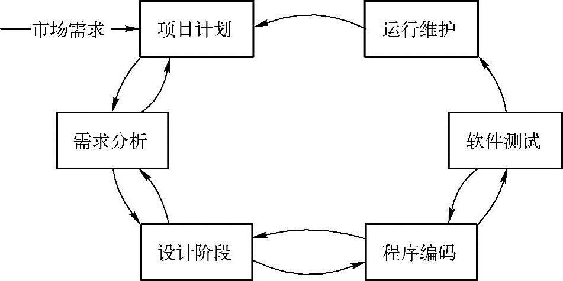
### 1.1.3 软件体系结构
近年来，随着计算机技术与网络技术突飞猛进的发展，现代企业遇到了巨大的机遇与挑战，为了最大限度地利用现代计算机及网络通信技术加强企业的信息管理，很多企业建立了管理信息系统（Management Information System，简称MIS）。一个完整的MIS应包括：辅助决策系统（Aided Decision Making System，简称ADMS）、工业控制系统（Industrial Control System，简称ICS）、办公自动化系统（Office Automation，简称OA）以及数据库、模型库、方法库、知识库和与上级机关及外界交换信息的接口。可以这样说，现代企业MIS不能没有Internet，但Internet的建立又必须依赖于MIS的体系结构和软硬件环境。   
基于Web的MIS系统同传统的MIS技术有相似也有区别。相似之处在于技术的理念；区别之处在于技术的实现。传统的MIS系统的核心是C/S（客户端/服务器）结构，而基于Web的MIS系统的核心是B/S（浏览器/服务器）结构。
* 1．什么是C/S结构   
C/S（Client/Server）结构即客户端/服务器结构。客户端通常可以理解为安装在PC、手机终端设备上的软件，是软件系统体系结构的一种。比如：QQ软件、手机APP等，C/S模式简单地讲就是基于企业内部网络的应用系统。与B/S（Browser/Server，浏览器/服务器）模式相比，C/S模式的应用系统最大的好处是不依赖企业外网环境，即无论企业是否能够上网，都不影响应用。还有一类通信的软件，比如：百度云盘、迅雷下载等，也属于C/S结构。但是它们之间的数据传输不需要经过服务器处理业务，可以直接通过客户端进行传输，这种结构通常称为P2P（Peer to Peer）点对点结构。

还有一类通信的软件，比如：百度云盘、迅雷下载等，也属于C/S结构。但是它们之间的数据传输不需要经过服务器处理业务，可以直接通过客户端进行传输，这种结构通常称为P2P（Peer to Peer）点对点结构。  
P2P是可以简单的定义成通过直接交换来共享计算机资源和服务，而对等计算模型应用层形成的网络通常称为对等网络。对等网络，即对等计算机网络，是一种在对等者（Peer）之间分配任务和工作负载的分布式应用架构，是对等计算模型在应用层形成的一种组网或网络形式。

2．什么是B/S结构   
B/S（Brower/Server）结构即浏览器/服务器结构。随着Internet技术的兴起，对C/S结构的一种变化或者改进的结构。在这种结构下，用户工作界面是通过浏览器来实现，极少部分事务通过逻辑在前端（Browser）实现，但是主要事务逻辑在服务器端（Server）实现，形成所谓三层3-tier结构。B/S是目前互联网中应用最为广泛的系统结构。B/S结构比起C/S结构有着很大的优越性，传统的MIS系统依赖于专门的操作环境，这意味着操作者的活动空间受到极大限制；而B/S结构则不需要专门的操作环境，在任何地方，只要能上网，就能够操作MIS系统，这其中的优劣差别是不言而喻的。        
基于Web的MIS系统，弥补了传统MIS系统的不足，充分体现了现代网络时代的特点。随着网络技术的高速发展，因特网必将成为人类社会新的技术基石。基于Web的MIS系统必将成为网络时代的新一代管理信息系统，前景极为乐观。

3．什么是A/S结构   
A/S（Application Serving）体系结构。A/S体系结构通过设置应用服务器，将关键性的业务软件集中安装并进行发布，客户端可完全在服务器上执行所需的应用。A/S结构利用ICA协议，将应用程序的逻辑从用户界面中分离开来，使得网络传输数据量很小，对网络带宽的要求低，平均每个用户仅占用10K左右，即使是通过电话线连接到Internet，也能保证多个用户同时工作，提供数据的实时访问和更新。另外，应用服务器与后台数据库通常采用局域网连接，计算和查询所需的大量数据都是基于LAN传输，因此远程用户的网络性能非常理想。同时在A/S结构中，网络中传输的仅仅是通过用户界面以及操作动作更新信息，因此系统的安全性更好。
### 1.2 软件研发模型
* 软件研发模型（Software Development Model）是指软件开发全部过程、活动和任务的结构框架.
####  目前比较流行的研发模型主要有：
* 瀑布模型:(过于强调文档的作用，并要求每个阶段都要仔细验证，适合一些规模小，需求明确的项目研发。随着软件的发展，现软件的功能也越来越多，逻辑也变得越来越复杂，所以瀑布模型已不再适合现代的软件开发模式，几乎被业界抛弃)
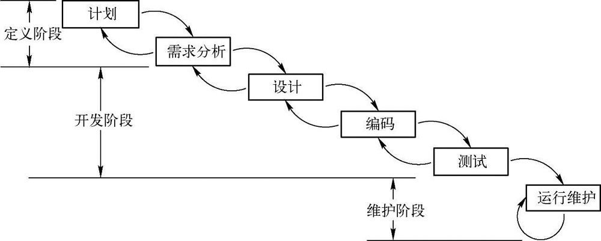
* 快速原型模型:(原型模型采用逐步求精的方法来完善原型，使得原型能够“快速”开发，避免了像瀑布模型一样在冗长的开发过程中难以对用户的反馈做出快速的响应。)
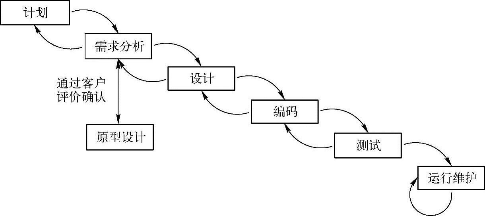
* 螺旋模型:(它将瀑布模型和快速原型模型结合起来，强调了其他模型所忽视的风险分析，特别适合于大型复杂的系统.由于该模式成本过高，目前商业模式下几乎不采用该模型，但是该模式相关安全系数极高，目前用在军方应用比较多。)
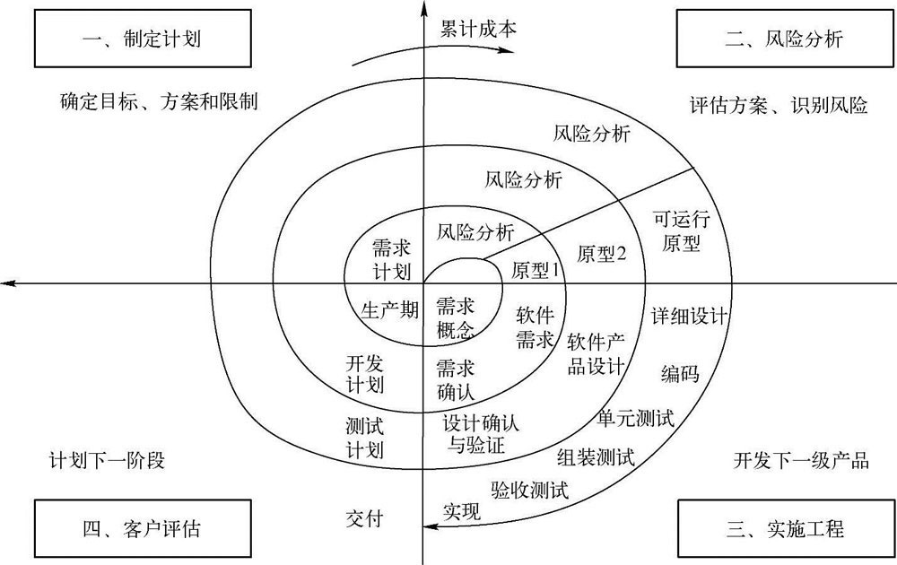
* RUP流程和敏捷模型。
* RUP（Rational Unified Process），是由Rational公司（Rational公司已被IBM并购）推出的一种统一软件开发过程，以用例驱动和体系结构为核心的增量迭代的软件过程模式。如图1-5所示。目前也是比较流行的研发模型。
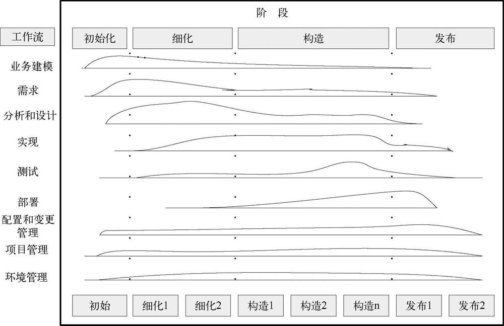
* 敏捷开发是以用户的需求进化为核心，采用迭代、循序渐进的方法进行软件开发。在敏捷开发中，软件项目在构建初期被切分成多个子项目，各个子项目的成果都经过测试，具备可视、可集成和可运行使用的特征。简单来说，就是把一个大项目分为多个相互联系，但也可独立运行的小项目，并分别完成，在此过程中软件一直处于可使用状态。敏捷开发宣言就是尽早的、持续的交付有价值的软件来使客户满意
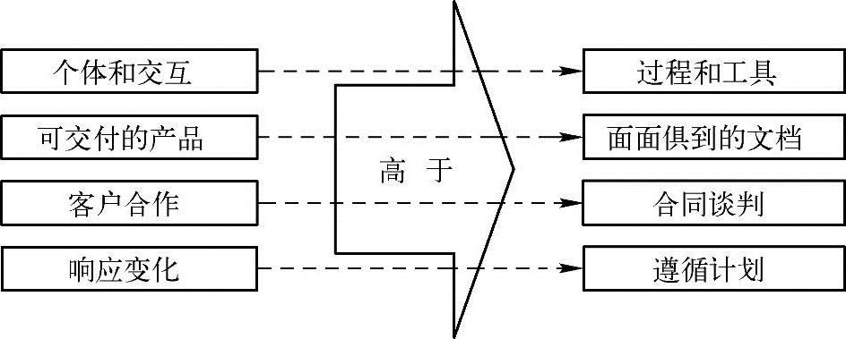
#### 敏捷模型（Agile Model）的原则有以下几点：
* 1．快速迭代
传统项目一般大约半年发布一次版本。而在敏捷中采用小版本，其需求、开发和测试更加简单快速。
* 2．让测试人员和开发者参与需求讨论
* 3．编写可测试的需求文档
* 4．多沟通，尽量减少文档
* 5．做好产品原型  
建议使用草图和模型来阐明用户界面。并不是所有人都可以理解一份复杂的文档，但人人都会看图。
* 6．及早考虑测试  
及早地考虑测试在敏捷开发中很重要。传统的软件开发，如果测试用例很晚才开始写，这将导致过晚发现需求中存在的问题，使得改进成本过高。较早地开始编写测试用例，当需求完成时，可以接受的测试用例也基本一块完成了。

## 1.3 软件测试基本概念测试
（Test）就是为检测特定的目标是否符合标准而采用专用的工具或者方法进行验证，并最终得出特定的结果。软件测试（Software Testing）伴随着软件的诞生而产生。对软件而言，软件测试就是在有限的时间内提高软件质量的保证，是软件开发过程中非常重要的一部分。
### 1.3.1 软件测试发展
迄今为止，软件测试的发展一共经历了五个重要时期：
* 1．以调试为主
* 2．以证明为主  
 1）调试（Debug），确保程序做了程序员想让它做的事情。   
 2）测试（Testing），确保程序解决了它该解决的问题。
* 3．以破坏为主:《软件测试之艺术》
* 4．以评估为主:验证（Verification）和确认（Validation），也就是我们常说的V&V理论.  
同时IEEE提出的软件工程标准术语中给软件测试定义是：“使用人工或自动手段来运行或测定某个软件系统的过程，其目的在于检验它是否满足规定的需求或弄清预期结果与实际结果之间的差别”
* 5．以预防为主    
STEP（产品模型数据交互规范，Systematic Test and Evaluation Process，简称STEP）是最早的一个以预防为主的生命周期模型，STEP认为测试与开发是并行的，整个测试的生命周期也是由计划、分析、设计、开发、执行和维护组成，也就是说，测试不是在编码完成后才开始介入，而是贯穿于整个软件生命周期。
### 1.3.2 软件测试目的
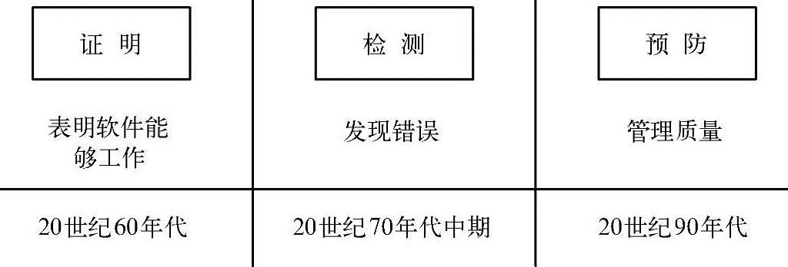
#### 软件测试目的往往包含如下内容：
* 1）测试并不仅是为了找出错误，而且要通过分析错误产生的原因和错误的发生趋势，帮助项目管理者发现当前软件开发过程中的缺陷，以便及时改进。
* 2）需要测试工程师设计出具有针对性的测试方法，以改善测试的有效性。
* 3）没有发现错误的测试也是有价值的，完整的测试是评估软件质量的一种方法。   
综上来看软件测试目的是指尽可能早的发现软件中存在的缺陷并提高软件质量。
### 1.3.3 软件测试原则
* 1．所有的测试要追溯到用户的需求：简单说就是一切从用户角度出发。
* 2．测试应尽早地介入：以提高软件质量，降低软件开发成本。
* 3．测试无法穷举：需要通过风险分析、优先级分析以及软件质量模型和不同测试的方法来确定测试关注点，从而代替穷举测试，提高测试覆盖率。
* 4．避免开发者自测：测试工作需要严谨的作风、冷静的分析。心理学告诉我们，每个人都具有一种不愿否定自己工作的心理，这种状态导致测试自己程序的障碍。同时，程序员对需求规格说明的错误理解而引入的错误是很难被发现。
* 5．群集现象：Pareto Principle帕累托法则（二八定律）。测试过程中要充分注意群集现象，对发现错误较多的程序段或者软件模块，应进行反复的深入的测试。
* 6．杀虫剂悖论：如果测试用例被反复使用时，发现缺陷的能力就会越来越差。为了避免克服这种现象出现，测试用例需要进行定期评审和修改，不断增加新的不同的测试用例来测试软件或系统的不同部分，从而发现更多潜在的缺陷。作为专业的测试人员来说，要具有探索性思维和逆向思维。同理，测试方法也需要不断地变化。
* 7．不存在缺陷的谬论：测试只能证明软件存在缺陷，不能证明软件不存在缺陷【比如审美，不满足用户需求】
* 8．测试活动依赖于测试背景：银行产品和电商平台。在银行产品中要将安全放到首位；在电商平台中要把兼容性、性能放到首位。
## 1.4 软件测试模型
软件测试根据不同的测试对象以及测试项目的背景可采用不同的测试模型实施测试活动。
#### 软件测试模型主要有：
* V模型：RAD（Rap Application Development，快速应用开发，简称RAD）通过开发和测试同时进行的方式来缩短开发周期，提高开发效率  
V模型存在一些`局限性`：该模型呈现线性的发展趋势，而且，它把测试过程作为在需求分析、概要设计、详细设计及编码之后的一个阶段，主要针对程序寻找错误，忽略了测试活动对需求分析、系统设计等活动的验证和确认。如果需求分析前期产生的错误，要到后期的验收测试才能发现。 

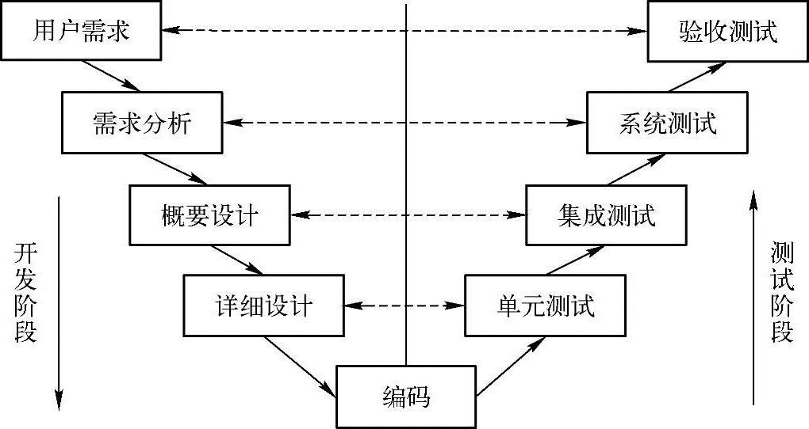
V模型适用于项目比较小、周期比较短的项目。随着软件行业发展，业务规模的不断扩大，研发模型的不断改革，该模型已渐渐被淘汰。

* W模型：V&V理论，即验证（Verification）和确认（Validation），是在模型实施过程中进行的，具体地说，就是验证是否做了正确的事情和确认是否把事情做正确了。
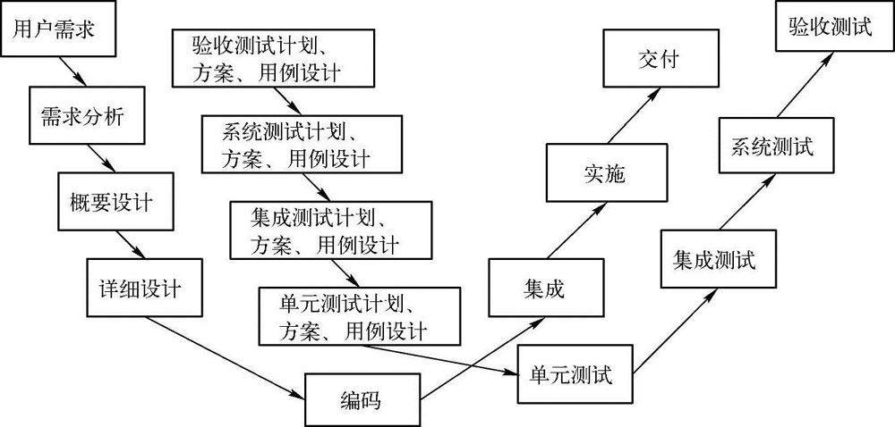   
1）验证：保证软件正确地实现了特定功能，验证是否满足软件生命周期过程中的标准和约定，判断每一个软件生命周期活动是否完成。   
2）确认：保证所生产的软件可追溯到用户需求，确认过程是否满足系统需求，并解决了相应的问题。  
测试伴随着整个软件开发周期，W模型强调，被测对象不仅仅是程序，需求、设计以及每个阶段输出的文档同样需要测试，也就是说，测试与开发是同步进行的。但是W模型也存在`局限性`。在W模型中，需求、设计、编码等活动被视为串行的，同时，测试和开发活动也保持着一种线性的前后关系，上一阶段完全结束后，才可正式开始下一个阶段工作。这样就无法支持迭代的开发模型。对于当前软件开发复杂多变的情况，W模型并不能解除测试管理面临的困惑.
* H模型：   
测试准备：包括测试需求分析、测试计划、测试设计、测试用例、测试验证等；  
测试执行：包括测试运行、测试报告、缺陷分析、回归测试等.
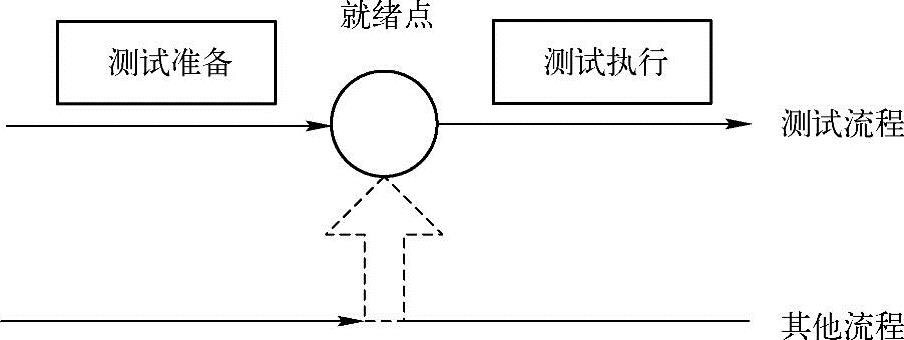
H模型，贯穿于整个产品的生命周期，与其他流程并发地进行。简单说，就是软件测试活动要尽早准备，尽早执行，只要某个测试达到准备就绪点，就可以开展测试执行活动，并且不同的测试活动可按照某个次序先后进行，也可以反复进行。
* X模型：
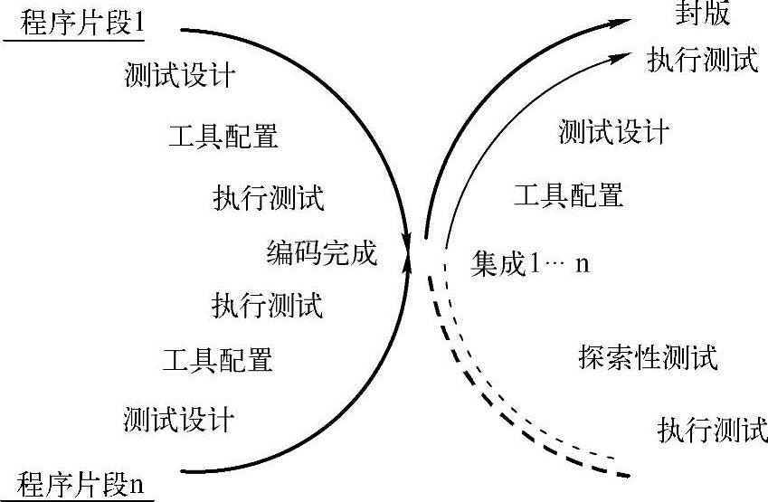
X模型中提出一个重要的理念是探索性测试，这是不进行事先计划的特殊类型的测试，这一方式往往能帮助有经验的测试人员在测试计划之外发现更多的软件错误。但这样可能对测试造成人力、物力和财力的浪费，而且对测试员的熟练程度要求比较高。
* 敏捷测试：   
敏捷测试（Agile Testing）也是测试的一种模型，它通过不断修正质量指标，正确建立测试策略，确认客户的有效需求来保证产品的质量。敏捷测试是遵循的一种测试实践就是强调从客户的角度，即从使用系统的用户角度来测试系统。   
敏捷测试需要关注需求变更、产品设计、源代码设计等。通常情况下，需要全程参与敏捷开发团队的讨论评审活动，并参与决策制定等。在独立完成测试设计、测试分析、测试执行的同时，还要关注用户需求并进行有效沟通，从而协助敏捷流程，推动产品的快速开发。
敏捷测试不仅测试软件本身，还包含了软件测试的过程和模式，测试除了针对软件的质量，还要保证整个软件开发过程是正确的是符合用户需求的。
#### 敏捷测试的主旨是测试驱动开发，所以对测试人员的要求有以下两点：   
1）理解敏捷的核心价值观（沟通，反馈，尊重、学习、分享）   
2）具备测试基本的技能，也可以擅长某个领域（如：探索性测试、白盒测试等）。
## 1.5 软件缺陷
#### 在IEEE（Institute of Electrical and Electronics Engineers，简称IEEE，电气和电子工程师协会）中对缺陷有一个标准的定义如下：
* 1）从产品内部看，是指软件产品开发或维护过程中存在的错误、毛病等各种问题。
* 2）从产品外部看，是指系统所需要实现的某种功能的失效或违背。
## 1.5.1 软件为什么会引入缺陷
* 1．缺乏有效的沟通或者没有进行沟通:可能会导致软件无法集成，或者集成出来的软件无法满足用户的需求。
* 2．软件的复杂度:图形化界面、分布式的应用、数据通信、关系数据库、应用程序等
* 3．程序员编程错误:包括语法错误、拼写错误以及逻辑设计的错误等。有很多问题可以通常由编译器直接找到，但是遗留下来的就必须通过严格的测试才可能发现。
* 4．需求的不断变更:
* 5．时间的压力:
* 6．人员过于自信
## 1.5.2 缺陷种类
#### 常见的缺陷种类的分为以下4种情况:
* 1．遗漏:遗漏是指规定或预期的需求未体现在产品中
* 2．错误:错误是指需求是明确的，在实现阶段未将规格说明正确实现
* 3．冗余:余是指需求规格说明并未涉及的需求被实现了
* 4．不满意:通常用户对产品的实现不满意也称为缺陷

作为一名优秀的测试工程师，在测试的过程中必须要以用户的需求为基准，从需求角度出发进行测试。

## 1.6 测试用例
测试用例（Test Case）：指对一项特定的软件产品测试任务的描述，体现测试方案、测试方法、测试策略和技术。其目的是将软件测试的行为转化为可管理的模式，同时测试用例也是将测试具体量化的方法之一。   
测试用例是软件测试的核心，也是软件测试质量稳定的根本保障。不同的测试类型，测试用例也是不同的。
### 1.6.1 测试用例的重要性
* 1．避免程序漏测:通把用户的每一个需求都通过测试用例来覆盖。如果需求发生变更，测试用例也要及时更新，这样可以避免在测试过程中将用户需求遗漏。
* 2．测试进度的把控:在项目结束后，还可以通过测试用来度量测试覆盖率是多少，测试合格率是多少等，它也是测试结束标准的一个度量指标。
* 4．分析缺陷的依据:要规划好测试环境、所属模块以及测试数据等。当发现缺陷后，开发人员可以通过测试用例准确的定位和分析缺陷。
### 1.6.2 测试用例写作思路
* 1．用例编号用例编号是测试用例的唯一标识，主要用来识别该测试用例的目的。用例编号需要具有指引性和维护性，格式一般由字母、数字、下划线组成，具体格式如下：产品名称_需求编号_用例类型_测试子项_数字编号
* 2．所属模块:为了更好识别以及维护用例
* 3．用例标题:每一条用例对应一个测试目的
* 4．用例优先级:对一个需求点我们会定义2～3个优先级高的测试用例。
* 5．前提条件:被测功能的先决条件以及测试环境
* 6．测试数据
* 7．操作步骤:注意避免冗余
* 8．预期结果：主要用来判断被测对象是否正常。根据需求规格说明书来描述用户的期望  
1）操作界面的提示：也就是说在执行操作步骤后，界面会有什么提示信息。   
2）数据库的变化：也就是说在执行操作步骤后，数据库会发生什么变化。
* 9．用例状态：在执行完之后给出状态（PASS通过、FAIL失败、N/A未执行）
# 第2章 软件质量
## 2.1 质量
ISO（International Organization for Standardization，国际标准化组织，简称ISO）中关于质量的定义为：一个实体的所有特性，基于这些特性可以满足明显的或隐含的需求，而质量就是实体基于这些特性满足需求的程度
### 2.1.1 质量铁三角
必须关注流程、技术、组织三者之间的关系，也就是说它们三者共同决定软件的质量，也是影响软件质量的铁三角。
### 2.2 质量管理体系
* ISO：不针对某个行业的质量标准，是普遍使用的质量管理体系。
* CMM：特定为软件行业制定的一套软件质量管理体系。
* 6Sigma：泛指所有行业的质量管理体系，不仅关注质量，还关注成本、进度等。
2.3 软件质量特性
##### 在ISO9126中定义了衡量软件质量由6大特性、27个子特性组成
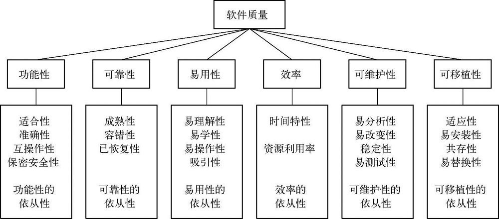

### 3.2 单元测试
* 单元测试（Unit Testing，简称UT）是对软件基本组成单元（函数或类）进行检测的测试工作。其目的是检测与详细设计说明书（Low Level Design，简称LLD）的符合程度。
### 3.2.1 单元测试环境
* 单元测试用于检测软件设计的最小单元在语法、格式、逻辑等方面可能存在的算法冗余、分支的覆盖率以及内存泄漏等问题。由于单元本身不是一个独立程序，所以需要一些辅助单元测试来完成单元测试。辅助单元测试有两种：驱动单元和桩单元。
### 3.2.2 单元测试策略
* 简单地说测试策略就是如何用尽量少的资源来尽量好的完成测试。通常执行单元测试的策略有三种：孤立的测试策略、自顶向下测试策略、自底向上测试策略
### 3.2.3 单元测试常见的错误
* 单元测试常见的错误一般出现在以下几个方面：单元接口、局部数据结构、独立路径、出错处理以及边界条件。
### 3.2.4 单元测试工具
* 目前在国内大多数公司进行单元测试时都是由开发人员来完成。目前比较流行的2个开源的工具为：CppUnit和JUnit。
## 3.3 集成测试
* 集成测试（Integration Testing，简称IT）是在单元测试的基础上，将所有的模块按照设计的要求进行集成，主要验证组装后的功能以及模块之间的接口是否正确安装的测试工作。主要目的是检测软件与概要设计说明书（High Level Design，简称HLD）的符合程度。
## 3.4 系统测试
* 系统测试（System Testing，简称ST）是将已经通过集成测试的软件系统，与计算机硬件、外设、数据库、网络等其他元素结合在一起，在实际运行环境下，进行的一系列的测试工作。其目的是验证系统是否满足了需求规格，找出与需求规格不符或与之矛盾的地方，从而提出更加完善的方案
### 3.4.1 系统测试环境
* 作中的软件环境大致分为：开发环境、测试环境、真实环境。被测系统开发环境下，所包含的代码不同，所有的测试代码都包含在Debug中，这样调试比较方便。
### 3.4.2 系统测试策略
从整个系统测试的活动来看，系统测试远远比单元测试、集成测试复杂。因此，针对不同的软件，不同的测试阶段，系统测试的策略在选取上也会有所不同。比如：在一些银行的软件中，它的安全性是最优先被考虑的。
#### 首先来看一下系统测试的类型有哪些：
* 1．功能测试
* 2．性能测试：性能测试是指在一定软件、硬件及网络环境下，对系统的各项性能指标来进行测试，主要检测其性能特性否满足特定的性能需求。常用的性能指标包括并发数、响应时间、每秒处理的事务数、吞吐量、点击率、访问量以及硬件资源等。   
借助测试工具来完成，如Loadrunner、JMeter等
* 3．压力测试：压力测试也称强度测试，也是性能测试的一种，是指在极限状态下，长时间或超大负荷地连续运行的测试，主要检测被测系统的性能、可靠性、稳定性等。
* 4．容量测试：检查当系统运行在大量数据，甚至最大或更多的数据测试环境下，系统是否会出问题
* 5．安全性测试：安全测试是用来验证系统内的保护机制是否能够在实际应用中保护系统不受到非法的侵入。该测试用来保护系统本身数据的完整性和保密性。
* #### 安全测试常用的方法有以下几点：  
* 1）静态代码检测主要验证功能的安全隐患。   
* 2）可以借助安全测试工具APPScan进行漏洞扫描。   
* 3）模拟攻击来验证软件系统的安全防护能力。  
* 4）利用Wireshark工具对网络数据包进行截取分析。

* 6．兼容性测试：检查软件在一定的软硬件、数据库、网络、操作系统环境下是否可以正确地进行交互和共享信息。兼容性测试的策略有向下兼容、向上兼容、交叉兼容。
* 7．GUI测试
* 8．可靠性测试
* 9．配置测试
* 10.异常测试
* 11.安装测试
* 12.网络测试
* 13.可用性测试
* 14.健壮性测试
* 15.文档测试

## 3.5 验收测试
验收测试可分为正式验收和非正式验收2种。
* 正式验收就是用户验收测试（UAT）：UAT（User Acceptance Test），也就是用户验收测试或用户可接受测试
* 非正式验收包括α测试和β测试   
α测试是在受控制的环境下进行的测试。β（Bate）测试是由软件的多个用户在一个或多个用户的实际使用环境下进行的测试。与α测试不同的是，β测试时开发者通常不在测试现场。因而，β测试是在开发者无法控制的环境下进行的软件现场应用。

## 3.6 回归测试
* 回归测试主要指软件在测试或其他活动中发现的缺陷经过修改后，重新进行测试，目的是验证修改后缺陷是否得到了正确的修复，同时还要关注有没有引入新的缺陷或导致其他代码产生缺陷或错误。
### 3.6.2 回归测试策略
* 1．完全重复测试
* 2．选择性重复测
#### 下面介绍几种选择性重复测试的方法：
* 1）覆盖修改法：即针对被修改的部分，选取或重新构造测试用例来验证是否有错误再次发生的测试方法。
* 2）周边影响法：该方法不但包含覆盖修改法确定的用例，还需要分析修改的扩散影响，对那些受到修改间接影响的部分选择测试用例验证它是否受到不良影响。
* 3）指标达成法：该方法就是在执行回归测试前，先确定一个要达到的指标，如代码覆盖率、接口覆盖率等。
* 4）基于风险选择方法：该方法是根据缺陷的严重性来确认风险的大小，基于一定的风险标准从测试用例库中选择回归测试用例。通常优先执行最重要、最关键的以及可疑的测试，而跳过那些非关键的、优先级别低的或者稳定的测试用例。
## 3.7 软件测试的流程
大多企业把测试工作分为五个阶段：测试计划阶段、测试设计阶段、测试实现阶段、测试执行阶段、测试总结。

## 6.1 配置管理工具
——SVNSVN主要分为服务端和客户端。下面简单介绍一下SVN在Windows系统下的安装配置以及基本使用。首先从官网：`http://www.visualsvn.com/server/download/下载服务端Visu-alSVN-Server-2.0.5.msi和客户端TortoiseSVN。`

## 8.2 Web测试技术
*  目前大部分业务系统都采用Web结构，由于Web应用与用户直接相关，因此Web项目必须要经过全面的测试。测试方向主要针对功能、性能、安全性、兼容性以及接口等。
### 8.2.1 Web功能测试
* 1．链接测试
* 2．表单测试
* 3．图形测试
* 4．整体界面
### 8.2.2 Web性能测试
* Web系统的性能测试涉及的面很广，种类也很多，如并发测试、压力测试、负载测试、稳定性测试、配置测试、网络测试以及大数据量测试等。
* Web系统的性能测试，针对服务器而言主要关注处理事务的响应时间、系统的吞吐量、系统的点击率、系统的访问量以及服务器资源等。
* 减少前端页面加载时间的方法主要是提升浏览器的缓存和减少请求数量和请求大小等。
#### 性能测试类型
* 1．单业务的性能测试
* 2．组合业务的性能测试
* 3．大数据量的性能测试
* 4．第三方接口的性能测试
* 5．Web前端性能：Web前端性能主要就是减少HTTP请求和资源的数量，合理设置浏览器缓存机制；对传输资源进行压缩，以便节省网络带宽资源；同时尽量减少Cookies的传输
### 下面介绍一下前端性能优化时，如何恰当地使用Cookie和Session。
* （1）Cookie是由Web服务器保存在客户端浏览器上的一个小文本文件，它包含用户的一些相关信息。通常Cookie用来判断用户是否访问过网站，是否为合法用户以及记录用户访问过的一些数据信息，以便在下一次访问时直接获取。Cookie的保存机制有两种：一种是保存到硬盘中，此时会指定一个生命周期，超过生命周期Cookie会被清除；还有一种是保存到内存中，通常关闭浏览器Cookie自动清除。
* （2）SessionSession可以理解为会话，通常存储在服务器端。当用户访问Web系统时，服务器将在服务端为该用户生成一个Session，并将相关数据记录在内存中；同时服务端生成一个Session ID（用来唯一标识该Sessi
* （3）Cookie与Session的区别Cookie存储在客户端，而Session是存储在服务器端。相对于Session而言Cookie的安全性不高，很容易被窃取或篡改，所以考虑到安全性时应该使用Session，通常涉及个人隐私的信息存放在Session中。但是Session会在服务器端保存一段时间，当访问过多时会影响服务器的性能，考虑到减轻服务器性能时，应该使用Cookie。所以在测试Web前端时，需要关注Session和Cookie的使用。特别在优化Web前端性能测试时，需要关注Session和Cookie对性能的影响。on，默认保存时间为30min），并通过响应发送到浏览器，浏览器将Session保存到Cookie中。
### 8.2.3 Web安全测试
* 对Web服务器的攻击也可以说是形形色色、种类繁多，常见的有SQL注入、跨站脚本攻击、跨站请求伪造、缓存区溢出等。
#### 1．SQL注入
* 主要是指攻击者巧妙的构建非法的SQL查询命令，插入表单或请求的字符串中后提交，根据返回的结果来获得想要的数据，这就是所谓的SQL Injection，即SQL注入。
* SQL注入的方法一般有`猜测法`和`屏蔽法`。猜测法主要是通过猜测数据库可能存在的表名和列名，根据组合的SQL语句获取数据表的信息。屏蔽法主要是利用SQL输入的不严谨进行逻辑验证，从而使得SQL验证结果始终为真，从而绕开验证的目的
* 屏蔽法：即“假OR真AND假OR真”，由于AND的运算规则高于OR，所以先执行AND，再执行OR，结果为“假OR假OR真”，整个SQL语句最终结果为真，这样可以成功绕过验证直接登录系统。
#### 2．跨站脚本攻击
* 跨站脚本攻击（Cross-Site Scripting，简称XSS），是一种迫使Web站点回显可执行代码的攻击技术，而这些可执行代码由攻击者提供，最终被用户浏览器加载。通俗的说法就是攻击者往Web页面里插入恶意Script代码，当用户浏览该页之时，嵌入其中Web里面的Script代码会被执行，从而达到恶意攻击用户的目的。
* XSS最为常见的攻击方法分为两种，分别为反射型XSS和存储型XSS。
* 造成这种安全问题的原因主要是在编程过程中对一些敏感的符号未进行处理，如“/、“.”、“’”、“‘”、“＜”、“＞”、“？”等，除了特殊字符外，还有对数据库字段、数据库类型以及长度的限制等未进行处理。
#### 3．跨站请求伪造
* 跨站请求伪造CSRF（Cross-site request forgery），是一种对网站的恶意利用。它通过伪装来自受信任用户的请求来利用受信任的网站。与XSS攻击相比，CSRF攻击往往不太流行和难以防范，所以被认为比XSS更具危险性。简单判断存在CSRF漏洞的方法就是通过抓取正常请求的数据包，然后通过去掉Referer字段后再重新提交，如果该提交还有效说明存在CSRF漏洞。
* 防止CSRF的最常见的方法就是在AJAX异步请求地址中添加Token并进行验证。
#### 4．缓存区溢出
* 4．缓存区溢出缓冲区溢出是一种非常普遍存在的漏洞，在各种操作系统、应用软件中其广泛存在。利用缓冲区溢出攻击，可以导致程序运行失败、系统关机、重新启动，或者执行攻击者的指令，比如非法提升权限等。
* 造成缓冲区溢出的主要原因是对输入、输出的数据没有限制大小、长度以及格式等，还有就是对用户的特殊操作没有做异常处理导致。所以在测试过程中需要注意输入输出的大小长度以及格式规范限制，还有需要多模拟一些异常，关注异常的处理情况。
* 对Web应用软件来说，安全性包含Web服务器、数据库、操作系统以及网络的安全等，只要其中任何一个部分出现安全漏洞，都会导致整个系统的安全性问题。Web安全测试是比较难解决的问题，这个取决于测试要达到什么程度。
* 简单说软件不可能做到100%的测试，所以也不要期望可以达到100%的安全。在实际测试过程中，测试人员主要是针对用户的权限以及数据库的安全性进行测试，还可以借助IBM的安全漏洞扫描工具`APPScan`来进行漏洞扫描。
### 8.2.4 Web兼容测试
* 8.2.4 Web兼容测试:在测试前，先创建一个兼容性矩阵，来测试不同厂商、不同版本的浏览器，也可以借助测试工具进行测试。
* 2．操作系统兼容性:目前大多用户以Win7、Win10及Mac、Android系统。
* 3．分辨率兼容性:常见的PC端分辨率有17英寸的1024×768、19英寸的1280×1024、22寸的1920×1080等，除了考虑PC端外，还需要在笔记本和手机上进行测试.
### 8.2.5 Web接口测试
#### 1 ，接口分类：
* （1）系统与系统之间的接口
* （2）下层服务对上层服务的接口一般的系统分为三层：应用层、服务层、数据库层。  
●应用层就是UI功能层，比如Web浏览器或者APP。  
●服务层是服务器所提供的数据处理功能，一般由后台服务器完成。  
●数据库层用来存储用户数据，一般有独立的数据库系统，比如Oracle、Mysql等。  
* 各层之间的交互通过接口完成，应用层与服务层主要通过HTTP接口。服务层与数据库层主要通过DAO（Data Access Object）数据库访问接口完成交互。
* （3）系统内部，服务与服务之间的调用接口
### 2．接口用例
#### 一般接口的用例设计需要考虑以下几点：
* （1）功能测试首先根据接口文档中的参数，输入正常参数验证接口返回是否正确；其次就是对接口参数的组合测试，要考虑参数是否必填、参数的类型和长度以及参数的约束限制等；最后在设计用例时要尽可能地保证所有的组合情况都能被覆盖到。
* （2）安全测试首先测试用户的权限，关注是否可以绕过授权；其次考虑敏感参数的加密规则是否容易破解，最后考虑SQL注入、XSS攻击等（参考8.2.3节Web安全测试）。
* （3）性能测试不管是程序接口还是第三方接口，都需要关注接口的性能，接口的性能需要考虑并发测试、负载测试、压力测试、可靠性测试等。总之设计用例是测试的关键，需要测试人员从业务逻辑、用户角度、用例设计方法三个角度进行考虑。

## 第9章 APP项目测试
* APP（Application的缩写）通常指安装在智能手机上的软件。随着互联网的技术不断发展，无论是人才还是资源都有从PC端到移动端流动的趋势。伴随着5G网络的到来，未来移动APP的发展将会以用户为主，朝着网络多元化、综合化、智能化的方向发展。
### 9.2 APP测试流程
* 移动应用软件开发的周期一般都比较短，基本都是敏捷开发，而且开发的模式跟传统互联网也有一些差异。通常开发模式都采用平行模式，开发人员比较少，但是分工比较明确，各团队之间（Android、IOS、后台）根据指定好的接口进行联调，也就是集成测试。
### 大多数都是一个人负责，所以要求测试工程师熟悉APP的整个测试的流程和方法。APP的测试流程如下：
* 1．计划阶段：最重要的是确认测试设备（Android和ISO不同版本的真机）以及测试工具。
* 2．设计阶段：写用例
* 3．执行阶段
* 4．评估报告阶段
### 9.3 APP测试方法
要想做好APP测试，首先需要了解Android与IOS操作系统的区别，再熟悉APP测试的方法，才能更全面进行测试，建议采用真机进行测试。
#### 9.3.1 Android与IOS
* Android是Google开发、发行的一个智能的、开放式的软件平台。它的内核是Linux，其应用程序都用Java编程语言来编写。由于Android的运行机制采用虚拟机，系统需要占用大量内存来换取执行速度，再加上不定期的内存自动回收机制，从而导致出现卡顿的现象。
* IOS是苹果公司在2007年1月推出的封闭式手机操作系统，它指定使用的一种开发语言——Objective-C语言。它的运行机制采用沙盒运行，整个运行过程中不需要虚拟机，所以相比Android来看其执行效率要高一点。
* 由于Android是采用了开放的策略，所以很多厂商对其进行了订制。这也使得Android手机在设计上相比IOS变得多样化，但是同时带来安全隐患，也就是说在测试APP软件时，Android的安全性比IOS要考虑得多一些；同时在测试兼容性时，Android也比IOS考虑得多一些。由于Android的设备比较多，基于市面上的辅助工具也比IOS要应用要广泛一些。另外还需要注意的是系统版本，Android系统的版本可升、可降，而IOS系统的版本只能升级（越狱除外）。除了上述问题之外，APP测试最大的问题是网络的不稳定以及隐私的安全问题，详见后面的介绍。
### 9.3.2 UI测试
UI测试即用户界面测试，具体测试方法如下：
* 1）首先确保UI界面设计符合国家的、行业的、企业的标准规范；
* 2）关注窗口、菜单、对话框以及按钮控件的布局、风格是否满足用户要求；
* 3）不同页面中控件大小、风格是否一致；
* 4）页面中颜色的搭配是否合理，整体的颜色不宜过多；
* 5）文字的提示是否友好，是否存在敏感词、关键词等；
* 6）操作是否简单、人性化，是否有帮助指引；
* 7）自适应界面设计，内容是否根据窗口的大小自适应调整；
* 8）图片是否涉及版权、隐私、专利等问题。
### 9.3.3 功能测试
* 1．安装卸载
* 2．启动运行
* 3．注册登录
* 4．前后台切换
* 5．升级更新
* 6．异常测试：      
1）电量测试，如电量10%、50%、90%时，验证APP功能是否正常；  
2）低电量提示时，验证APP功能是否正常；   
3）充电、拔电时，验证APP功能是否正常；   
4）弱网测试，模拟2G、3G、4G、wifi时，验证APP功能是否正常；   
5）模拟网络2G、3G、4G、wifi之间的切换，验证APP功能是否正常；   
6）离线测试，检查APP是否支持离线浏览；   
7）Push测试，检查用户在免打扰模式下能否接受Push。  
### 9.3.4 性能测试
APP的性能测试分手机端和服务端的性能。
#### 1．手机端性能
手机端性能主要检查资源问题，如CPU，内的占用，耗电量、流量的情况。
* （1）CPU占用据经验表明，在使用APP软件时，如果CPU占用率低于20%表示为最佳状态，如果CPU占用在20%～60%之间表示资源使用比较稳定，如果CPU占用率在60%～80%之间表示资源使用饱和，如果CPU占用率超过80%属于性能的瓶颈，必须尽快进行资源调整与优化。
* （2）内存使用手机的内存是非常有限的，为每个APP进程分配的私有内存也是有限制。一方面，要合理的申请内存使用，以免导致内存溢出；另一方面，要及时释放内存，以免发生内存泄漏。不合理使用内存，经常会造成APP软件出现无响应、死机、崩溃、闪退等现象。
* （3）耗电量智能手机的电池都是内嵌的，它的电量也是非常有限的，而且智能手机本身耗电量就比较多（如屏幕、GPS定位、传感器等），所以在进行APP测试时，必须要检查APP的电量使用，以免导致手机耗电发热，带来不良的影响。
* （4）流量的使用目前手机网络类型主要包含2G、3G、4G、wifi，其中还有不同运营商的区分，在使用APP软件时，经常遇到重复请求、响应慢等各种情况。  
#### 在测试时要注意不同的网络下，流量的使用。可以借助一些Monkey工具来检测Android手机端的性能问题，工具在后面小节介绍。
#### 2．服务端性能
APP服务端性能跟Web性能大同小异，主要是模拟大量手机用户调用接口对服务器产生负载。可以使用Loadrunner12.0以上（或者Loadrunner11.0+补丁包Patch 3）、Jmeter、HyperPacer等工具，进行并发测试、负载测试、压力测试等。在这里使用HyperPacer工具进行服务端性能测试，工具在后面小节介绍。### ### 9.3.5 安全测试
#### 近年来，移动APP存在一个非常重要的问题就是安全问题，即用户的隐私泄漏。针对APP的安全测试可以参考以下几个方面。
### 1．安装包安全性
* 1）首先验证安装包是否对签名进行了校验，以防止被恶意第三方应用覆盖安装等；
* 2）开发人员是否对源代码进行混淆，以免被反编译软件查看源代码；
* 3）用户隐私，特别是访问通讯录，需要对特定权限进行检查。
### 2．用户安全性
* 1）用户拨打电话、发短信、连接网络等是否存在扣费的风险；
* 2）用户密码在传输中是否进行加密，在数据库中存储是否进行了加密；
* 3）免登录是否设置了过期时间；
* 4）用户的账号、密码等敏感数据是否存储在设备上；
* 5）当用户注销账号时需要身份验证的接口是否可以调用；
* 6）对Cookie的使用是否设置了合理的过期时间。
### 3．数据安全性
* 1）用户的敏感数据是否写到日志或配置文件中；
* 2）当用户使用敏感数据时是否给用户提示信息或安全警告；
* 3）在输入敏感数据时是否支持第三方输入法输入；
* 4）用户输入的数据是否进行了数据合法性的校验；
* 5）在含有敏感数据的连接中是否使用了安全通信，如HTTPS；
* 6）对安全通信的数字证书是否进行合法的验证。
### 4．通信安全性
* 1）所有手机的功能应优先处理，如接电话、收短信等；
* 2）当网络中断或出现异常时需要给用户网络异常的提示；
### 5．服务端安全性
服务端主要关注接口，其安全性跟Web端的安全性类似，主要考虑SQL注入、XSS跨站脚本攻击、CSRF跨站请求伪造以及越权访问等。
### 9.3.6 兼容性测试
* 众所周知，APP兼容性测试是一个耗时、耗人力，而且成本很高的测试工作，且APP兼容性测试又是一项必须要进行的测试活动，其测试时主要考虑手机端的软、硬件兼容性，一方面要考虑与主流APP的兼容性；另一方面又要考虑手机设备的兼容性，如不同品牌的手机，不同的操作系统，不同手机的屏幕分辨率等。
* 具体的测试方法可以使用模拟器来进行模拟不同的手机品牌、系统、分辨率进行测试，但是模拟器测试的数据会有差异，针对一些实力雄厚的公司，建议购买真机进行测试。还可以借助第三方工具（如Spider工具）以及云测试平台来进行测试，这样可以即能保证兼容质量的同时、又能高效地完成APP兼容性测试的覆盖。
### 9.3.7 接口测试
不管是Web端还是APP接口，其测试的方法思路大致相同（请参考Web端接口测试）。
### 9.3.8 用户体验测试
* 由于APP软件的研发人员、研发周期以及测试周期都比较短，所以进行用户体验测试在APP测试中是一项非常有必要的测试活动。通常公司组织内部人员，从用户的角度来评价产品的特性，提出修改意见，从而提升客户的满意度。体验可以从以下几点考虑：
* 1）UI界面的设计，从用户视觉评价产品；
* 2）使用真机对手机兼容性进行体验测试；
* 3）用户的指引设计是否合理；
* 4）APP页面跳转设计和深度是否合理；
* 5）体验锁屏、横竖屏的设计以及各种异常操作等。
## 9.4 APP测试工具
* 因为手机的局限性给测试带来很多不便，所以在APP的测试相对于Web测试更关注是一些工具的使用，下面介绍一下Android手机测试工具的使用，在介绍工具前，首先了解一下Android系统主要的目录描述，详见表
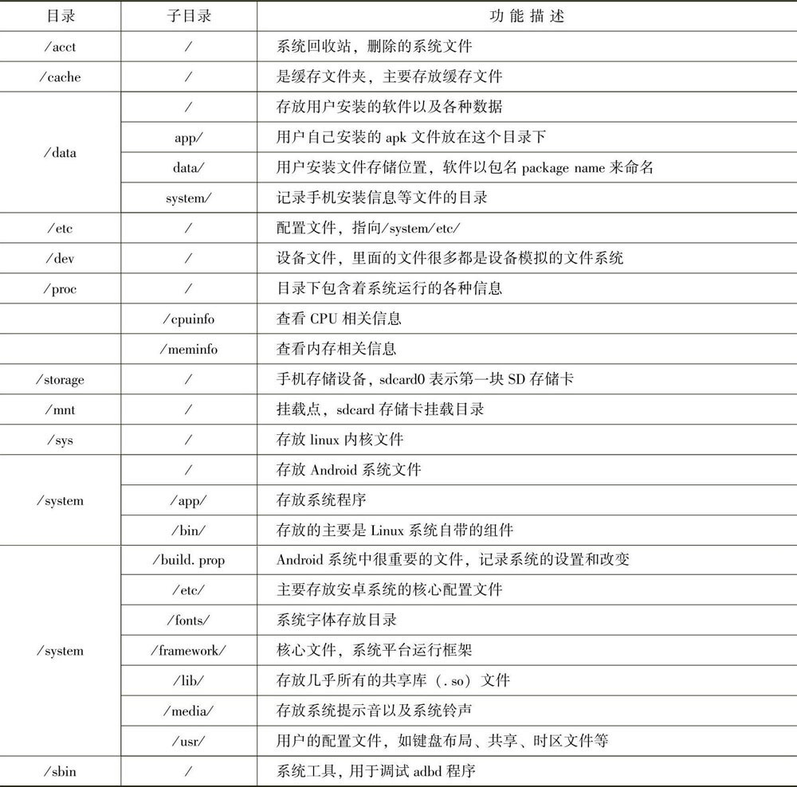
## 9.4.1 ADB
```python
1．ADB工具介绍
ADB（Android Debug Bridge的缩写）是Android SDK里面的一个多用途调试工具，可以通过ADB来管理设备或模拟器的状态。

ADB工具由3组成部分：
1）在计算机上运行的客户端。PC端主要通过客户端与模拟器或设备通信；
2）在计算机上作为后台进程运行的服务器。负责管理客户端与模拟器或设备上的adbd守护进程间的通信。
3）守护进程adb以后台进程的形式运行于模拟器或设备上。当启动一个ADB客户端时，客户端首先确认是否有一个ADB服务器进程在运行。如果没有进程，则启动服务器进程。当ADB服务器运行，就会绑定本地的TCP端口5037，并监听ADB客户端发来的命令。接着服务器将所有运行中的模拟器或设备实例建立连接。它会扫描所有5554～5584之间的端口来定位所有模拟器或设备。一旦服务器与所有模拟器实例建立连接，就可以使用ADB命令控制和访问该设备。

我们可以通过向模拟器或设备发送命令来控制它，发送命令的一般格式：adb-s设备名命令（通过命令adb devices可获取设备名）。
使用ADB主要可以完成以下功能：
1）可以快速更新设备或模拟器上的软件；
2）可以在设备或模拟器上运行Shell命令；
3）可以同步设备或模拟器上的文件，即上传、下载文件；
4）可以实时的抓取APP运行时的Log信息。

2,安装ADB

ADB安装常见的问题以及解决方法如下：

问题一：出现adb server version（32）doesn’t match this client（36）；killing...error：un-known host service。

可能原因是金山毒霸或360的手机助手占用了adb，需要把占用adb的应用关掉，解决方法如下：

1）首先找到占用端口的进程。在命令提示窗口输入，
如下命令：netstat-ano findstr＂5037＂findstr＂LISTENING＂
结果显示：TCP 127.0.0.1：50370.0.0.0：0 LISTENING 18384

2）其次根据进程ID 18384找到对应的程序，在命令提示窗口输入，
如下命令：tasklist|findstr＂18384＂
结果显示：sjk daemon.exe 18384 Console 18，188K

3）打开任务管理器，找到sjk daemon.exe进程，结束进程，重新连接设备。

问题二：如果连接模拟器时，出现adb server is out of date.killing...。

可能原因是另一个adb程序及服务已经启动并占用了端口。
解决方法如下：

1）同样查看端口占用情况。在命令提示窗口输入，
如下命令：netstat-ano findstr＂5037＂findstr＂LISTENING＂
结果显示：TCP 127.0.0.1：50370.0.0.0：0 LISTENING 2608
2）其次根据进程ID 2608找到对应的程序，在命令提示窗口输入，
如下命令：tasklist findstr＂2608＂
结果显示：adb.exe 2608 Console 17，808K
3）打开任务管理器，在进程ID中找到2608，结束进程，重新启动模拟器。


```
### 9.4.2 AAPT
* AAPT是Android Asset Packaging Tool的缩写，是Android应用资源打包工具。可以用AAPT工具来创建APK文件，也可以用它来列出APK文件里面的详细信息，包括一些组件文件与资源文件等。
* AAPT存放在SDK的build-tools目录下，使用时需要在环境变量path中添加AAPT的路径。由于配置adb时添加了环境变量，也可以直接将aapt.exe文件复制到platform-tools目录下即可。AAPT工具的子命令也比较多，这里介绍一下常用的子命令。
```python
* 1．l→listlist列出应用程序*.apk包里的内容，
命令格式：aapt list*.apk
例子：aapt list D:\notepad.apk
显示notepad.apk包里的内容。
一般apk里面的内容很多，最好用重定向把文件内容重定向到一个文本文件里面，方便查看。
如：aapt list D:\notepad.apk＞D:\apk.txt
2．d→dumpdump
查看apk的基本信息，
命令格式：aapt d values*.apk
其中values的值可以选：
（1）badging
参数说明：列出应用的基本信息，包括包名package name、版本、应用名字（application-label，可执行的活动（launchable-activity）等信息。
例子：查看ImageViewer.apk的基本信息命令：aapt d badging D:\ImageViewer.apk。
如果只想得到包名，用以下命令：aapt d badging D:\tenson.apk findstr＂package＂。
通过这个方式得到的包名是com.love-plusplus.demo.image。如果想查看应用的启动activity名字，用以下命令：
aapt d badging D:\tenson.apk findstr＂launchable-activity＂。得到结果是com.loveplus-plus.demo.tenson.MainActivity。

```
2．Monkey测试
使用流程Monkey是一个稳定性压力测试工具，通常是在功能测试完成后，进行稳定性压力测试。其主要用来检测手机是否出现无响应、闪退、崩溃以及死机等。导致这些问题的主要原因就是内存泄漏。

## 9.4.4 DDMS
* DDMS是Dalvik Debug Monitor Service的缩写，实际上它是Android虚拟机的调试监听服务器。它提供了端口转发服务、设备屏幕截取、设备上的线程和堆信息、logcat信息、进程和广播状态信息、来电和短信息模拟、地理位置数据模拟等。
* DDMS包含在SDK的tool/目录中。在ADB中添加过环境变量，这里直接在终端下输入DDMS就可以运行它。DDMS工作在设备或模拟器上，如果真机设备或模拟器都同时运行并且都连接到计算机上，那么DDMS默认工作在模拟器上。
#### 1．DDMS工作原理
DDMS担当了连接开发测试环境和运行在设备上的应用程序的“中间人”的角色。在Android上，每个应用运行在它自己的进程中，都有自己的虚拟机（VM）。DDMS启动的时候，它连接到adb，在adb和DDMS之间启动设备监视服务。当设备连接时，在adb和DDMS间建立了虚拟机监听服务，它将通知DDMS“设备上的虚拟机何时开始、何时终止”。一旦虚拟机运行，DDMS通过adb取得虚拟机进程的PID，并通过adbd（adb deamon守护进程）建立一个到虚拟机调试器的连接。DDMS可以通过相应的协议和虚拟机通信。   
在命令行下运行ddms便可以启动DDMS，启动DDMS之前需要先运行模拟器或连上设备。

#### 2．DDMS的功能
DDMS集成在android的虚拟机中，用于管理运行在模拟器或设备上的进程，并协助进行调试。可以用它来选择一个程序来调试、生成跟踪数据、查看堆和线程数据、对模拟器或设备进行屏幕快照等。
* （1）启动DDMS启动DDMS之前需要连上设备或模拟器。然后在命令行下运行ddms便可以启动DDMS。启动后界面如图9-9所示（图中分3大模块，第1模块是设备或模拟器中运行的进程。第2模块有多个标签页，包括info、Threads、VM Heap、Sysinfo、Network等。第3模块显示应用运行的日志信息）。
* （2）信息日志信息——logcatlogcat用来显示系统中的调试信息，在程序中调用的log类函数的输出信息都在这里输出。如图9-9第3模块所示。Logcat中输出很多日志信息，可以选择不同级别的信息进行显示，日志显示的级别，详见表9-3
* （3）线程标签页——Threads显示在目标虚拟机中当前进程中的所有线程信息
* （4）内存堆状态信息VM heap首先在图9-11中，单击[插图]图标（show heap update），然后再单击[插图]图标（Cause an im-mediate GC），便在VM heap标签页中显示虚拟机内存堆信息。显示当前进程占用的内存情况。
* （5）生成分析.hprof文件在图9-11中，单击有[插图]图标（Dump HPROF file）可以抓取heap dump文件，它的扩展名为.hprof，开发人员通过分析heap dump可以发现应用是否存在内存泄漏的问题。
* （6）导入导出在启动页面中，菜单栏Device下，单击File Explorer会列出当前设备或模拟器上的所有文件，如图9-12所示。还可以把设备或模拟器上的文件导出到PC端，也可以PC端上的文件复制到设备或模拟器中。
* （7）保存截图DDMS还提供了一个截图功能，当测试过程中发现一个问题，并且想把现场保存下来，可以使用ddms来保存截图。具体操作：在启动界面菜单栏Device下，单击“Screen capture...”按钮，在出现图中单击“Save”按钮就可以保存。然后选择保存路径进行保存，最后保存为.png文件。

## 9.4.5 Fiddler
Fiddler是一个HTTP的调试代理工具，它以代理服务器的方式，监听系统的HTTP网络数据，俗称抓包工具。
###  Fiddler抓取接口
* 配置Fiddler首先启动Fiddler，在启动页面中单击“Tools”→“Options”
* 在弹出Options页面中，单击“Connections”选项，勾选“Allow remote computers to con-nect”，再单击“OK”按钮，如图9-15所示。
* 配置手机首先设置手机（vivo为例）进入开发者模式，进入手机“设置”→“关于手机”→连续点击“软件版本号”，出现提示“您已处于开发者模式”，如图9-16所示。
* 然后进入“开发者选项”→启用“USB调试”，如图9-17所示。
* 最后进入手机“设置”→选择“Wlan”→选择“wifi”→进入高级设置选项→选择手动代理，将“代理服务器主机名”改为连接手机电脑的IP地址，再将“端口”修改为8888。

### Fiddler模拟弱网
Fiddler还提供了一个很方便的网络限速功能，通过网络限速，可以模拟用户的一些真实环，也就是模拟弱网的环境进行APP测试。
#### Fiddler模拟弱网需要设置延时的时间，算法为：
* 需要延时的时间（毫秒）=8*1000/网络速度。比如模拟2G网络（上行速度为2.7KB/s，下行速度为9.6KB/s）的速度，其计算方法如下：上行时延为8*1000/2.7=2962ms，下行时延为8*1000/9.6=833ms。
* 在Fiddler里面具体设置步骤如下：首先启动Fiddler在菜单栏Rules下→单击“Customize Rules...”选项
* 其次在弹出的“Fiddler ScriptEditor”页面中，搜索“m SimulateModem”字段，然后修改下面2行数据
* oSession[＂request-trickle-delay＂]=＂300＂；中的300改为2962oSession[＂request-trickle-delay＂]=＂150＂；中的150改为833，保存。最后修改完延时后，在Fiddler界面中，选择“Rules”→“Performances”→“Simulate ModemSpeeds”，勾选该项即可.

## 9.5 APP测试与Web测试的区别
#### 不管是APP测试，还是Web测试，相对于测试而言，其测试流程、测试思路都没有太大区别。由于测试环境不一样，测试涉及的工具不同，测试方法考虑略有不同，其主要的区别归纳为以下几点：
* 1．系统架构不同:Web项目主要是基于浏览器的B/S架构，当Web服务端更新后，客户端就会同步更新。而APP项目主要是基于手机端的C/S架构，当APP服务端更新后，如果更新版本为强制更新版时，则手机端必须更新，否则功能无法使用；如果更新版本不是强制更新，手机端可以选择性更新，此时除了测试新版本以外，还要测试老版本的核心功能是否受到影响。

* 2．测试方法不同  
1）功能测试，测试思路同样为逐一分析软件质量的六大特性，唯一不同的是Web项目不支持离线浏览，有些APP支持离线浏览，待有网络时再同步更新数据。  
2）性能测试，Web项目的主要关注服务器的压力以及Web页面的响应，而APP项目除了考虑服务端的压力之外，还需要考虑手机端的性能，主要是内存使用问题。   
3）兼容性测试，Web项目主要考虑浏览器的兼容性，而APP项目需要考虑不同设备，不同系统、不同系统的版本、不同分辨率等。  
4）专项测试，相对于Web测试，在APP测试中多了一些专项测试，如电量测试、弱网测试、安装卸载、升级更新、中断测试、访问权限测试以及用户体验测试等。  
* 3．测试工具不同  
* 自动化测试工具：APP一般使用Monkey Runner和Appium；而Web端一般使用QTP和Selenium。
* 性能测试工具：APP一般使用HyperPacer、Monkey、Jmeter、Loadrunner12.0；而Web端一般使用Jmeter和Loadrunner。
* 弱网测试工具：Fiddler、Network Link Conditioner（IOS）。

## 9.6 H5页面测试
2014年10月29日，万维网联盟宣布，H5的标准规范制定完成，它是超文本标记语言（HTML）的第五次重大修改，简称H5。
#### HTML5的设计目的是为了在移动设备上支持多媒体，它还引进了新的功能，可以真正改变用户与文档的交互方式。所以在进行H5测试需要注意以下几点：
### 1．功能相关
* 1）关注每个页面的请求是否正确，是否有重复。
* 2）关注APP缓存，清除缓存后功能是否正确，获取数据失败后是否有重试机制。
* 3）关注在登录时H5与Native切换。
* 4）关注页面的加载与刷新，加载的
* 5）关注网络问题，特别是弱网以及网络之间的切换，对H5页面有没有影响。
* 6）关注前后台切换时页面的情况。
* 7）关注mtop接口的处理。
### 2．性能相关
* 1）关注每个页面的加载时间、大小以及请求数。
* 2）关注弱网下页面的响应。
* 3）是否适当添加本地缓存。
### 3．H5适配
* 1）关注不同品牌手机的浏览器。
* 2）关注不同品牌手机屏幕大小和分辨率问题。