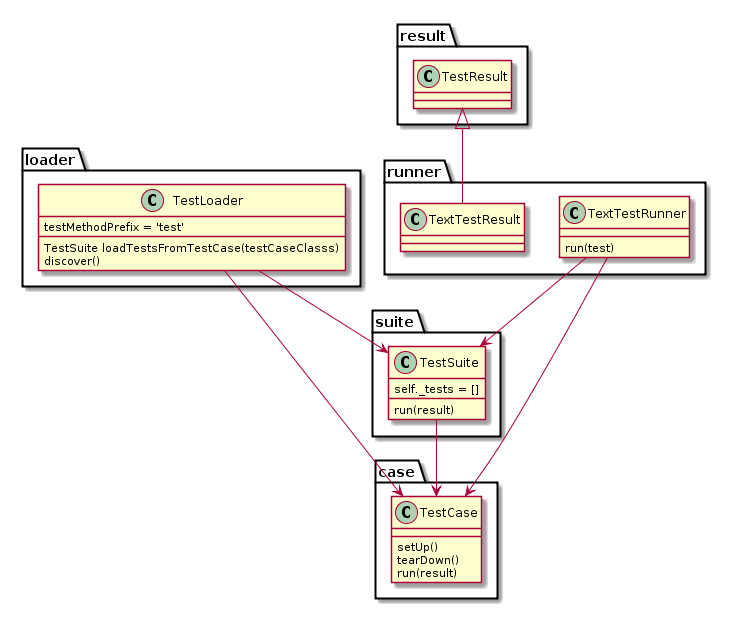

## unitest framework for fixture
* 写方法集合的`.py`文件:例如`mathfunc.py`.
* 写一个测试`test_mathfunc.py`执行测试。  
小结：
* 1，在在unittest.main()中加 verbosity 参数可以控制输出的错误报告的详细程度。0:不输出执行结果，1:默认只输出错误的情况，2:详细的执行结果。
* 2，每一个测试均需要以`Test`开头，否则是不被unittest识别。
* 为了控制用例的执行顺序，需要用到`TestSuite`

  """ skip装饰器一共有三个 unittest.skip(reason)、unittest.skipIf(condition, reason)
   、unittest.skipUnless(condition, reason) """

## 小结
* unittest是Python自带的单元测试框架，我们可以用其来作为我们自动化测试框架的用例组织执行框架。
* unittest的流程：写好TestCase，然后由TestLoader加载TestCase到TestSuite，然后由TextTestRunner来运行TestSuite，
运行的结果保存在TextTestResult中，我们通过命令行或者unittest.main()执行时，main会调用TextTestRunner中的run来执行，或者我们可以直接通过TextTestRunner来执行用例。
* 一个class继承unittest.TestCase即是一个TestCase，其中以 test 开头的方法在load时被加载为一个真正的TestCase。
* verbosity参数可以控制执行结果的输出，0 是简单报告、1 是一般报告、2 是详细报告。
* 可以通过addTest和addTests向suite中添加case或suite，可以用TestLoader的loadTestsFrom__()方法。
* 用 setUp()、tearDown()、setUpClass()以及 tearDownClass()可以在用例执行前布置环境，以及在用例执行后清理环境
* 我们可以通过skip，skipIf，skipUnless装饰器跳过某个case，或者用TestCase.skipTest方法。
* 参数中加stream，可以将报告输出到文件：可以用TextTestRunner输出txt报告，以及可以用HTMLTestRunner输出html报告。
# unittest 框架图
